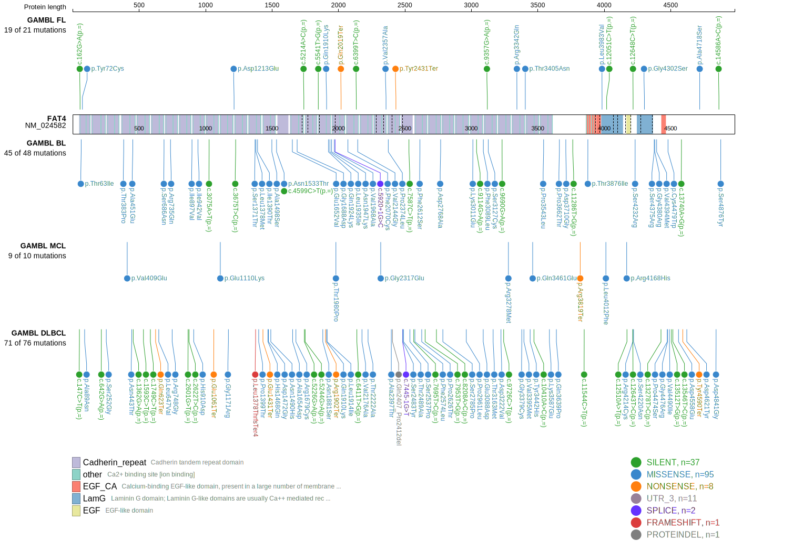
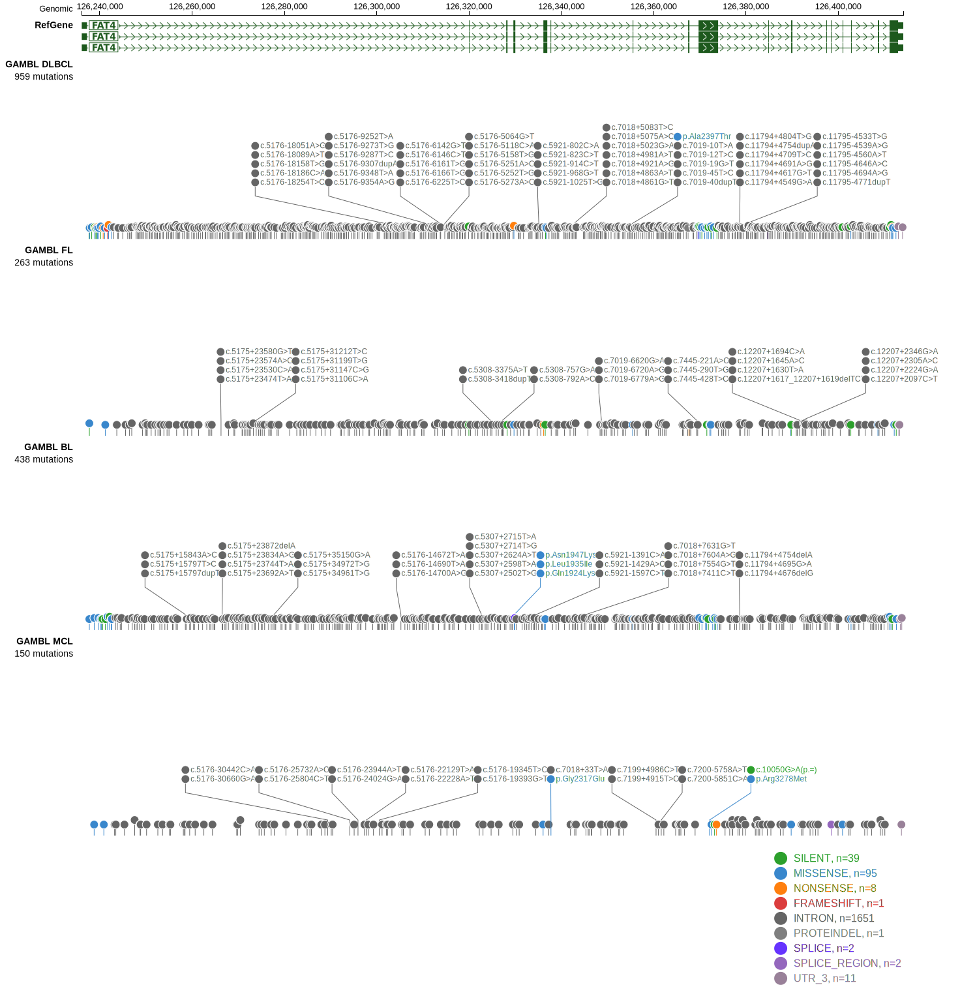
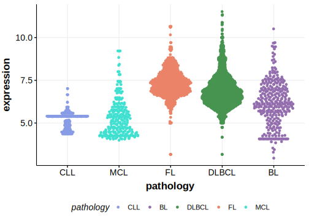

[[_TOC_]]

## Relevance tier by entity

|Entity|Tier|Description                              |
|:------:|:----:|-----------------------------------------|
||1|high-confidence PMBL/cHL/GZL gene|
||2|relevance in MZL not firmly established[@parryWholeExomeSequencing2013]|
| |2   |relevance in DLBCL not firmly established[@morinMutationalStructuralAnalysis2013]|
|   |2   |relevance in MCL not firmly established  [@zhangGenomicLandscapeMantle2014]|

## Mutation incidence in large patient cohorts (GAMBL reanalysis)

|Entity|source        |frequency (%)|
|:------:|:--------------:|:-------------:|
|DLBCL |GAMBL genomes |12.81        |
|DLBCL |Schmitz cohort|20.43        |
|DLBCL |Reddy cohort  |14.91        |
|DLBCL |Chapuy cohort |16.67        |
|MCL   |GAMBL genomes | 3.79        |

## Mutation pattern and selective pressure estimates

|Entity|aSHM|Significant selection|dN/dS (missense)|dN/dS (nonsense)|
|:------:|:----:|:---------------------:|:----------------:|:----------------:|
|BL    |No  |No                   |0.000           |0.000           |
|DLBCL |No  |No                   |1.682           |4.189           |
|FL    |No  |No                   |0.000           |0.000           |

View coding variants in ProteinPaint [hg19](https://morinlab.github.io/LLMPP/GAMBL/FAT4_protein.html)  or [hg38](https://morinlab.github.io/LLMPP/GAMBL/FAT4_protein_hg38.html)

View all variants in GenomePaint [hg19](https://morinlab.github.io/LLMPP/GAMBL/FAT4.html)  or [hg38](https://morinlab.github.io/LLMPP/GAMBL/FAT4_hg38.html)

## FAT4 Expression

<!-- ORIGIN: morinMutationalStructuralAnalysis2013 -->
<!-- DLBCL: morinMutationalStructuralAnalysis2013 -->
<!-- MCL: zhangGenomicLandscapeMantle2014 -->
<!-- MZL: parryWholeExomeSequencing2013 -->

## All Mutations

### DLBCL

[RG014](https://www.bcgsc.ca/downloads/morinlab/GAMBL/Morin_2013/RG014.html)
[RG038](https://www.bcgsc.ca/downloads/morinlab/GAMBL/Morin_2013/RG038.html)
[RG043](https://www.bcgsc.ca/downloads/morinlab/GAMBL/Morin_2013/RG043.html)
[RG055](https://www.bcgsc.ca/downloads/morinlab/GAMBL/Morin_2013/RG055.html)
[RG077](https://www.bcgsc.ca/downloads/morinlab/GAMBL/Morin_2013/RG077.html)
[RG081](https://www.bcgsc.ca/downloads/morinlab/GAMBL/Morin_2013/RG081.html)
[RG111](https://www.bcgsc.ca/downloads/morinlab/GAMBL/Morin_2013/RG111.html)

[[include:mermaid_FAT4.md]]

## References
