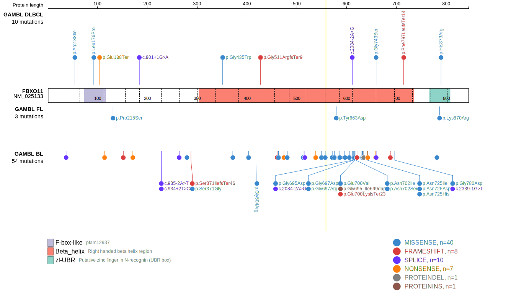
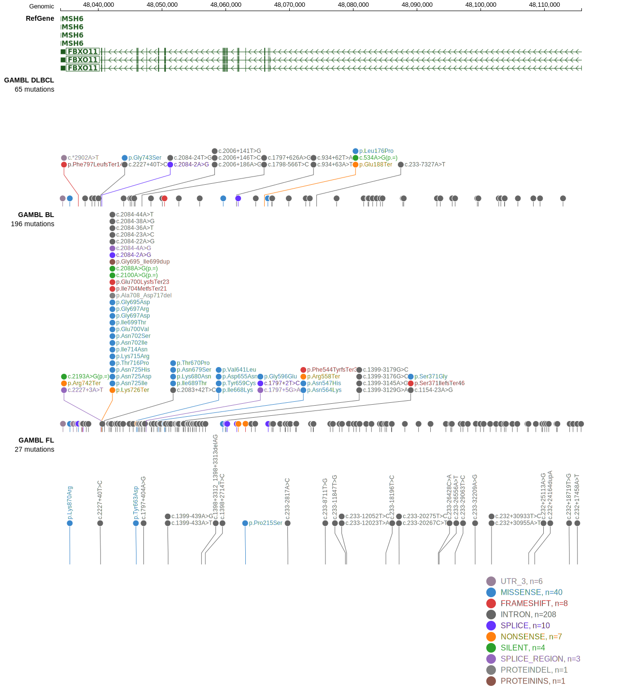

# [FBXO11]

## Mutation tier

|Entity|Tier|Description               |
|:------:|:----:|--------------------------|
|BL    |1   |high-confidence BL gene   |
|DLBCL |1   |high-confidence DLBCL gene|
## Mutation incidence

|Entity|source               |frequency (%)|
|:------:|:---------------------:|:-------------:|
|BL    |GAMBL genomes+capture|23.79        |
|BL    |Thomas cohort        |21.60        |
|BL    |Panea cohort         |15.80        |
|DLBCL |GAMBL genomes        | 3.82        |
|DLBCL |Schmitz cohort       | 2.10        |
|DLBCL |Reddy cohort         | 2.10        |
|DLBCL |Chapuy cohort        | 2.60        |

## Mutation pattern

|Entity|aSHM|Significant selection|dN/dS (missense)|dN/dS (nonsense)|
|:------:|:----:|:---------------------:|:----------------:|:----------------:|
|BL    |No  |Yes                  |14.801          |114.063         |
|DLBCL |No  |Yes                  | 2.464          | 39.449         |
|FL    |No  |No                   | 8.837          |  0.000         |

> [!NOTE]
> First described in BL in 2023 by [Thomas N](https://pubmed.ncbi.nlm.nih.gov/36201743)

View coding variants in ProteinPaint [hg19](https://www.bcgsc.ca/downloads/morinlab/GAMBL/test/genes/FBXO11_protein.html)  or [hg38](https://www.bcgsc.ca/downloads/morinlab/GAMBL/test/genes/FBXO11_protein_hg38.html)

View all variants in GenomePaint [hg19](https://www.bcgsc.ca/downloads/morinlab/GAMBL/test/genes/FBXO11.html)

