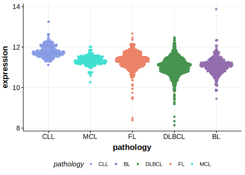

# FBXO11
## Overview
Somatic mutations in FBXO11 are common in BL1,2 and appear in a small number of DLBCLs.3 This gene has some recurrent sites of mutations (hot spots). Mutations lead to stabilization of BCL6, an important transcriptional repressor involved in lymphomagenesis.4 These mutations present a potential novel target for therapeutic intervention, particularly through strategies aimed at degrading BCL6 or inhibiting its function.4

## History
Mutations in this gene were first described in BL in 2015 by Pighi et al4 and in DLBCL by Hübschmann et al.5

## Relevance tier by entity

|Entity|Tier|Description               |
|:------:|:----:|--------------------------|
|    |1   |high-confidence BL gene   |
| |1   |high-confidence DLBCL gene|

## Mutation incidence in large patient cohorts (GAMBL reanalysis)

|Entity|source               |frequency (%)|
|:------:|:---------------------:|:-------------:|
|BL    |GAMBL genomes+capture|23.79        |
|BL    |Thomas cohort        |21.60        |
|BL    |Panea cohort         |15.80        |
|DLBCL |GAMBL genomes        | 3.82        |
|DLBCL |Schmitz cohort       | 2.13        |
|DLBCL |Reddy cohort         | 2.10        |
|DLBCL |Chapuy cohort        | 2.56        |

## Mutation pattern and selective pressure estimates

|Entity|aSHM|Significant selection|dN/dS (missense)|dN/dS (nonsense)|
|:------:|:----:|:---------------------:|:----------------:|:----------------:|
|BL    |No  |Yes                  |14.801          |114.063         |
|DLBCL |No  |Yes                  | 2.464          | 39.449         |
|FL    |No  |No                   | 8.837          |  0.000         |

> [!NOTE]
> First described in BL in 2015 by Pighi et al1 and described in DLBCL in 2021 by Hübschmann et al.5

## FBXO11 hot spots
|Chromosome|Coordinate|Mutation|HGVSp|
|:-:|:-:|:-:|:-:|
|chr2|48040426|T>A|N725I| 
|chr2|48040427|T>C|N725D| 
|chr2|48040427|T>G|N725H| 
|chr2|48040427|T>A|N725Y| 
|chr2|48040488|TA>GC|I704S| 
|chr2|48040489|A>C|I704R| 
|chr2|48040495|T>A|N702I| 
|chr2|48040495|T>C|N702S| 
|chr2|48040496|T>C|N702D| 
|chr2|48040496|T>A|N702Y| 
|chr2|48040500|T>A|E700D| 
|chr2|48040500|T>G|E700D| 
|chr2|48040501|T>A|E700V| 
|chr2|48040510|C>T|G697D| 
|chr2|48040511|C>G|G697R| 

View coding variants in ProteinPaint [hg19](https://morinlab.github.io/LLMPP/GAMBL/FBXO11_protein.html)  or [hg38](https://morinlab.github.io/LLMPP/GAMBL/FBXO11_protein_hg38.html)

View all variants in GenomePaint [hg19](https://morinlab.github.io/LLMPP/GAMBL/FBXO11.html)  or [hg38](https://morinlab.github.io/LLMPP/GAMBL/FBXO11_hg38.html)

## References
1. *Pighi, C., Compagno, M., Wang, Q., Cheong, T., Poggio, T., Langellotto, F., Celle, P., Zamó, A., & Chiarle, R. (2015). FBXO11, a Regulator of BCL6 Stability, Is Recurrently Mutated in Burkitt Lymphoma. Blood, 126, 3673-3673. https://doi.org/10.1182/BLOOD.V126.23.3673.3673.*
2. *Grande BM, Gerhard DS, Jiang A, Griner NB, Abramson JS, Alexander TB, Allen H, Ayers LW, Bethony JM, Bhatia K, Bowen J, Casper C, Choi JK, Culibrk L, Davidsen TM, Dyer MA, Gastier-Foster JM, Gesuwan P, Greiner TC, Gross TG, Hanf B, Harris NL, He Y, Irvin JD, Jaffe ES, Jones SJM, Kerchan P, Knoetze N, Leal FE, Lichtenberg TM, Ma Y, Martin JP, Martin MR, Mbulaiteye SM, Mullighan CG, Mungall AJ, Namirembe C, Novik K, Noy A, Ogwang MD, Omoding A, Orem J, Reynolds SJ, Rushton CK, Sandlund JT, Schmitz R, Taylor C, Wilson WH, Wright GW, Zhao EY, Marra MA, Morin RD, Staudt LM. Genome-wide discovery of somatic coding and noncoding mutations in pediatric endemic and sporadic Burkitt lymphoma. Blood. 2019 Mar 21;133(12):1313-1324. doi: 10.1182/blood-2018-09-871418. Epub 2019 Jan 7. PMID: 30617194; PMCID: PMC6428665.*
3. *Thomas N, Dreval K, Gerhard DS, Hilton LK, Abramson JS, Ambinder RF, Barta S, Bartlett NL, Bethony J, Bhatia K, Bowen J, Bryan AC, Cesarman E, Casper C, Chadburn A, Cruz M, Dittmer DP, Dyer MA, Farinha P, Gastier-Foster JM, Gerrie AS, Grande BM, Greiner T, Griner NB, Gross TG, Harris NL, Irvin JD, Jaffe ES, Henry D, Huppi R, Leal FE, Lee MS, Martin JP, Martin MR, Mbulaiteye SM, Mitsuyasu R, Morris V, Mullighan CG, Mungall AJ, Mungall K, Mutyaba I, Nokta M, Namirembe C, Noy A, Ogwang MD, Omoding A, Orem J, Ott G, Petrello H, Pittaluga S, Phelan JD, Ramos JC, Ratner L, Reynolds SJ, Rubinstein PG, Sissolak G, Slack G, Soudi S, Swerdlow SH, Traverse-Glehen A, Wilson WH, Wong J, Yarchoan R, ZenKlusen JC, Marra MA, Staudt LM, Scott DW, Morin RD. Genetic subgroups inform on pathobiology in adult and pediatric Burkitt lymphoma. Blood. 2023 Feb 23;141(8):904-916. doi: 10.1182/blood.2022016534. PMID: 36201743; PMCID: PMC10023728.*
4. *Pighi, C., Cheong, T., Compagno, M., Patrucco, E., Arigoni, M., Olivero, M., Wang, Q., López, C., Bernhart, S., Grande, B., Poggio, T., Langellotto, F., Bonello, L., Dall’Olio, R., Martínez-Martín, S., Molinaro, L., Celle, P., Whitfield, J., Soucek, L., Voena, C., Calogero, R., Morin, R., Staudt, L., Siebert, R., Zamó, A., & Chiarle, R. (2021). Frequent mutations of FBXO11 highlight BCL6 as a therapeutic target in Burkitt lymphoma.. Blood advances. https://doi.org/10.1182/bloodadvances.2021005682.*
5. *Hübschmann D, Kleinheinz K, Wagener R, Bernhart SH, López C, Toprak UH, Sungalee S, Ishaque N, Kretzmer H, Kreuz M, Waszak SM, Paramasivam N, Ammerpohl O, Aukema SM, Beekman R, Bergmann AK, Bieg M, Binder H, Borkhardt A, Borst C, Brors B, Bruns P, Carrillo de Santa Pau E, Claviez A, Doose G, Haake A, Karsch D, Haas S, Hansmann ML, Hoell JI, Hovestadt V, Huang B, Hummel M, Jäger-Schmidt C, Kerssemakers JNA, Korbel JO, Kube D, Lawerenz C, Lenze D, Martens JHA, Ott G, Radlwimmer B, Reisinger E, Richter J, Rico D, Rosenstiel P, Rosenwald A, Schillhabel M, Stilgenbauer S, Stadler PF, Martín-Subero JI, Szczepanowski M, Warsow G, Weniger MA, Zapatka M, Valencia A, Stunnenberg HG, Lichter P, Möller P, Loeffler M, Eils R, Klapper W, Hoffmann S, Trümper L; ICGC MMML-Seq consortium; ICGC DE-Mining consortium; BLUEPRINT consortium; Küppers R, Schlesner M, Siebert R. Mutational mechanisms shaping the coding and noncoding genome of germinal center derived B-cell lymphomas. Leukemia. 2021 Jul;35(7):2002-2016. doi: 10.1038/s41375-021-01251-z. Epub 2021 May 5. PMID: 33953289; PMCID: PMC8257491.*
## FBXO11 Expression

<!-- ORIGIN: parryWholeExomeSequencing2013 -->
<!-- BL: richterRecurrentMutationID32012a -->
<!-- MZL: parryWholeExomeSequencing2013 -->
<!-- DLBCL: hubschmannMutationalMechanismsShaping2021b -->
