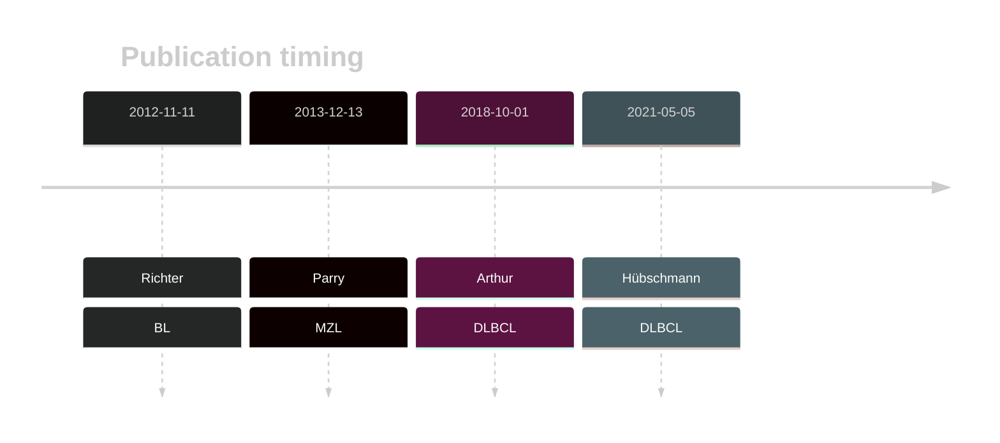

# FBXO11

## Overview
Somatic mutations in FBXO11 are common in BL[@richterRecurrentMutationID32012] and appear in a small number of DLBCLs.[@hubschmannMutationalMechanismsShaping2021]
This gene has some recurrent sites of mutations (hot spots). Mutations lead to stabilization of BCL6, an important transcriptional repressor involved in lymphomagenesis.
These mutations present a potential novel target for therapeutic intervention, particularly through strategies aimed at degrading BCL6 or inhibiting its function.

## Relevance tier by entity

|Entity|Tier|Description               |
|:------:|:----:|--------------------------|
||2|relevance in MZL not firmly established[@parryWholeExomeSequencing2013]|
|    |1   |high-confidence BL gene   [@richterRecurrentMutationID32012]|
| |1   |high-confidence DLBCL gene[@hubschmannMutationalMechanismsShaping2021; @arthurGenomewideDiscoverySomatic2018]|

## Mutation incidence in large patient cohorts (GAMBL reanalysis)

|Entity|source               |frequency (%)|
|:------:|:---------------------:|:-------------:|
|BL    |GAMBL genomes+capture|23.79        |
|BL    |Thomas cohort        |21.60        |
|BL    |Panea cohort         |15.80        |
|DLBCL |GAMBL genomes        | 3.82        |
|DLBCL |Schmitz cohort       | 2.13        |
|DLBCL |Reddy cohort         | 2.10        |
|DLBCL |Chapuy cohort        | 2.56        |

## Mutation pattern and selective pressure estimates

|Entity|aSHM|Significant selection|dN/dS (missense)|dN/dS (nonsense)|
|:------:|:----:|:---------------------:|:----------------:|:----------------:|
|BL    |No  |Yes                  |14.801          |114.063         |
|DLBCL |No  |Yes                  | 2.464          | 39.449         |
|FL    |No  |No                   | 8.837          |  0.000         |

## FBXO11 hot spots
|Chromosome|Coordinate|Mutation|HGVSp|
|:-:|:-:|:-:|:-:|
|chr2|48040426|T>A|N725I| 
|chr2|48040427|T>C|N725D| 
|chr2|48040427|T>G|N725H| 
|chr2|48040427|T>A|N725Y| 
|chr2|48040488|TA>GC|I704S| 
|chr2|48040489|A>C|I704R| 
|chr2|48040495|T>A|N702I| 
|chr2|48040495|T>C|N702S| 
|chr2|48040496|T>C|N702D| 
|chr2|48040496|T>A|N702Y| 
|chr2|48040500|T>A|E700D| 
|chr2|48040500|T>G|E700D| 
|chr2|48040501|T>A|E700V| 
|chr2|48040510|C>T|G697D| 
|chr2|48040511|C>G|G697R| 

View coding variants in ProteinPaint [hg19](https://morinlab.github.io/LLMPP/GAMBL/FBXO11_protein.html)  or [hg38](https://morinlab.github.io/LLMPP/GAMBL/FBXO11_protein_hg38.html)

View all variants in GenomePaint [hg19](https://morinlab.github.io/LLMPP/GAMBL/FBXO11.html)  or [hg38](https://morinlab.github.io/LLMPP/GAMBL/FBXO11_hg38.html)

## FBXO11 Expression

## References
<!-- ORIGIN: parryWholeExomeSequencing2013 -->
<!-- BL: richterRecurrentMutationID32012a -->
<!-- MZL: parryWholeExomeSequencing2013 -->
<!-- DLBCL: hubschmannMutationalMechanismsShaping2021b -->
