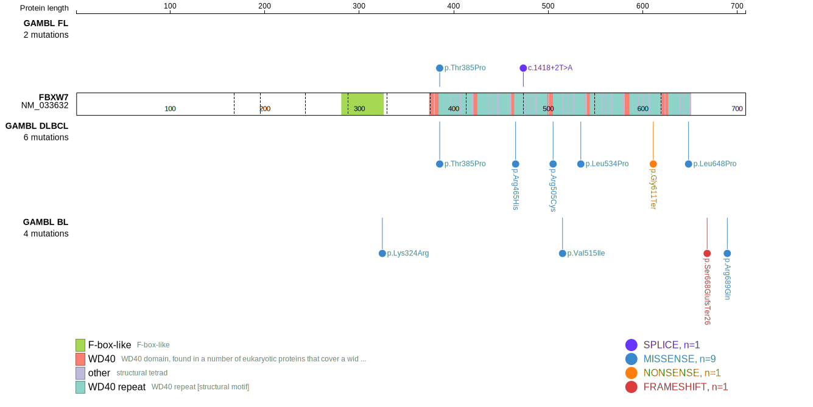
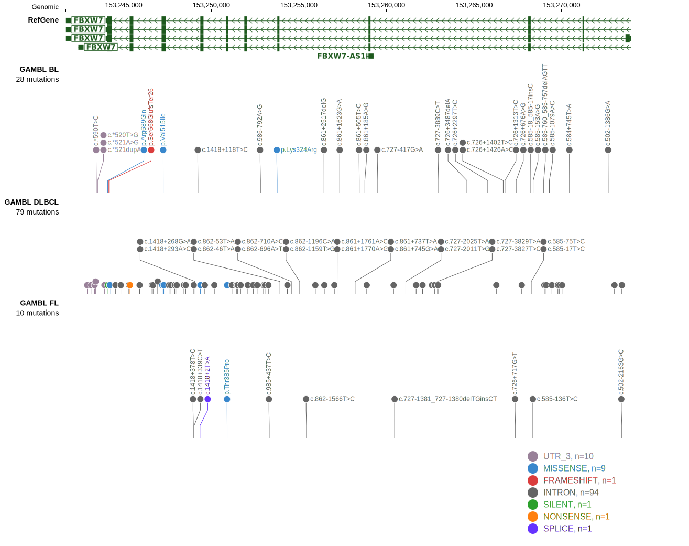

# FBXW7

## Relevance tier by entity

|Entity|Tier|Description               |
|:------:|:----:|--------------------------|
|DLBCL |1   |high-confidence DLBCL gene|

## Mutation incidence in large patient cohorts (GAMBL reanalysis)

|Entity|source        |frequency (%)|
|:------:|:--------------:|:-------------:|
|DLBCL |GAMBL genomes |2.10         |
|DLBCL |Schmitz cohort|2.98         |
|DLBCL |Reddy cohort  |1.30         |
|DLBCL |Chapuy cohort |1.71         |

## Mutation pattern and selective pressure estimates

|Entity|aSHM|Significant selection|dN/dS (missense)|dN/dS (nonsense)|
|:------:|:----:|:---------------------:|:----------------:|:----------------:|
|BL    |No  |No                   |3.846           | 0.000          |
|DLBCL |No  |No                   |2.734           |10.734          |
|FL    |No  |No                   |2.987           |22.593          |

View coding variants in ProteinPaint [hg19](https://morinlab.github.io/LLMPP/GAMBL/FBXW7_protein.html)  or [hg38](https://morinlab.github.io/LLMPP/GAMBL/FBXW7_protein_hg38.html)

View all variants in GenomePaint [hg19](https://morinlab.github.io/LLMPP/GAMBL/FBXW7.html)  or [hg38](https://morinlab.github.io/LLMPP/GAMBL/FBXW7_hg38.html)

