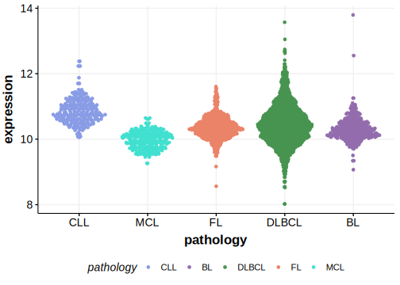

[[_TOC_]]

## Overview
FBXW7 mutations are found in a range of lymphoid malignancies, including B-cell lymphomas. These mutations often include missense mutations, deletions, frameshift mutations and splice-site mutations. 
Overall, these mutations are relatively rare in DLBCL and occur more frequently in other solid tumors as well as T-cell acute lymphocytic leukemia.[@akhoondiFBXW7HCDC4General2007] 
The most commonly observed mutations in those cancers are the hot spots R465 and R479.[@akhoondiFBXW7HCDC4General2007]
In leukemias, FBXW7 mutations enhance the activity of leukemia-initiating cells by stabilizing oncogenic MYC.[@kingUbiquitinLigaseFBXW72013] Whether they have this role in DLBCL remains to be determined. 

## Relevance tier by entity

|Entity|Tier|Description               |
|:------:|:----:|--------------------------|
| |1   |high-confidence DLBCL gene[@zhangGeneticHeterogeneityDiffuse2013; @reddyGeneticFunctionalDrivers2017; @hubschmannMutationalMechanismsShaping2021]|

## Mutation incidence in large patient cohorts (GAMBL reanalysis)

[[include:DLBCL_FBXW7.md]]

## Mutation pattern and selective pressure estimates

[[include:dnds_FBXW7.md]]

[[include:browser_FBXW7.md]]

## Expression

[[include:mermaid_FBXW7.md]]

## References

<!-- ORIGIN: zhangGeneticHeterogeneityDiffuse2013 -->
<!-- DLBCL: zhangGeneticHeterogeneityDiffuse2013 -->
