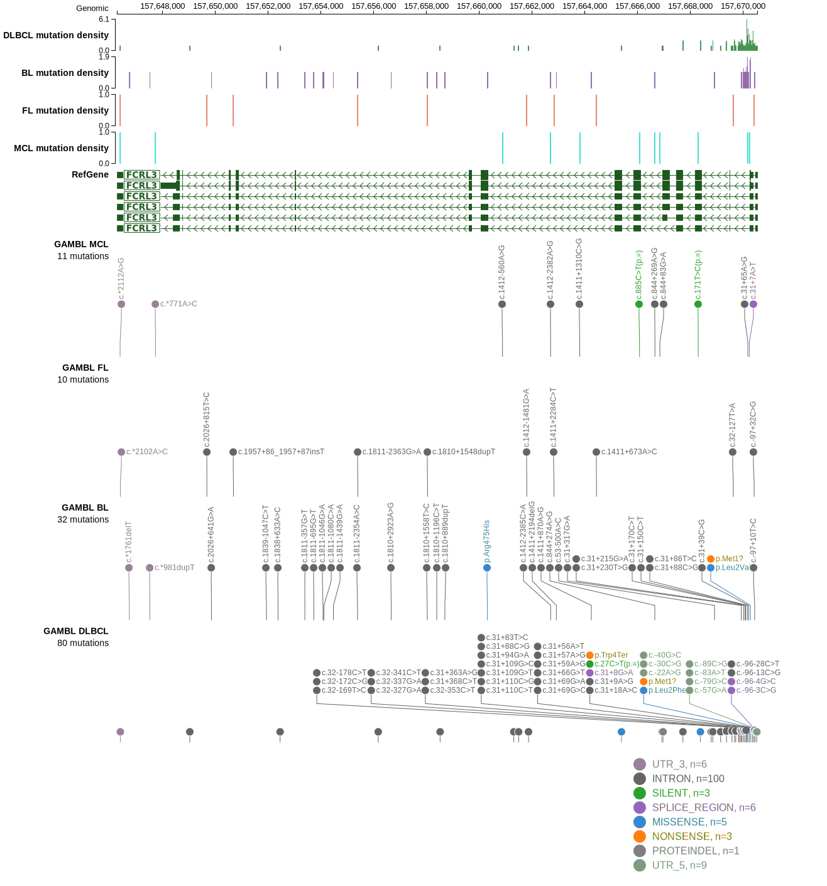

# FCRL3

## Relevance tier by entity

|Entity|Tier|Description                              |
|:------:|:----:|-----------------------------------------|
|DLBCL |2-a | aSHM target; Although recurrent, the relevance of mutations in DLBCL is tenuous |

## Mutation incidence in large patient cohorts (GAMBL reanalysis)

|Entity|source        |frequency (%)|
|:------:|:--------------:|:-------------:|
|DLBCL |GAMBL genomes |2.49         |
|DLBCL |Schmitz cohort|3.40         |
|DLBCL |Reddy cohort  |2.70         |
|DLBCL |Chapuy cohort |3.42         |

## Mutation pattern and selective pressure estimates

|Entity|aSHM|Significant selection|dN/dS (missense)|dN/dS (nonsense)|
|:------:|:----:|:---------------------:|:----------------:|:----------------:|
|BL    |Yes |No                   |3.558           |0.000           |
|DLBCL |Yes |No                   |2.408           |7.608           |
|FL    |Yes |No                   |0.000           |0.000           |

## aSHM regions

|chr_name|hg19_start|hg19_end |region                                                                                     |regulatory_comment|
|:--------:|:----------:|:---------:|:-------------------------------------------------------------------------------------------:|:------------------:|
|chr2    |157669490 |157671299|[TSS](https://genome.ucsc.edu/s/rdmorin/GAMBL%20hg19?position=chr2%3A157669490%2D157671299)|NA                |

View coding variants in ProteinPaint [hg19](https://www.bcgsc.ca/downloads/morinlab/GAMBL/test/genes/FCRL3_protein.html)  or [hg38](https://www.bcgsc.ca/downloads/morinlab/GAMBL/test/genes/FCRL3_protein_hg38.html)

View all variants in GenomePaint [hg19](https://www.bcgsc.ca/downloads/morinlab/GAMBL/test/genes/FCRL3.html)  or [hg38](https://www.bcgsc.ca/downloads/morinlab/GAMBL/test/genes/FCRL3_hg38.html)

