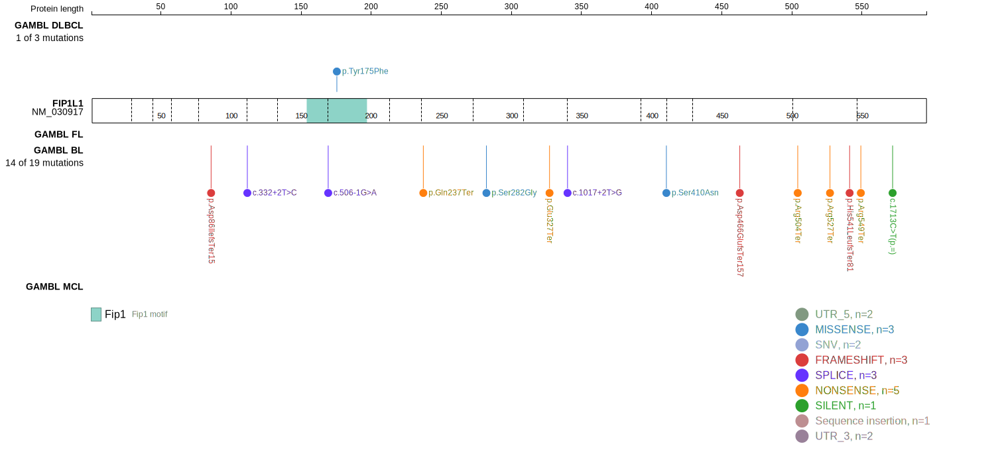
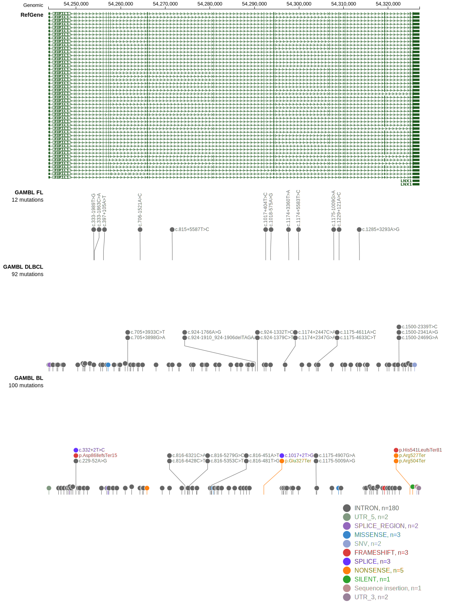

# FIP1L1

## Relevance tier by entity

|Entity|Tier|Description                           |
|:------:|:----:|--------------------------------------|
|BL    |2   |relevance in BL not firmly established|

## Mutation incidence in large patient cohorts (GAMBL reanalysis)

|Entity|source               |frequency (%)|
|:------:|:---------------------:|:-------------:|
|BL    |GAMBL genomes+capture|5.31         |
|BL    |Thomas cohort        |2.50         |
|BL    |Panea cohort         |2.00         |

## Mutation pattern and selective pressure estimates

|Entity|aSHM|Significant selection|dN/dS (missense)|dN/dS (nonsense)|
|:------:|:----:|:---------------------:|:----------------:|:----------------:|
|BL    |No  |Yes                  |1.128           |47.630          |
|DLBCL |No  |No                   |1.343           |10.476          |
|FL    |No  |No                   |3.166           | 0.000          |

View coding variants in ProteinPaint [hg19](https://morinlab.github.io/LLMPP/GAMBL/FIP1L1_protein.html)  or [hg38](https://morinlab.github.io/LLMPP/GAMBL/FIP1L1_protein_hg38.html)

View all variants in GenomePaint [hg19](https://morinlab.github.io/LLMPP/GAMBL/FIP1L1.html)  or [hg38](https://morinlab.github.io/LLMPP/GAMBL/FIP1L1_hg38.html)

## FIP1L1 Expression

