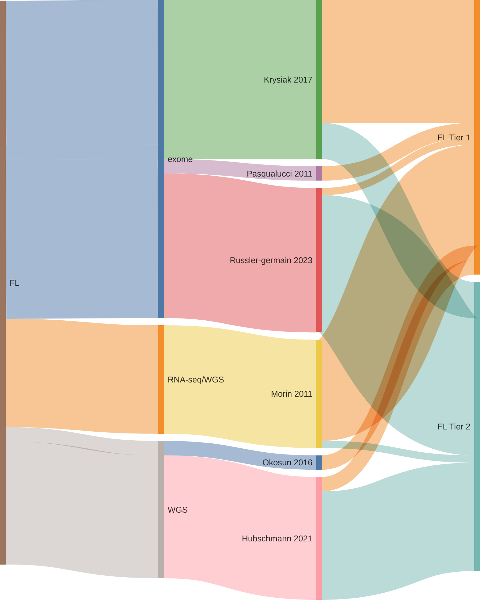

# FL genes

## Origins of FL genes

## Tier 1 FL genes

### *66 total*

|          Gene          |  Tier   | Relevant references                                                                                     |
|:----------------------:|:-------:|:--------------------------------------------------------------------------------------------------------|
|      [ACTB](ACTB)      | 1, aSHM | Lohr et al. 2012; Wienand et al. 2019                                                                 |
|    [ARID1A](ARID1A)    |    1    | Zhang et al. 2013; Wienand et al. 2019; Love et al. 2012; Krysiak et al. 2017; Rossi et al. 2012      |
|   [ATP6AP1](ATP6AP1)   |    1    | Okosun et al. 2016                                                                                    |
|  [ATP6V1B2](ATP6V1B2)  |    1    | Okosun et al. 2016                                                                                    |
|       [B2M](B2M)       |    1    | Morin et al. 2011; Pararajalingam et al. 2020; Reichel et al. 2015                                    |
|      [BCL2](BCL2)      | 1, aSHM | Sarkozy et al. 2021; Tanaka et al. 1992; Burkhardt et al. 2022; Morin et al. 2011                     |
|      [BCL6](BCL6)      | 1, aSHM | Morin et al. 2011; Love et al. 2012                                                                   |
|     [BCL7A](BCL7A)     | 1, aSHM | Reichel et al. 2015; Grande et al. 2019; Krysiak et al. 2017; Arthur et al. 2018                      |
|     [BIRC6](BIRC6)     |    1    | Sarkozy et al. 2021; Reddy et al. 2017                                                                |
|      [BTG1](BTG1)      | 1, aSHM | Sarkozy et al. 2021; Burkhardt et al. 2022; Morin et al. 2011                                         |
|      [BTG2](BTG2)      | 1, aSHM | Love et al. 2012; Morin et al. 2011                                                                   |
|       [BTK](BTK)       |    1    | Krysiak et al. 2017; Albuquerque et al. 2017                                                          |
|    [CARD11](CARD11)    |    1    | Yan et al. 2012; Lenz et al. 2008; Morin et al. 2011; Panea et al. 2019; Wu et al. 2016               |
|     [CCND3](CCND3)     |    1    | Desch et al. 2020; Jallades et al. 2017; Richter et al. 2012; Morin et al. 2011                       |
|      [CD83](CD83)      | 1, aSHM | Russler-Germain et al. 2023; Panea et al. 2019; Duns et al. 2021; Morin et al. 2013                   |
|    [CREBBP](CREBBP)    |    1    | Duns et al. 2021; Laura Pasqualucci, Dominguez-Sola, et al. 2011; Love et al. 2012; Parry et al. 2013 |
|      [CTSS](CTSS)      |    1    | Bararia et al. 2020                                                                                   |
|      [DTX1](DTX1)      | 1, aSHM | Rossi et al. 2012; Panea et al. 2019; Gomez et al. 2023; Schmitz et al. 2018                          |
|      [EBF1](EBF1)      | 1, aSHM | Reichel et al. 2015; Thomas et al. 2023; Bohle et al. 2013                                            |
|    [EEF1A1](EEF1A1)    |    1    | Reichel et al. 2015; Hübschmann et al. 2021                                                           |
|     [EP300](EP300)     |    1    | Laura Pasqualucci, Dominguez-Sola, et al. 2011; Panea et al. 2019; Rossi et al. 2012                  |
|      [EZH2](EZH2)      |    1    | Morin et al. 2010; Love et al. 2012; Mottok et al. 2019                                               |
|       [FAS](FAS)       |    1    | Scholl et al. 2007; Spina et al. 2016                                                                 |
|     [FOXO1](FOXO1)     |    1    | Morin et al. 2011; Schmitz et al. 2012; Duns et al. 2021                                              |
|     [GNA13](GNA13)     |    1    | Love et al. 2012; Morin et al. 2011; Reichel et al. 2015                                              |
|     [GNAI2](GNAI2)     |    1    | Morin et al. 2013; Grande et al. 2019                                                                 |
|  [HIST1H1B](HIST1H1B)  | 1, aSHM | Sarkozy et al. 2021; Chapuy et al. 2018; Krysiak et al. 2017                                          |
|  [HIST1H1C](HIST1H1C)  | 1, aSHM | Morin et al. 2011; Panea et al. 2019                                                                  |
|  [HIST1H1D](HIST1H1D)  | 1, aSHM | Krysiak et al. 2017; Morin et al. 2013; Jallades et al. 2017                                          |
|  [HIST1H1E](HIST1H1E)  | 1, aSHM | Reichel et al. 2015; Morin et al. 2013; Krysiak et al. 2017; Grande et al. 2019                       |
| [HIST1H2AC](HIST1H2AC) | 1, aSHM | Krysiak et al. 2017; Morin et al. 2013                                                                |
| [HIST1H2AG](HIST1H2AG) | 1, aSHM | Krysiak et al. 2017; Panea et al. 2019; Morin et al. 2013; Rossi et al. 2012                          |
| [HIST1H2AM](HIST1H2AM) | 1, aSHM | Panea et al. 2019; Krysiak et al. 2017                                                                |
| [HIST1H2BC](HIST1H2BC) | 1, aSHM | Mottok et al. 2019; Krysiak et al. 2017; Reddy et al. 2017                                            |
| [HIST1H2BD](HIST1H2BD) | 1, aSHM | Krysiak et al. 2017                                                                                   |
| [HIST1H2BG](HIST1H2BG) | 1, aSHM | Krysiak et al. 2017                                                                                   |
|  [HIST1H3B](HIST1H3B)  | 1, aSHM | Zhang et al. 2013; Reichel et al. 2015                                                                |
|  [HIST1H3G](HIST1H3G)  | 1, aSHM | Krysiak et al. 2017                                                                                   |
|     [HVCN1](HVCN1)     |    1    | Krysiak et al. 2017                                                                                   |
|      [IRF4](IRF4)      | 1, aSHM | Mottok et al. 2019; Morin et al. 2011                                                                 |
|      [IRF8](IRF8)      | 1, aSHM | Panea et al. 2019; Morin et al. 2011; Mottok et al. 2019                                              |
|     [ITPKB](ITPKB)     | 1, aSHM | Schmitz et al. 2018; Reichel et al. 2015                                                              |
|      [KLF2](KLF2)      | 1, aSHM | Laura Pasqualucci, Trifonov, et al. 2011; Desch et al. 2020; Jallades et al. 2017                     |
|     [KLHL6](KLHL6)     | 1, aSHM | Panea et al. 2019; Ganapathi et al. 2016; Morin et al. 2011                                           |
|     [KMT2D](KMT2D)     |    1    | Rossi et al. 2012; Desch et al. 2020; Morin et al. 2011; Beà et al. 2013; Grande et al. 2019          |
|       [LTB](LTB)       | 1, aSHM | Desch et al. 2020; Chapuy et al. 2018; Panea et al. 2019                                              |
|    [MAP2K1](MAP2K1)    |    1    | Shin et al. 2015; Louissaint et al. 2016                                                              |
|     [MEF2B](MEF2B)     | 1, aSHM | Beà et al. 2013; Morin et al. 2011                                                                    |
|     [MEF2C](MEF2C)     | 1, aSHM | Arthur et al. 2018                                                                                    |
|      [PCLO](PCLO)      |    1    | Lohr et al. 2012                                                                                      |
|      [PIM1](PIM1)      | 1, aSHM | Duns et al. 2021; L. Pasqualucci et al. 2001; Burkhardt et al. 2022                                   |
|   [POU2AF1](POU2AF1)   |    1    | Krysiak et al. 2017                                                                                   |
|    [POU2F2](POU2F2)    |    1    | Zhang et al. 2013; Krysiak et al. 2017                                                                |
|     [PTPRD](PTPRD)     |    1    | Spina et al. 2016                                                                                     |
|     [RRAGC](RRAGC)     |    1    | Okosun et al. 2016                                                                                    |
|     [S1PR2](S1PR2)     | 1, aSHM | Morin et al. 2011; Muppidi et al. 2014                                                                |
|      [SGK1](SGK1)      | 1, aSHM | Morin et al. 2011; Duns et al. 2021                                                                   |
|   [SMARCA4](SMARCA4)   |    1    | Zhang et al. 2013; Nadeu et al. 2020; Krysiak et al. 2017; Richter et al. 2012                        |
|     [SOCS1](SOCS1)     | 1, aSHM | Morin et al. 2011; Weniger et al. 2006                                                                |
|     [STAT6](STAT6)     |    1    | Yildiz et al. 2015; Ritz et al. 2009                                                                  |
|   [TBL1XR1](TBL1XR1)   |    1    | Rossi et al. 2012; Mareschal et al. 2016                                                              |
|    [TMSB4X](TMSB4X)    | 1, aSHM | Albuquerque et al. 2017                                                                               |
|   [TNFAIP3](TNFAIP3)   |    1    | Schmitz et al. 2009; Compagno et al. 2009; Rossi et al. 2011                                          |
|  [TNFRSF14](TNFRSF14)  |    1    | Cheung et al. 2010; Spina et al. 2016                                                                 |
|      [TP53](TP53)      |    1    | Wilda et al. 2004; Rossi et al. 2012; Beà et al. 2013; Tiacci et al. 2018; Morin et al. 2011          |
|     [VMA21](VMA21)     |    1    | Hübschmann et al. 2021                                                                                |

## Tier 2 FL genes

### *50 total*

|          Gene          |  Tier   | Relevant references                                                                             |
|:----------------------:|:-------:|:------------------------------------------------------------------------------------------------|
|      [ABL2](ABL2)      |    2    | Russler-Germain et al. 2023                                                                   |
|     [ACTG1](ACTG1)     | 2, aSHM | Hübschmann et al. 2021; Spina et al. 2016; Desch et al. 2020                                  |
|   [ATP6V1A](ATP6V1A)   |    2    | Hübschmann et al. 2021                                                                        |
|     [BCL10](BCL10)     |    2    | Spina et al. 2016; Russler-Germain et al. 2023; Morin et al. 2011                             |
| [CCDC42BPB](CCDC42BPB) |    2    | Hübschmann et al. 2021                                                                        |
|      [CD70](CD70)      |    2    | Morin et al. 2011; Russler-Germain et al. 2023                                                |
|     [CD79B](CD79B)     |    2    | Morin et al. 2011; Panea et al. 2019                                                          |
|      [CILP](CILP)      |    2    | Russler-Germain et al. 2023                                                                   |
|     [CPNE8](CPNE8)     |    2    | Hübschmann et al. 2021                                                                        |
|     [CXCR4](CXCR4)     | 2, aSHM | Krysiak et al. 2017; Panea et al. 2019; Khodabakhshi et al. 2012                              |
|    [CYP2A6](CYP2A6)    |    2    | Russler-Germain et al. 2023                                                                   |
|     [DDX3X](DDX3X)     |    2    | Schmitz et al. 2018, 2012; Mottok et al. 2019                                                 |
|     [DHX15](DHX15)     |    2    | Hübschmann et al. 2021                                                                        |
|     [DUSP2](DUSP2)     | 2, aSHM | Morin et al. 2013; Duns et al. 2021                                                           |
|      [EGR1](EGR1)      |    2    | Krysiak et al. 2017; Rossi et al. 2012; Reichel et al. 2015                                   |
|      [FZR1](FZR1)      |    2    | Hübschmann et al. 2021                                                                        |
|      [GBP7](GBP7)      |    2    | Russler-Germain et al. 2023                                                                   |
|      [GRM6](GRM6)      |    2    | Russler-Germain et al. 2023                                                                   |
| [HIST1H2BM](HIST1H2BM) | 2, aSHM | Krysiak et al. 2017                                                                           |
|  [HIST1H3I](HIST1H3I)  | 2, aSHM | Panea et al. 2019; Krysiak et al. 2017                                                        |
|     [HLA-B](HLA-B)     |    2    | Wienand et al. 2019                                                                           |
|    [HNRNPD](HNRNPD)    |    2    |                                                                                                 |
|     [IGLL5](IGLL5)     | 2, aSHM | Russler-Germain et al. 2023; Desch et al. 2020; Panea et al. 2019                             |
|       [JUP](JUP)       |    2    | Hübschmann et al. 2021                                                                        |
|   [KIR3DL1](KIR3DL1)   |    2    | Russler-Germain et al. 2023                                                                   |
|    [LAPTM5](LAPTM5)    |    2    | Hübschmann et al. 2021                                                                        |
|    [MAGEC1](MAGEC1)    |    2    | Russler-Germain et al. 2023                                                                   |
|    [MAP7D1](MAP7D1)    |    2    | Russler-Germain et al. 2023                                                                   |
|     [MGEA5](MGEA5)     |    2    | Hübschmann et al. 2021                                                                        |
|     [MKI67](MKI67)     |    2    | Russler-Germain et al. 2023; Schmitz et al. 2012                                              |
|       [MYC](MYC)       | 2, aSHM | Johnston and Carroll 1992; L. Pasqualucci et al. 2001; Jallades et al. 2017; Duns et al. 2021 |
|    [MYCBP2](MYCBP2)    |    2    | Hübschmann et al. 2021                                                                        |
|     [MYD88](MYD88)     |    2    | Ngo et al. 2011; Yan et al. 2012                                                              |
|    [NFKBIA](NFKBIA)    |    2    | Wienand et al. 2019; Russler-Germain et al. 2023; Lake et al. 2009                            |
|     [OR8H2](OR8H2)     |    2    | Russler-Germain et al. 2023                                                                   |
|     [P2RY8](P2RY8)     |    2    | Muppidi et al. 2014; Lohr et al. 2012                                                         |
|     [PDS5B](PDS5B)     |    2    | Morin et al. 2013; Hübschmann et al. 2021                                                     |
|     [PPP4C](PPP4C)     |    2    | Hübschmann et al. 2021                                                                        |
|     [PRKDC](PRKDC)     |    2    | Schmitz et al. 2018; Hübschmann et al. 2021                                                   |
|       [PZP](PZP)       |    2    | Russler-Germain et al. 2023                                                                   |
|      [RBM6](RBM6)      |    2    | Hübschmann et al. 2021                                                                        |
|     [SESN1](SESN1)     |    2    | Oricchio et al. 2017                                                                          |
|   [SHROOM3](SHROOM3)   |    2    | Russler-Germain et al. 2023                                                                   |
|     [SRRM2](SRRM2)     |    2    | Morin et al. 2013; Russler-Germain et al. 2023                                                |
|     [STAB2](STAB2)     |    2    | Russler-Germain et al. 2023                                                                   |
|   [TMEM30A](TMEM30A)   |    2    | Morin et al. 2011                                                                             |
|      [TPP1](TPP1)      |    2    | Hübschmann et al. 2021                                                                        |
|     [XIRP2](XIRP2)     |    2    | Russler-Germain et al. 2023                                                                   |
|   [ZC3H12A](ZC3H12A)   |    2    | Arthur et al. 2018                                                                            |
|    [ZNF608](ZNF608)    |    2    | Zhang et al. 2013; Krysiak et al. 2017                                                        |

# References

Albuquerque, Marco A., Bruno M. Grande, Elie J. Ritch, Prasath
Pararajalingam, Selin Jessa, Martin Krzywinski, Jasleen K. Grewal,
Sohrab P. Shah, Paul C. Boutros, and Ryan D. Morin. 2017. “Enhancing
Knowledge Discovery from Cancer Genomics Data with Galaxy.”
*GigaScience* 6 5: 1–13. <https://doi.org/10.1093/gigascience/gix015>.

Arthur, Sarah E., Aixiang Jiang, Bruno M. Grande, Miguel Alcaide, Razvan
Cojocaru, Christopher K. Rushton, Anja Mottok, et al. 2018. “Genome-Wide
Discovery of Somatic Regulatory Variants in Diffuse Large B-cell Lymphoma.” *Nature Communications* 9 1:
4001. <https://doi.org/10.1038/s41467-018-06354-3>.

Bararia, Deepak, Johannes A. Hildebrand, Sebastian Stolz, Sarah Haebe,
Stefan Alig, Christopher P. Trevisani, Francisco Osorio-Barrios, et al.
2020. “Cathepsin S Alterations Induce a Tumor-Promoting Immune
Microenvironment in Follicular Lymphoma.” *Cell Reports* 31 5: 107522.
<https://doi.org/10.1016/j.celrep.2020.107522>.

Beà, Sílvia, Rafael Valdés-Mas, Alba Navarro, Itziar Salaverria, David
Martín-Garcia, Pedro Jares, Eva Giné, et al. 2013. “Landscape of Somatic
Mutations and Clonal Evolution in Mantle Cell Lymphoma.” *Proceedings of
the National Academy of Sciences* 110 45: 18250–55.
<https://doi.org/10.1073/pnas.1314608110>.

Bohle, V., C. Döring, M.-L. Hansmann, and R. Küppers. 2013. “Role of
Early B-cell Factor 1 EBF1 in Hodgkin
Lymphoma.” *Leukemia* 27 3: 671–79.
<https://doi.org/10.1038/leu.2012.280>.

Burkhardt, Birgit, Ulf Michgehl, Jonas Rohde, Tabea Erdmann, Philipp
Berning, Katrin Reutter, Marius Rohde, et al. 2022. “Clinical Relevance
of Molecular Characteristics in Burkitt Lymphoma Differs According to
Age.” *Nature Communications* 13 1: 3881.
<https://doi.org/10.1038/s41467-022-31355-8>.

Chapuy, Bjoern, Chip Stewart, Andrew J. Dunford, Jaegil Kim, Atanas
Kamburov, Robert A. Redd, Mike S. Lawrence, et al. 2018. “Molecular
Subtypes of Diffuse Large B Cell Lymphoma Are Associated with Distinct
Pathogenic Mechanisms and Outcomes.” *Nature Medicine* 24 5: 679–90.
<https://doi.org/10.1038/s41591-018-0016-8>.

Cheung, K.-John J., Nathalie A. Johnson, Joslynn G. Affleck, Tesa
Severson, Christian Steidl, Susana Ben-Neriah, Jacqueline Schein, et al.
2010. “Acquired TNFRSF14 Mutations in Follicular Lymphoma Are Associated
with Worse Prognosis.” *Cancer Research* 70 22: 9166–74.
<https://doi.org/10.1158/0008-5472.CAN-10-2460>.

Compagno, Mara, Wei Keat Lim, Adina Grunn, Subhadra V. Nandula, Manisha
Brahmachary, Qiong Shen, Francesco Bertoni, et al. 2009. “Mutations of
Multiple Genes Cause Deregulation of NF-kappaB in Diffuse Large B-cell Lymphoma.” *Nature* 459 7247: 717–21.
<https://doi.org/10.1038/nature07968>.

Desch, Ann-Kathrin, Kristin Hartung, Ante Botzen, Alexander Brobeil,
Mathias Rummel, Lars Kurch, Thomas Georgi, et al. 2020. “Genotyping
Circulating Tumor DNA of Pediatric Hodgkin Lymphoma.” *Leukemia* 34 1:
151–66. <https://doi.org/10.1038/s41375-019-0541-6>.

Duns, Gerben, Elena Viganò, Daisuke Ennishi, Clementine Sarkozy, Stacy
S. Hung, Elizabeth Chavez, Katsuyoshi Takata, et al. 2021.
“Characterization of DLBCL with a PMBL Gene Expression Signature.”
*Blood* 138 2: 136–48. <https://doi.org/10.1182/blood.2020007683>.

Ganapathi, Karthik A., Vaidehi Jobanputra, Fabio Iwamoto, Preti Jain,
Jinli Chen, Luciano Cascione, Odelia Nahum, et al. 2016. “The Genetic
Landscape of Dural Marginal Zone Lymphomas.” *Oncotarget* 7 28:
43052–61. <https://doi.org/10.18632/oncotarget.9678>.

Gomez, Felicia, Bryan Fisk, Joshua F. McMichael, Matthew Mosior,
Jennifer A. Foltz, Zachary L. Skidmore, Eric J. Duncavage, et al. 2023.
“Ultra-Deep Sequencing Reveals the Mutational Landscape of Classical
Hodgkin Lymphoma.” *Cancer Research Communications* 3 11: 2312–30.
<https://doi.org/10.1158/2767-9764.CRC-23-0140>.

Grande, Bruno M., Daniela S. Gerhard, Aixiang Jiang, Nicholas B. Griner,
Jeremy S. Abramson, Thomas B. Alexander, Hilary Allen, et al. 2019.
“Genome-Wide Discovery of Somatic Coding and Noncoding Mutations in
Pediatric Endemic and Sporadic Burkitt Lymphoma.” *Blood* 133 12:
1313–24. <https://doi.org/10.1182/blood-2018-09-871418>.

Hübschmann, Daniel, Kortine Kleinheinz, Rabea Wagener, Stephan H.
Bernhart, Cristina López, Umut H. Toprak, Stephanie Sungalee, et al.
2021. “Mutational Mechanisms Shaping the Coding and Noncoding Genome of
Germinal Center Derived B-cell Lymphomas.”
*Leukemia* 35 7: 2002–16.
<https://doi.org/10.1038/s41375-021-01251-z>.

Jallades, Laurent, Lucile Baseggio, Pierre Sujobert, Sarah Huet, Kaddour
Chabane, Evelyne Callet-Bauchu, Aurélie Verney, et al. 2017. “Exome
Sequencing Identifies Recurrent BCOR Alterations and the Absence of
KLF2, TNFAIP3 and MYD88 Mutations in Splenic Diffuse Red Pulp Small
B-cell Lymphoma.” *Haematologica* 102 10:
1758–66. <https://doi.org/10.3324/haematol.2016.160192>.

Johnston, J. M., and W. L. Carroll. 1992. “C-Myc Hypermutation in
Burkitt’s Lymphoma.” *Leukemia & Lymphoma* 8 6: 431–39.
<https://doi.org/10.3109/10428199209051025>.

Khodabakhshi, Alireza Hadj, Ryan D. Morin, Anthony P. Fejes, Andrew J.
Mungall, Karen L. Mungall, Madison Bolger-Munro, Nathalie A. Johnson, et
al. 2012. “Recurrent Targets of Aberrant Somatic Hypermutation in
Lymphoma.” *Oncotarget* 3 11: 1308–19.
<https://www.ncbi.nlm.nih.gov/pmc/articles/PMC3717795/>.

Krysiak, Kilannin, Felicia Gomez, Brian S. White, Matthew Matlock,
Christopher A. Miller, Lee Trani, Catrina C. Fronick, et al. 2017.
“Recurrent Somatic Mutations Affecting B-cell Receptor Signaling Pathway Genes in
Follicular Lymphoma.” *Blood* 129 4: 473–83.
<https://doi.org/10.1182/blood-2016-07-729954>.

Lake, Annette, Lesley A. Shield, Pablo Cordano, Daniel T. Y. Chui, Julie
Osborne, Shauna Crae, Katherine S. Wilson, et al. 2009. “Mutations of
NFKBIA, Encoding IkappaB Alpha, Are a Recurrent Finding in Classical
Hodgkin Lymphoma but Are Not a Unifying Feature of Non-EBV-associated Cases.” *International Journal of
Cancer* 125 6: 1334–42. <https://doi.org/10.1002/ijc.24502>.

Lenz, Georg, R Eric Davis, Vu N Ngo, Lloyd Lam, Thaddeus C George,
George W Wright, Sandeep S Dave, et al. 2008. “Oncogenic CARD11
Mutations in Human Diffuse Large B Cell Lymphoma.” *Science* 319 5870:
1676–79.

Lohr, Jens G., Petar Stojanov, Michael S. Lawrence, Daniel Auclair,
Bjoern Chapuy, Carrie Sougnez, Peter Cruz-Gordillo, et al. 2012.
“Discovery and Prioritization of Somatic Mutations in Diffuse Large
B-cell Lymphoma DLBCL by Whole-Exome
Sequencing.” *Proceedings of the National Academy of Sciences of the
United States of America* 109 10: 3879–84.
<https://doi.org/10.1073/pnas.1121343109>.

Louissaint, Abner, Kristian T. Schafernak, Julia T. Geyer, Alexandra E.
Kovach, Mahmoud Ghandi, Dita Gratzinger, Christine G. Roth, et al. 2016.
“Pediatric-Type Nodal Follicular Lymphoma: A Biologically Distinct
Lymphoma with Frequent MAPK Pathway Mutations.” *Blood* 128 8:
1093–1100. <https://doi.org/10.1182/blood-2015-12-682591>.

Love, Cassandra, Zhen Sun, Dereje Jima, Guojie Li, Jenny Zhang, Rodney
Miles, Kristy L. Richards, et al. 2012. “The Genetic Landscape of
Mutations in Burkitt Lymphoma.” *Nature Genetics* 44 12: 1321–25.
<https://doi.org/10.1038/ng.2468>.

Mareschal, Sylvain, Sydney Dubois, Pierre-Julien Viailly, Philippe
Bertrand, Elodie Bohers, Catherine Maingonnat, Jean-Philippe Jaïs, et
al. 2016. “Whole Exome Sequencing of Relapsed/Refractory Patients
Expands the Repertoire of Somatic Mutations in Diffuse Large B-cell Lymphoma.” *Genes, Chromosomes & Cancer* 55
3: 251–67. <https://doi.org/10.1002/gcc.22328>.

Morin, Ryan D., Nathalie A. Johnson, Tesa M. Severson, Andrew J.
Mungall, Jianghong An, Rodrigo Goya, Jessica E. Paul, et al. 2010.
“Somatic Mutations Altering EZH2 Tyr641 in Follicular and Diffuse
Large B-cell Lymphomas of Germinal-Center
Origin.” *Nature Genetics* 42 2: 181–85.
<https://doi.org/10.1038/ng.518>.

Morin, Ryan D., Maria Mendez-Lago, Andrew J. Mungall, Rodrigo Goya,
Karen L. Mungall, Richard D. Corbett, Nathalie A. Johnson, et al. 2011.
“Frequent Mutation of Histone-Modifying Genes in Non-Hodgkin Lymphoma.”
*Nature* 476 7360: 298–303. <https://doi.org/10.1038/nature10351>.

Morin, Ryan D., Karen Mungall, Erin Pleasance, Andrew J. Mungall,
Rodrigo Goya, Ryan D. Huff, David W. Scott, et al. 2013. “Mutational and
Structural Analysis of Diffuse Large B-cell
Lymphoma Using Whole-Genome Sequencing.” *Blood* 122 7: 1256–65.
<https://doi.org/10.1182/blood-2013-02-483727>.

Mottok, Anja, Stacy S. Hung, Elizabeth A. Chavez, Bruce Woolcock, Adèle
Telenius, Lauren C. Chong, Barbara Meissner, et al. 2019. “Integrative
Genomic Analysis Identifies Key Pathogenic Mechanisms in Primary
Mediastinal Large B-cell Lymphoma.” *Blood*
134 10: 802–13. <https://doi.org/10.1182/blood.2019001126>.

Muppidi, J., R. Schmitz, Jesse A. Green, Jesse A. Green, Wenming Xiao,
Adrien B. Larsen, S. Braun, et al. 2014. “Loss of Signaling via Gα13 in
Germinal Center B Cell-Derived Lymphoma.” *Nature* 516: 254–58.
<https://doi.org/10.1038/nature13765>.

Nadeu, F., D. Martín-García, G. Clot, A. Díaz-Navarro, M. Duran-Ferrer,
A. Navarro, Roser Vilarrasa-Blasi, et al. 2020. “Genomic and Epigenomic
Insights into the Origin, Pathogenesis and Clinical Behavior of Mantle
Cell Lymphoma Subtypes.” *Blood*.
<https://doi.org/10.1182/blood.2020005289>.

Ngo, Vu N., Ryan M. Young, Roland Schmitz, Sameer Jhavar, Wenming Xiao,
Kian-Huat Lim, Holger Kohlhammer, et al. 2011. “Oncogenically Active
MYD88 Mutations in Human Lymphoma.” *Nature* 470 7332: 115–19.
<https://doi.org/10.1038/nature09671>.

Okosun, Jessica, Rachel L. Wolfson, Jun Wang, Shamzah Araf, Lucy
Wilkins, Brian M. Castellano, Leire Escudero-Ibarz, et al. 2016.
“Recurrent mTORC1-activating RRAGC Mutations
in Follicular Lymphoma.” *Nature Genetics* 48 2: 183–88.
<https://doi.org/10.1038/ng.3473>.

Oricchio, Elisa, Natalya Katanayeva, Maria Christine Donaldson,
Stephanie Sungalee, Joyce P. Pasion, Wendy Béguelin, Elena Battistello,
et al. 2017. “Genetic and Epigenetic Inactivation of SESTRIN1 Controls
mTORC1 and Response to EZH2 Inhibition in
Follicular Lymphoma.” *Science Translational Medicine* 9 396:
eaak9969. <https://doi.org/10.1126/scitranslmed.aak9969>.

Panea, R., C. Love, Jennifer R. Shingleton, Anupama Reddy, J. Bailey, A.
Moormann, J. Otieno, et al. 2019. “The Whole Genome Landscape of Burkitt
Lymphoma Subtypes.” *Blood*. <https://doi.org/10.1182/blood.2019001880>.

Pararajalingam, Prasath, Krysta M. Coyle, Sarah E. Arthur, Nicole
Thomas, Miguel Alcaide, Barbara Meissner, Merrill Boyle, et al. 2020.
“Coding and Noncoding Drivers of Mantle Cell Lymphoma Identified Through
Exome and Genome Sequencing.” *Blood* 136 5: 572–84.
<https://doi.org/10.1182/blood.2019002385>.

Parry, Marina, Matthew J. J. Rose-Zerilli, Jane Gibson, Sarah Ennis,
Renata Walewska, Jade Forster, Helen Parker, et al. 2013. “Whole Exome
Sequencing Identifies Novel Recurrently Mutated Genes in Patients with
Splenic Marginal Zone Lymphoma.” *PloS One* 8 12: e83244.
<https://doi.org/10.1371/journal.pone.0083244>.

Pasqualucci, Laura, David Dominguez-Sola, Annalisa Chiarenza, Giulia
Fabbri, Adina Grunn, Vladimir Trifonov, Lawryn H. Kasper, et al. 2011.
“Inactivating Mutations of Acetyltransferase Genes in B-cell Lymphoma.” *Nature* 471 7337: 189–95.
<https://doi.org/10.1038/nature09730>.

Pasqualucci, Laura, Vladimir Trifonov, Giulia Fabbri, Jing Ma, Davide
Rossi, Annalisa Chiarenza, Victoria A. Wells, et al. 2011. “Analysis of
the Coding Genome of Diffuse Large B-cell
Lymphoma.” *Nature Genetics* 43 9: 830–37.
<https://doi.org/10.1038/ng.892>.

Pasqualucci, L., P. Neumeister, T. Goossens, G. Nanjangud, R. S.
Chaganti, R. Küppers, and R. Dalla-Favera. 2001. “Hypermutation of
Multiple Proto-Oncogenes in B-cell Diffuse
Large-Cell Lymphomas.” *Nature* 412 6844: 341–46.
<https://doi.org/10.1038/35085588>.

Reddy, Anupama, Jenny Zhang, Nicholas S Davis, Andrea B Moffitt,
Cassandra L Love, Alexander Waldrop, Sirpa Leppa, et al. 2017. “Genetic
and Functional Drivers of Diffuse Large B Cell Lymphoma.” *Cell* 171
2: 481–494.e15.

Reichel, Jonathan, Amy Chadburn, Paul G. Rubinstein, Lisa Giulino-Roth,
Wayne Tam, Yifang Liu, Rafael Gaiolla, et al. 2015. “Flow Sorting and
Exome Sequencing Reveal the Oncogenome of Primary Hodgkin and
Reed-Sternberg Cells.” *Blood* 125 7: 1061–72.
<https://doi.org/10.1182/blood-2014-11-610436>.

Richter, Julia, Matthias Schlesner, Steve Hoffmann, Markus Kreuz, Ellen
Leich, Birgit Burkhardt, Maciej Rosolowski, et al. 2012. “Recurrent
Mutation of the ID3 Gene in Burkitt Lymphoma Identified by Integrated
Genome, Exome and Transcriptome Sequencing.” *Nature Genetics* 44 12:
1316–20. <https://doi.org/10.1038/ng.2469>.

Ritz, Olga, Chrystelle Guiter, Flavia Castellano, Karola Dorsch, Julia
Melzner, Jean-Philippe Jais, Gwendoline Dubois, Philippe Gaulard, Peter
Möller, and Karen Leroy. 2009. “Recurrent Mutations of the STAT6 DNA
Binding Domain in Primary Mediastinal B-cell
Lymphoma.” *Blood* 114 6: 1236–42.
<https://doi.org/10.1182/blood-2009-03-209759>.

Rossi, Davide, Silvia Deaglio, David Dominguez-Sola, Silvia Rasi,
Tiziana Vaisitti, Claudio Agostinelli, Valeria Spina, et al. 2011.
“Alteration of BIRC3 and Multiple Other NF-κB Pathway Genes in Splenic Marginal Zone
Lymphoma.” *Blood* 118 18: 4930–34.
<https://doi.org/10.1182/blood-2011-06-359166>.

Rossi, Davide, Vladimir Trifonov, Marco Fangazio, Alessio Bruscaggin,
Silvia Rasi, Valeria Spina, Sara Monti, et al. 2012. “The Coding Genome
of Splenic Marginal Zone Lymphoma: Activation of NOTCH2 and Other
Pathways Regulating Marginal Zone Development.” *The Journal of
Experimental Medicine* 209 9: 1537–51.
<https://doi.org/10.1084/jem.20120904>.

Russler-Germain, David A., Kilannin Krysiak, Cody A. Ramirez, Matthew
Mosior, Marcus P. Watkins, Felicia Gomez, Zachary L. Skidmore, et al.
2023. “Mutations Associated with Progression in Follicular Lymphoma
Predict Inferior Outcomes at Diagnosis: Alliance A151303.” *Blood
Advances* 7: 5524–39.
<https://doi.org/10.1182/bloodadvances.2023010779>.

Sarkozy, Clémentine, Stacy S. Hung, Elizabeth A. Chavez, Gerben Duns,
Katsuyoshi Takata, Lauren C. Chong, Tomohiro Aoki, et al. 2021.
“Mutational Landscape of Gray Zone Lymphoma.” *Blood* 137 13: 1765–76.
<https://doi.org/10.1182/blood.2020007507>.

Schmitz, Roland, Martin-Leo Hansmann, Verena Bohle, Jose Ignacio
Martin-Subero, Sylvia Hartmann, Gunhild Mechtersheimer, Wolfram Klapper,
et al. 2009. “TNFAIP3 A20 Is a Tumor Suppressor Gene in Hodgkin
Lymphoma and Primary Mediastinal B Cell Lymphoma.” *The Journal of
Experimental Medicine* 206 5: 981–89.
<https://doi.org/10.1084/jem.20090528>.

Schmitz, Roland, George W. Wright, Da Wei Huang, Calvin A. Johnson,
James D. Phelan, James Q. Wang, Sandrine Roulland, et al. 2018.
“Genetics and Pathogenesis of Diffuse Large B-Cell Lymphoma.” *The New
England Journal of Medicine* 378 15: 1396–1407.
<https://doi.org/10.1056/NEJMoa1801445>.

Schmitz, Roland, Ryan M. Young, Michele Ceribelli, Sameer Jhavar,
Wenming Xiao, Meili Zhang, George Wright, et al. 2012. “Burkitt Lymphoma
Pathogenesis and Therapeutic Targets from Structural and Functional
Genomics.” *Nature* 490 7418: 116–20.
<https://doi.org/10.1038/nature11378>.

Scholl, Vanesa, Claudio Gustavo Stefanoff, Rocio Hassan, Nelson Spector,
and Ilana Zalcberg Renault. 2007. “Mutations Within the 5’ Region of
FAS/CD95 Gene in Nodal Diffuse Large B-cell
Lymphoma.” *Leukemia & Lymphoma* 48 5: 957–63.
<https://doi.org/10.1080/10428190701230858>.

Shin, Sang-Yong, Seung-Tae Lee, Hee-Jin Kim, Chang-Seok Ki, Chul Won
Jung, Jong-Won Kim, and Sun-Hee Kim. 2015. “BRAF V600E and MAP2K1
Mutations in Hairy Cell Leukemia and Splenic Marginal Zone Lymphoma
Cases.” *Annals of Laboratory Medicine* 35 2: 257–59.
<https://doi.org/10.3343/alm.2015.35.2.257>.

Spina, Valeria, Hossein Khiabanian, Monica Messina, Sara Monti, Luciano
Cascione, Alessio Bruscaggin, Elisa Spaccarotella, et al. 2016. “The
Genetics of Nodal Marginal Zone Lymphoma.” *Blood* 128 10: 1362–73.
<https://doi.org/10.1182/blood-2016-02-696757>.

Tanaka, S., D. C. Louie, J. A. Kant, and J. C. Reed. 1992. “Frequent
Incidence of Somatic Mutations in Translocated BCL2 Oncogenes of
Non-Hodgkin’s Lymphomas.” *Blood* 79 1: 229–37.

Thomas, Nicole, Kostiantyn Dreval, Daniela S. Gerhard, Laura K. Hilton,
Jeremy S. Abramson, Richard F. Ambinder, Stefan Barta, et al. 2023.
“Genetic Subgroups Inform on Pathobiology in Adult and Pediatric Burkitt
Lymphoma.” *Blood* 141 8: 904–16.
<https://doi.org/10.1182/blood.2022016534>.

Tiacci, Enrico, Erik Ladewig, Gianluca Schiavoni, Alex Penson,
Elisabetta Fortini, Valentina Pettirossi, Yuchun Wang, et al. 2018.
“Pervasive Mutations of JAK-STAT Pathway Genes in Classical Hodgkin
Lymphoma.” *Blood* 131 22: 2454–65.
<https://doi.org/10.1182/blood-2017-11-814913>.

Weniger, M. A., I. Melzner, C. K. Menz, S. Wegener, A. J. Bucur, K.
Dorsch, T. Mattfeldt, T. F. E. Barth, and P. Möller. 2006. “Mutations of
the Tumor Suppressor Gene SOCS-1 in Classical Hodgkin Lymphoma Are
Frequent and Associated with Nuclear Phospho-STAT5 Accumulation.”
*Oncogene* 25 18: 2679–84. <https://doi.org/10.1038/sj.onc.1209151>.

Wienand, Kirsty, Bjoern Chapuy, Chip Stewart, Andrew J. Dunford, David
Wu, Jaegil Kim, Atanas Kamburov, et al. 2019. “Genomic Analyses of
Flow-Sorted Hodgkin Reed-Sternberg Cells Reveal Complementary Mechanisms
of Immune Evasion.” *Blood Advances* 3 23: 4065–80.
<https://doi.org/10.1182/bloodadvances.2019001012>.

Wilda, M., J. Bruch, L. Harder, D. Rawer, A. Reiter, A. Borkhardt, and
W. Woessmann. 2004. “Inactivation of the ARF-MDM-2-p53 Pathway in Sporadic Burkitt’s
Lymphoma in Children.” *Leukemia* 18 3: 584–88.
<https://doi.org/10.1038/sj.leu.2403254>.

Wu, Chenglin, Noel Fcc de Miranda, Longyun Chen, Agata M. Wasik, Larry
Mansouri, Wojciech Jurczak, Krystyna Galazka, et al. 2016. “Genetic
Heterogeneity in Primary and Relapsed Mantle Cell Lymphomas: Impact of
Recurrent CARD11 Mutations.” *Oncotarget* 7 25: 38180–90.
<https://doi.org/10.18632/oncotarget.9500>.

Yan, Qingguo, Yuanxue Huang, A. James Watkins, Sylvia Kocialkowski,
Naiyan Zeng, Rifat A. Hamoudi, Peter G. Isaacson, Laurence de Leval,
Andrew Wotherspoon, and Ming-Qing Du. 2012. “BCR and TLR Signaling
Pathways Are Recurrently Targeted by Genetic Changes in Splenic Marginal
Zone Lymphomas.” *Haematologica* 97 4: 595–98.
<https://doi.org/10.3324/haematol.2011.054080>.

Yildiz, Mehmet, Hongxiu Li, Denzil Bernard, Nisar A. Amin, Peter
Ouillette, Siân Jones, Kamlai Saiya-Cork, et al. 2015. “Activating STAT6
Mutations in Follicular Lymphoma.” *Blood* 125 4: 668–79.
<https://doi.org/10.1182/blood-2014-06-582650>.

Zhang, Jenny, Vladimir Grubor, Cassandra L Love, Anjishnu Banerjee,
Kristy L Richards, Piotr A Mieczkowski, Cherie Dunphy, et al. 2013.
“Genetic Heterogeneity of Diffuse Large B-cell Lymphoma.” January.

