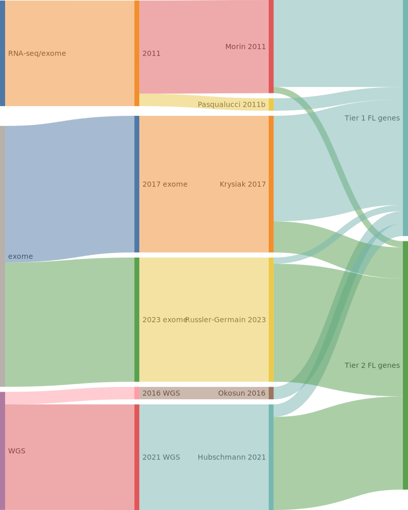

## Origins of FL genes

## Tier 1 FL genes

### *66 total*

|Gene|Tier| First FL evidence | Other entities |
|:-:|:-:|:--|:-|
|[ACTB](ACTB)|1, aSHM||[@wienandGenomicAnalysesFlowsorted2019b; @lohrDiscoveryPrioritizationSomatic2012a]|
|[ARID1A](ARID1A)|1|[Krysiak et al](papers/krysiakRecurrentSomaticMutations2017b)[@krysiakRecurrentSomaticMutations2017b]|[@rossiCodingGenomeSplenic2012c; @zhangGeneticHeterogeneityDiffuse2013; @wienandGenomicAnalysesFlowsorted2019b; @loveGeneticLandscapeMutations2012]|
|[ATP6AP1](ATP6AP1)|1|[Okosun et al](papers/okosunRecurrentMTORC1activatingRRAGC2016a)[@okosunRecurrentMTORC1activatingRRAGC2016a]||
|[ATP6V1B2](ATP6V1B2)|1|[Okosun et al](papers/okosunRecurrentMTORC1activatingRRAGC2016a)[@okosunRecurrentMTORC1activatingRRAGC2016a]||
|[B2M](B2M)|1|[Morin et al](papers/morinFrequentMutationHistonemodifying2011)[@morinFrequentMutationHistonemodifying2011]|[@reichelFlowSortingExome2015a; @pararajalingamCodingNoncodingDrivers2020]|
|[BCL2](BCL2)|1, aSHM|[Morin et al](papers/morinFrequentMutationHistonemodifying2011)[@morinFrequentMutationHistonemodifying2011]|[@sarkozyMutationalLandscapeGray2021a; @tanakaFrequentIncidenceSomatic1992; @burkhardtClinicalRelevanceMolecular2022b]|
|[BCL6](BCL6)|1, aSHM||[@loveGeneticLandscapeMutations2012; @morinFrequentMutationHistonemodifying2011]|
|[BCL7A](BCL7A)|1, aSHM|[Krysiak et al](papers/krysiakRecurrentSomaticMutations2017b)[@krysiakRecurrentSomaticMutations2017b]|[@reichelFlowSortingExome2015a; @grandeGenomewideDiscoverySomatic2019; @arthurGenomewideDiscoverySomatic2018]|
|[BIRC6](BIRC6)|1||[@sarkozyMutationalLandscapeGray2021a; @reddyGeneticFunctionalDrivers2017]|
|[BTG1](BTG1)|1, aSHM||[@burkhardtClinicalRelevanceMolecular2022b; @morinFrequentMutationHistonemodifying2011; @sarkozyMutationalLandscapeGray2021a]|
|[BTG2](BTG2)|1, aSHM|[Morin et al](papers/morinFrequentMutationHistonemodifying2011)[@morinFrequentMutationHistonemodifying2011]|[@loveGeneticLandscapeMutations2012]|
|[BTK](BTK)|1|[Krysiak et al](papers/krysiakRecurrentSomaticMutations2017b)[@krysiakRecurrentSomaticMutations2017b]|[@albuquerqueEnhancingKnowledgeDiscovery2017a]|
|[CARD11](CARD11)|1|[Morin et al](papers/morinFrequentMutationHistonemodifying2011)[@morinFrequentMutationHistonemodifying2011]|[@lenzOncogenicCARD11Mutations2008; @yanBCRTLRSignaling2012a; @wuGeneticHeterogeneityPrimary2016; @paneaWholeGenomeLandscape2019]|
|[CCND3](CCND3)|1|[Morin et al](papers/morinFrequentMutationHistonemodifying2011)[@morinFrequentMutationHistonemodifying2011]|[@richterRecurrentMutationID32012a; @deschGenotypingCirculatingTumor2020; @jalladesExomeSequencingIdentifies2017]|
|[CD83](CD83)|1, aSHM|[Russler et al](papers/russler-germainMutationsAssociatedProgression2023b)[@russler-germainMutationsAssociatedProgression2023b]|[@morinMutationalStructuralAnalysis2013; @dunsCharacterizationDLBCLPMBL2021b; @paneaWholeGenomeLandscape2019]|
|[CREBBP](CREBBP)|1|[Pasqualucci et al](papers/pasqualucciInactivatingMutationsAcetyltransferase2011a)[@pasqualucciInactivatingMutationsAcetyltransferase2011a]|[@dunsCharacterizationDLBCLPMBL2021b; @loveGeneticLandscapeMutations2012; @parryWholeExomeSequencing2013]|
|[CTSS](CTSS)|1|[Bararia et al](papers/barariaCathepsinAlterationsInduce2020c)[@barariaCathepsinAlterationsInduce2020c]||
|[DTX1](DTX1)|1, aSHM||[@schmitzGeneticsPathogenesisDiffuse2018a; @rossiCodingGenomeSplenic2012c; @gomezUltraDeepSequencingReveals2023; @loveGeneticLandscapeMutations2012]|
|[EBF1](EBF1)|1, aSHM||[@reichelFlowSortingExome2015a; @thomasGeneticSubgroupsInform2023; @bohleRoleEarlyBcell2013]|
|[EEF1A1](EEF1A1)|1|[Hubschmann et al](papers/hubschmannMutationalMechanismsShaping2021b)[@hubschmannMutationalMechanismsShaping2021b]|[@reichelFlowSortingExome2015a]|
|[EP300](EP300)|1|[Pasqualucci et al](papers/pasqualucciInactivatingMutationsAcetyltransferase2011a)[@pasqualucciInactivatingMutationsAcetyltransferase2011a]|[@paneaWholeGenomeLandscape2019; @rossiCodingGenomeSplenic2012c]|
|[EZH2](EZH2)|1|[Morin et al](papers/morinSomaticMutationsAltering2010a)[@morinSomaticMutationsAltering2010a]|[@mottokIntegrativeGenomicAnalysis2019b; @loveGeneticLandscapeMutations2012]|
|[FAS](FAS)|1||[@schollMutationsRegionFAS2007; @spinaGeneticsNodalMarginal2016b]|
|[FOXO1](FOXO1)|1|[Morin et al](papers/morinFrequentMutationHistonemodifying2011)[@morinFrequentMutationHistonemodifying2011]|[@schmitzBurkittLymphomaPathogenesis2012; @dunsCharacterizationDLBCLPMBL2021b]|
|[GNA13](GNA13)|1|[Morin et al](papers/morinFrequentMutationHistonemodifying2011)[@morinFrequentMutationHistonemodifying2011]|[@reichelFlowSortingExome2015a; @loveGeneticLandscapeMutations2012]|
|[GNAI2](GNAI2)|1||[@morinMutationalStructuralAnalysis2013; @grandeGenomewideDiscoverySomatic2019]|
|[HIST1H1B](HIST1H1B)|1, aSHM|[Krysiak et al](papers/krysiakRecurrentSomaticMutations2017b)[@krysiakRecurrentSomaticMutations2017b]|[@chapuyMolecularSubtypesDiffuse2018b; @sarkozyMutationalLandscapeGray2021a]|
|[HIST1H1C](HIST1H1C)|1, aSHM|[Morin et al](papers/morinFrequentMutationHistonemodifying2011)[@morinFrequentMutationHistonemodifying2011]|[@paneaWholeGenomeLandscape2019]|
|[HIST1H1D](HIST1H1D)|1, aSHM|[Krysiak et al](papers/krysiakRecurrentSomaticMutations2017b)[@krysiakRecurrentSomaticMutations2017b]|[@morinMutationalStructuralAnalysis2013; @jalladesExomeSequencingIdentifies2017]|
|[HIST1H1E](HIST1H1E)|1, aSHM|[Krysiak et al](papers/krysiakRecurrentSomaticMutations2017b)[@krysiakRecurrentSomaticMutations2017b]|[@grandeGenomewideDiscoverySomatic2019; @reichelFlowSortingExome2015a; @lohrDiscoveryPrioritizationSomatic2012a]|
|[HIST1H2AC](HIST1H2AC)|1, aSHM|[Krysiak et al](papers/krysiakRecurrentSomaticMutations2017b)[@krysiakRecurrentSomaticMutations2017b]|[@morinMutationalStructuralAnalysis2013]|
|[HIST1H2AG](HIST1H2AG)|1, aSHM|[Krysiak et al](papers/krysiakRecurrentSomaticMutations2017b)[@krysiakRecurrentSomaticMutations2017b]|[@paneaWholeGenomeLandscape2019; @rossiCodingGenomeSplenic2012c; @morinMutationalStructuralAnalysis2013]|
|[HIST1H2AM](HIST1H2AM)|1, aSHM|[Krysiak et al](papers/krysiakRecurrentSomaticMutations2017b)[@krysiakRecurrentSomaticMutations2017b]|[@paneaWholeGenomeLandscape2019]|
|[HIST1H2BC](HIST1H2BC)|1, aSHM|[Krysiak et al](papers/krysiakRecurrentSomaticMutations2017b)[@krysiakRecurrentSomaticMutations2017b]|[@mottokIntegrativeGenomicAnalysis2019b; @lohrDiscoveryPrioritizationSomatic2012a]|
|[HIST1H2BD](HIST1H2BD)|1, aSHM|[Krysiak et al](papers/krysiakRecurrentSomaticMutations2017b)[@krysiakRecurrentSomaticMutations2017b]||
|[HIST1H2BG](HIST1H2BG)|1, aSHM|[Krysiak et al](papers/krysiakRecurrentSomaticMutations2017b)[@krysiakRecurrentSomaticMutations2017b]||
|[HIST1H3B](HIST1H3B)|1, aSHM||[@lohrDiscoveryPrioritizationSomatic2012a; @reichelFlowSortingExome2015a]|
|[HIST1H3G](HIST1H3G)|1, aSHM|[Krysiak et al](papers/krysiakRecurrentSomaticMutations2017b)[@krysiakRecurrentSomaticMutations2017b]||
|[HVCN1](HVCN1)|1|[Krysiak et al](papers/krysiakRecurrentSomaticMutations2017b)[@krysiakRecurrentSomaticMutations2017b]||
|[IRF4](IRF4)|1, aSHM||[@morinFrequentMutationHistonemodifying2011; @mottokIntegrativeGenomicAnalysis2019b]|
|[IRF8](IRF8)|1, aSHM|[Morin et al](papers/morinFrequentMutationHistonemodifying2011)[@morinFrequentMutationHistonemodifying2011]|[@mottokIntegrativeGenomicAnalysis2019b; @paneaWholeGenomeLandscape2019]|
|[ITPKB](ITPKB)|1, aSHM||[@schmitzGeneticsPathogenesisDiffuse2018a; @reichelFlowSortingExome2015a]|
|[KLF2](KLF2)|1, aSHM||[@pasqualucciAnalysisCodingGenome2011; @jalladesExomeSequencingIdentifies2017; @deschGenotypingCirculatingTumor2020]|
|[KLHL6](KLHL6)|1, aSHM|[Morin et al](papers/morinFrequentMutationHistonemodifying2011)[@morinFrequentMutationHistonemodifying2011]|[@paneaWholeGenomeLandscape2019; @ganapathiGeneticLandscapeDural2016]|
|[KMT2D](KMT2D)|1|[Morin et al](papers/morinFrequentMutationHistonemodifying2011)[@morinFrequentMutationHistonemodifying2011]|[@grandeGenomewideDiscoverySomatic2019; @rossiCodingGenomeSplenic2012c; @deschGenotypingCirculatingTumor2020; @beaLandscapeSomaticMutations2013]|
|[LTB](LTB)|1, aSHM||[@chapuyMolecularSubtypesDiffuse2018b; @paneaWholeGenomeLandscape2019; @deschGenotypingCirculatingTumor2020]|
|[MAP2K1](MAP2K1)|1|[Louissaint et al](papers/louissaintPediatrictypeNodalFollicular2016a)[@louissaintPediatrictypeNodalFollicular2016a]|[@shinBRAFV600EMAP2K12015]|
|[MEF2B](MEF2B)|1, aSHM|[Morin et al](papers/morinFrequentMutationHistonemodifying2011)[@morinFrequentMutationHistonemodifying2011]|[@beaLandscapeSomaticMutations2013]|
|[MEF2C](MEF2C)|1, aSHM||[@arthurGenomewideDiscoverySomatic2018]|
|[PCLO](PCLO)|1||[@lohrDiscoveryPrioritizationSomatic2012a]|
|[PIM1](PIM1)|1, aSHM||[@dunsCharacterizationDLBCLPMBL2021b; @burkhardtClinicalRelevanceMolecular2022b; @pasqualucciHypermutationMultipleProtooncogenes2001a]|
|[POU2AF1](POU2AF1)|1|[Krysiak et al](papers/krysiakRecurrentSomaticMutations2017b)[@krysiakRecurrentSomaticMutations2017b]||
|[POU2F2](POU2F2)|1|[Krysiak et al](papers/krysiakRecurrentSomaticMutations2017b)[@krysiakRecurrentSomaticMutations2017b]|[@lohrDiscoveryPrioritizationSomatic2012a]|
|[PTPRD](PTPRD)|1||[@spinaGeneticsNodalMarginal2016b]|
|[RRAGC](RRAGC)|1||[@okosunRecurrentMTORC1activatingRRAGC2016a]|
|[S1PR2](S1PR2)|1, aSHM||[@morinFrequentMutationHistonemodifying2011; @muppidiLossSignalingGa132014b]|
|[SGK1](SGK1)|1, aSHM|[Morin et al](papers/morinFrequentMutationHistonemodifying2011)[@morinFrequentMutationHistonemodifying2011]|[@dunsCharacterizationDLBCLPMBL2021b]|
|[SMARCA4](SMARCA4)|1|[Krysiak et al](papers/krysiakRecurrentSomaticMutations2017b)[@krysiakRecurrentSomaticMutations2017b]|[@nadeuGenomicEpigenomicInsights2020b; @lohrDiscoveryPrioritizationSomatic2012a; @richterRecurrentMutationID32012a]|
|[SOCS1](SOCS1)|1, aSHM||[@morinFrequentMutationHistonemodifying2011; @wenigerMutationsTumorSuppressor2006a]|
|[STAT6](STAT6)|1|[Yildiz et al](papers/yildizActivatingSTAT6Mutations2015c)[@yildizActivatingSTAT6Mutations2015c]|[@ritzRecurrentMutationsSTAT62009a]|
|[TBL1XR1](TBL1XR1)|1||[@rossiCodingGenomeSplenic2012c; @lohrDiscoveryPrioritizationSomatic2012a]|
|[TMSB4X](TMSB4X)|1, aSHM||[@albuquerqueEnhancingKnowledgeDiscovery2017a]|
|[TNFAIP3](TNFAIP3)|1||[@compagnoMutationsMultipleGenes2009a; @rossiAlterationBIRC3Multiple2011a; @schmitzTNFAIP3A20Tumor2009a]|
|[TNFRSF14](TNFRSF14)|1|[Cheung et al](papers/cheungAcquiredTNFRSF14Mutations2010a)[@cheungAcquiredTNFRSF14Mutations2010a]|[@morinFrequentMutationHistonemodifying2011; @spinaGeneticsNodalMarginal2016b]|
|[TP53](TP53)|1|[Morin et al](papers/morinFrequentMutationHistonemodifying2011)[@morinFrequentMutationHistonemodifying2011]|[@wildaInactivationARFMDM2p53Pathway2004; @beaLandscapeSomaticMutations2013; @tiacciPervasiveMutationsJAKSTAT2018b; @lohrDiscoveryPrioritizationSomatic2012a; @rossiCodingGenomeSplenic2012c]|
|[VMA21](VMA21)|1|[Hubschmann et al](papers/hubschmannMutationalMechanismsShaping2021b)[@hubschmannMutationalMechanismsShaping2021b]||

## Tier 2 FL genes

### *50 total*

|Gene|Tier| First FL evidence | Other entities |
|:-:|:-:|:--|:-|
|[ABL2](ABL2)|2|[Russler et al](papers/russler-germainMutationsAssociatedProgression2023b)[@russler-germainMutationsAssociatedProgression2023b]||
|[ACTG1](ACTG1)|2, aSHM|[Hubschmann et al](papers/hubschmannMutationalMechanismsShaping2021b)[@hubschmannMutationalMechanismsShaping2021b]|[@spinaGeneticsNodalMarginal2016b; @deschGenotypingCirculatingTumor2020]|
|[ATP6V1A](ATP6V1A)|2|[Hubschmann et al](papers/hubschmannMutationalMechanismsShaping2021b)[@hubschmannMutationalMechanismsShaping2021b]||
|[BCL10](BCL10)|2|[Russler et al](papers/russler-germainMutationsAssociatedProgression2023b)[@russler-germainMutationsAssociatedProgression2023b]|[@morinFrequentMutationHistonemodifying2011; @spinaGeneticsNodalMarginal2016b]|
|[CD70](CD70)|2|[Russler et al](papers/russler-germainMutationsAssociatedProgression2023b)[@russler-germainMutationsAssociatedProgression2023b]|[@morinFrequentMutationHistonemodifying2011]|
|[CD79B](CD79B)|2||[@morinFrequentMutationHistonemodifying2011; @paneaWholeGenomeLandscape2019]|
|[CDC42BPB](CDC42BPB)|2|[Hubschmann et al](papers/hubschmannMutationalMechanismsShaping2021b)[@hubschmannMutationalMechanismsShaping2021b]|[@spinaGeneticsNodalMarginal2016b]|
|[CILP](CILP)|2|[Russler et al](papers/russler-germainMutationsAssociatedProgression2023b)[@russler-germainMutationsAssociatedProgression2023b]||
|[CPNE8](CPNE8)|2|[Hubschmann et al](papers/hubschmannMutationalMechanismsShaping2021b)[@hubschmannMutationalMechanismsShaping2021b]||
|[CXCR4](CXCR4)|2, aSHM|[Krysiak et al](papers/krysiakRecurrentSomaticMutations2017b)[@krysiakRecurrentSomaticMutations2017b]|[@khodabakhshiRecurrentTargetsAberrant2012; @paneaWholeGenomeLandscape2019]|
|[CYP2A6](CYP2A6)|2|[Russler et al](papers/russler-germainMutationsAssociatedProgression2023b)[@russler-germainMutationsAssociatedProgression2023b]||
|[DDX3X](DDX3X)|2||[@schmitzBurkittLymphomaPathogenesis2012; @mottokIntegrativeGenomicAnalysis2019b; @schmitzGeneticsPathogenesisDiffuse2018a]|
|[DHX15](DHX15)|2|[Hubschmann et al](papers/hubschmannMutationalMechanismsShaping2021b)[@hubschmannMutationalMechanismsShaping2021b]||
|[DUSP2](DUSP2)|2, aSHM||[@dunsCharacterizationDLBCLPMBL2021b; @lohrDiscoveryPrioritizationSomatic2012a]|
|[EGR1](EGR1)|2|[Krysiak et al](papers/krysiakRecurrentSomaticMutations2017b)[@krysiakRecurrentSomaticMutations2017b]|[@reichelFlowSortingExome2015a; @rossiCodingGenomeSplenic2012c]|
|[FZR1](FZR1)|2|[Hubschmann et al](papers/hubschmannMutationalMechanismsShaping2021b)[@hubschmannMutationalMechanismsShaping2021b]||
|[GBP7](GBP7)|2|[Russler et al](papers/russler-germainMutationsAssociatedProgression2023b)[@russler-germainMutationsAssociatedProgression2023b]||
|[GRM6](GRM6)|2|[Russler et al](papers/russler-germainMutationsAssociatedProgression2023b)[@russler-germainMutationsAssociatedProgression2023b]||
|[HIST1H2BM](HIST1H2BM)|2, aSHM|[Krysiak et al](papers/krysiakRecurrentSomaticMutations2017b)[@krysiakRecurrentSomaticMutations2017b]||
|[HIST1H3I](HIST1H3I)|2, aSHM|[Krysiak et al](papers/krysiakRecurrentSomaticMutations2017b)[@krysiakRecurrentSomaticMutations2017b]|[@paneaWholeGenomeLandscape2019]|
|[HLA-B](HLA-B)|2||[@lohrDiscoveryPrioritizationSomatic2012a; @wienandGenomicAnalysesFlowsorted2019b]|
|[HNRNPD](HNRNPD)|2|||
|[IGLL5](IGLL5)|2, aSHM|[Russler et al](papers/russler-germainMutationsAssociatedProgression2023b)[@russler-germainMutationsAssociatedProgression2023b]|[@deschGenotypingCirculatingTumor2020; @paneaWholeGenomeLandscape2019]|
|[JUP](JUP)|2|[Hubschmann et al](papers/hubschmannMutationalMechanismsShaping2021b)[@hubschmannMutationalMechanismsShaping2021b]||
|[KIR3DL1](KIR3DL1)|2|[Russler et al](papers/russler-germainMutationsAssociatedProgression2023b)[@russler-germainMutationsAssociatedProgression2023b]||
|[LAPTM5](LAPTM5)|2|[Hubschmann et al](papers/hubschmannMutationalMechanismsShaping2021b)[@hubschmannMutationalMechanismsShaping2021b]||
|[MAGEC1](MAGEC1)|2|[Russler et al](papers/russler-germainMutationsAssociatedProgression2023b)[@russler-germainMutationsAssociatedProgression2023b]||
|[MAP7D1](MAP7D1)|2|[Russler et al](papers/russler-germainMutationsAssociatedProgression2023b)[@russler-germainMutationsAssociatedProgression2023b]||
|[MGEA5](MGEA5)|2|[Hubschmann et al](papers/hubschmannMutationalMechanismsShaping2021b)[@hubschmannMutationalMechanismsShaping2021b]||
|[MKI67](MKI67)|2|[Russler et al](papers/russler-germainMutationsAssociatedProgression2023b)[@russler-germainMutationsAssociatedProgression2023b]|[@schmitzBurkittLymphomaPathogenesis2012]|
|[MYC](MYC)|2, aSHM||[@johnstonCmycHypermutationBurkitt1992; @jalladesExomeSequencingIdentifies2017; @dunsCharacterizationDLBCLPMBL2021b; @pasqualucciHypermutationMultipleProtooncogenes2001a]|
|[MYCBP2](MYCBP2)|2|[Hubschmann et al](papers/hubschmannMutationalMechanismsShaping2021b)[@hubschmannMutationalMechanismsShaping2021b]||
|[MYD88](MYD88)|2||[@yanBCRTLRSignaling2012a; @ngoOncogenicallyActiveMYD882011a]|
|[NFKBIA](NFKBIA)|2|[Russler et al](papers/russler-germainMutationsAssociatedProgression2023b)[@russler-germainMutationsAssociatedProgression2023b]|[@lakeMutationsNFKBIAEncoding2009; @wienandGenomicAnalysesFlowsorted2019b]|
|[OR8H2](OR8H2)|2|[Russler et al](papers/russler-germainMutationsAssociatedProgression2023b)[@russler-germainMutationsAssociatedProgression2023b]||
|[P2RY8](P2RY8)|2||[@muppidiLossSignalingGa132014b; @lohrDiscoveryPrioritizationSomatic2012a]|
|[PDS5B](PDS5B)|2|[Hubschmann et al](papers/hubschmannMutationalMechanismsShaping2021b)[@hubschmannMutationalMechanismsShaping2021b]|[@morinMutationalStructuralAnalysis2013]|
|[PPP4C](PPP4C)|2|[Hubschmann et al](papers/hubschmannMutationalMechanismsShaping2021b)[@hubschmannMutationalMechanismsShaping2021b]||
|[PRKDC](PRKDC)|2|[Hubschmann et al](papers/hubschmannMutationalMechanismsShaping2021b)[@hubschmannMutationalMechanismsShaping2021b]|[@schmitzGeneticsPathogenesisDiffuse2018a]|
|[PZP](PZP)|2|[Russler et al](papers/russler-germainMutationsAssociatedProgression2023b)[@russler-germainMutationsAssociatedProgression2023b]||
|[RBM6](RBM6)|2|[Hubschmann et al](papers/hubschmannMutationalMechanismsShaping2021b)[@hubschmannMutationalMechanismsShaping2021b]||
|[SESN1](SESN1)|2|[Oricchio et al](papers/oricchioGeneticEpigeneticInactivation2017b)[@oricchioGeneticEpigeneticInactivation2017b]||
|[SHROOM3](SHROOM3)|2|[Russler et al](papers/russler-germainMutationsAssociatedProgression2023b)[@russler-germainMutationsAssociatedProgression2023b]||
|[SRRM2](SRRM2)|2|[Russler et al](papers/russler-germainMutationsAssociatedProgression2023b)[@russler-germainMutationsAssociatedProgression2023b]|[@morinMutationalStructuralAnalysis2013]|
|[STAB2](STAB2)|2|[Russler et al](papers/russler-germainMutationsAssociatedProgression2023b)[@russler-germainMutationsAssociatedProgression2023b]||
|[TMEM30A](TMEM30A)|2|[Morin et al](papers/morinFrequentMutationHistonemodifying2011)[@morinFrequentMutationHistonemodifying2011]||
|[TPP1](TPP1)|2|[Hubschmann et al](papers/hubschmannMutationalMechanismsShaping2021b)[@hubschmannMutationalMechanismsShaping2021b]||
|[XIRP2](XIRP2)|2|[Russler et al](papers/russler-germainMutationsAssociatedProgression2023b)[@russler-germainMutationsAssociatedProgression2023b]||
|[ZC3H12A](ZC3H12A)|2||[@arthurGenomewideDiscoverySomatic2018]|
|[ZNF608](ZNF608)|2|[Krysiak et al](papers/krysiakRecurrentSomaticMutations2017b)[@krysiakRecurrentSomaticMutations2017b]|[@zhangGeneticHeterogeneityDiffuse2013]|

# References
