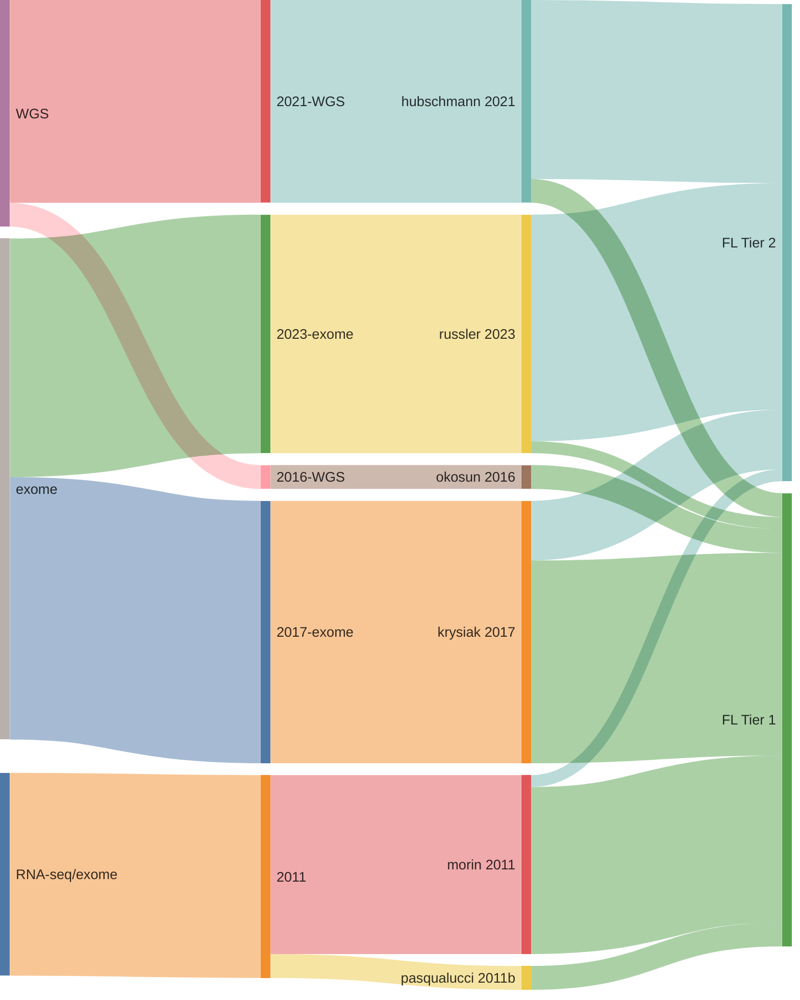

```mermaid


---
config:
  sankey:
    showValues: false
    linkColor: target
    width: 800
    height: 1000
    nodeAlignment: right
---
sankey-beta

RNA-seq/exome, 2011, 17
2011, morin 2011, 15
morin 2011, FL Tier 2, 1
morin 2011, FL Tier 1, 14
2011, pasqualucci 2011b, 2
pasqualucci 2011b, FL Tier 1, 2

WGS, 2016-WGS, 2
2016-WGS, okosun 2016, 2
okosun 2016, FL Tier 1, 2

exome, 2017-exome, 22
2017-exome, krysiak 2017, 22
krysiak 2017, FL Tier 2, 5
krysiak 2017, FL Tier 1, 17

WGS, 2021-WGS, 17
2021-WGS, hubschmann 2021, 17
hubschmann 2021, FL Tier 2, 15
hubschmann 2021, FL Tier 1, 2

exome, 2023-exome, 20
2023-exome, russler 2023, 20
russler 2023, FL Tier 1, 1
russler 2023, FL Tier 2, 19

```