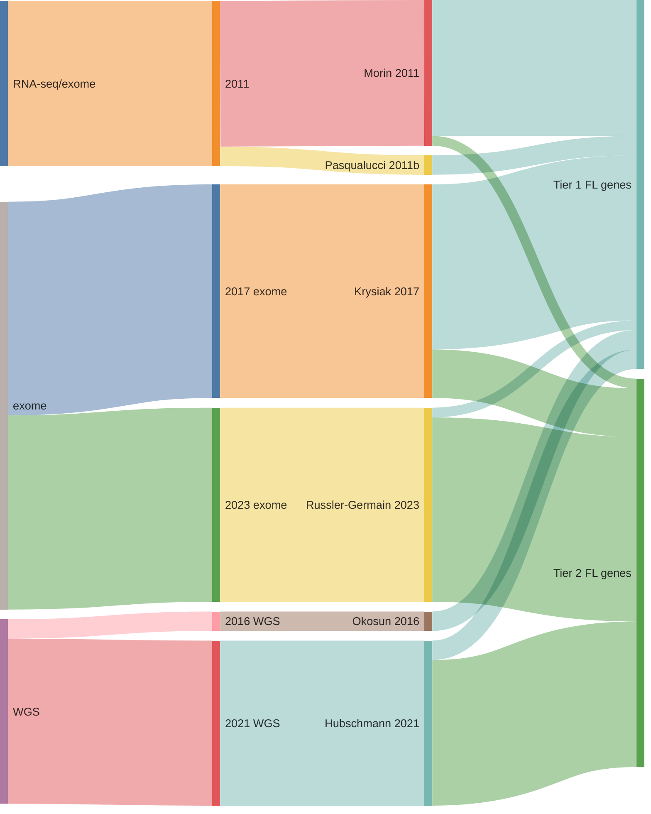

```mermaid


---
config:
  sankey:
    showValues: false
    linkColor: target
    width: 800
    height: 1000
    nodeAlignment: right
---
sankey-beta

RNA-seq/exome, 2011, 17
2011, Morin 2011, 15
Morin 2011, Tier 1 FL genes, 14
Morin 2011, Tier 2 FL genes, 1
2011, Pasqualucci 2011b, 2
Pasqualucci 2011b, Tier 1 FL genes, 2

WGS, 2016 WGS, 2
2016 WGS, Okosun 2016, 2
Okosun 2016, Tier 1 FL genes, 2

exome, 2017 exome, 22
2017 exome, Krysiak 2017, 22
Krysiak 2017, Tier 2 FL genes, 5
Krysiak 2017, Tier 1 FL genes, 17

WGS, 2021 WGS, 17
2021 WGS, Hubschmann 2021, 17
Hubschmann 2021, Tier 2 FL genes, 15
Hubschmann 2021, Tier 1 FL genes, 2

exome, 2023 exome, 20
2023 exome, Russler-Germain 2023, 20
Russler-Germain 2023, Tier 1 FL genes, 1
Russler-Germain 2023, Tier 2 FL genes, 19

```