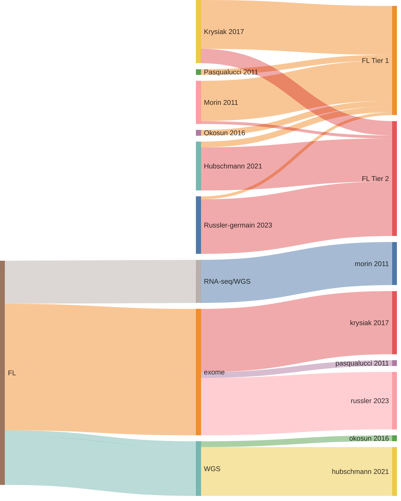

```mermaid
---
config:
  sankey:
    showValues: false
    linkColor: target
    width: 800
    height: 1000
    nodeAlignment: right
---
sankey-beta
Russler-germain 2023, FL Tier 1, 1
Russler-germain 2023, FL Tier 2, 19
Hubschmann 2021, FL Tier 1, 2
Hubschmann 2021, FL Tier 2, 15
Pasqualucci 2011, FL Tier 1, 2
Krysiak 2017, FL Tier 1, 17
Krysiak 2017, FL Tier 2, 5
Okosun 2016, FL Tier 1, 2
Morin 2011, FL Tier 1, 14
Morin 2011, FL Tier 2, 1
FL, RNA-seq/WGS, 15
RNA-seq/WGS, morin 2011, 15
FL, exome, 22
exome, krysiak 2017, 22
FL, WGS, 2
WGS, okosun 2016, 2
FL, WGS, 17
WGS, hubschmann 2021, 17
FL, exome, 2
exome, pasqualucci 2011, 2
FL, exome, 20
exome, russler 2023, 20
```
