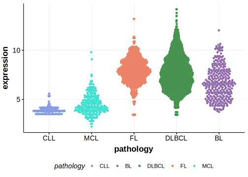

[[_TOC_]]

## Relevance tier by entity

|Entity|Tier|Description                              |
|:------:|:----:|-----------------------------------------|
| |2   |relevance in DLBCL not firmly established[@morinMutationalStructuralAnalysis2013]|

## Mutation incidence in large patient cohorts (GAMBL reanalysis)

|Entity|source        |frequency (%)|
|:------:|:--------------:|:-------------:|
|DLBCL |GAMBL genomes |2.10         |
|DLBCL |Schmitz cohort|5.32         |
|DLBCL |Reddy cohort  |2.80         |
|DLBCL |Chapuy cohort |2.56         |

## Mutation pattern and selective pressure estimates

[[include:dnds_FNDC1.md]]

[[include:browser_FNDC1.md]]

## Expression

<!-- ORIGIN: morinMutationalStructuralAnalysis2013 -->
<!-- DLBCL: morinMutationalStructuralAnalysis2013 -->

## All Mutations

[RG049](https://www.bcgsc.ca/downloads/morinlab/GAMBL/Morin_2013/RG049.html)
[RG081](https://www.bcgsc.ca/downloads/morinlab/GAMBL/Morin_2013/RG081.html)

[[include:mermaid_FNDC1.md]]

## References

