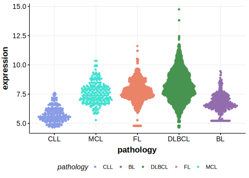

[[_TOC_]]

## Overview
FOXC1 is a transcription factor that regulates genes involved in cell growth, differentiation, and survival. While specific data on FOXC1 mutations in DLBCL are currently limited, the functional role of FOXC1 in transcription regulation and its involvement in other cancers suggest that it could play a significant role in lymphoma pathogenesis. Further research is needed to explore the implications of FOXC1 mutations in DLBCL and other B-cell lymphomas. The rate of FOXC1 varies across studies and was high in only one cohort.[@schmitzGeneticsPathogenesisDiffuse2018] Owing to this, the actual prevalence in DLBCL remains unclear and should be studied further. *Without further support, this gene may be migrated to Tier 2.* 

## Relevance tier by entity

[[include:tables/table1_FOXC1.md]]

## Mutation incidence in large patient cohorts (GAMBL reanalysis)

|Entity|source        |frequency (%)|
|:------:|:--------------:|:-------------:|
|DLBCL |GAMBL genomes |0.96         |
|DLBCL |Schmitz cohort|4.47         |
|DLBCL |Reddy cohort  |1.20         |
|DLBCL |Chapuy cohort |0.85         |

## Mutation pattern and selective pressure estimates

[[include:tables/dnds_FOXC1.md]]

[[include:browser_FOXC1.md]]

## Expression

[[include:tables/mermaid_FOXC1.md]]

## References

<!-- FLAGGED FOR TIER 2 -->
<!-- ORIGIN: schmitzGeneticsPathogenesisDiffuse2018a -->
<!-- DLBCL: schmitzGeneticsPathogenesisDiffuse2018a -->
