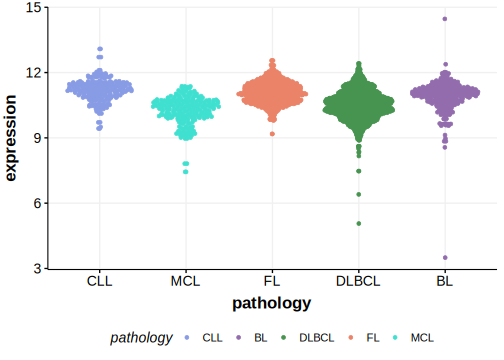

[[_TOC_]]

## Overview
Mutations in the FOXO1 gene, which encodes a member of the forkhead family of transcription factors, play a significant role in diffuse large B-cell lymphoma (DLBCL). Mutations primarily occur in the first exon, with significant portions affecting the N-terminal region and the Forkhead DNA binding domain.[@trinhAnalysisFOXO1Mutations]  These mutations are common in DLBCL, BL and, to a lesser extent, FL.[@schmitzBurkittLymphomaPathogenesis2012; @morinFrequentMutationHistonemodifying2011] FOXO1 mutations can contribute to resistance to certain therapies, such as anti-CD20-based immunotherapies, by repressing MS4A1 (CD20) expression.[@pyrzynskaFOXO1PromotesResistance2018] 

## Experimental Evidence

Driver mutations affecting this gene in FL/DLBCL/BL have been experimentally demonstrated to cause a gain of function (GOF).[@trinhAnalysisFOXO1Mutations]

## Relevance tier by entity

[[include:table1_FOXO1.md]]

## Mutation incidence in large patient cohorts (GAMBL reanalysis)

### DLBCL
[[include:DLBCL_FOXO1.md]]

### FL
[[include:FL_FOXO1.md]]

### BL
[[include:BL_FOXO1.md]]

## Mutation pattern and selective pressure estimates

[[include:dnds_FOXO1.md]]

## FOXO1 Hotspots

| Chromosome |Coordinate (hg19) | ref>alt | HGVSp | 
 | :---:| :---: | :--: | :---: |
| chr13 | 41240294 | C>T | R19Q |
| chr13 | 41240294 | C>G | R19P |
| chr13 | 41240294 | C>A | R19L |
| chr13 | 41240289 | G>C | R21G |
| chr13 | 41240289 | G>A | R21C |
| chr13 | 41240288 | C>T | R21H |
| chr13 | 41240288 | C>G | R21P |
| chr13 | 41240288 | C>A | R21L |
| chr13 | 41240286 | AG>GC | S22P |
| chr13 | 41240286 | AG>GA | S22P |
| chr13 | 41240286 | A>G | S22P |
| chr13 | 41240285 | G>C | S22W |
| chr13 | 41240281 | G>T | C23* |
| chr13 | 41240280 | T>C | T24A |
| chr13 | 41240279 | G>A | T24I |
| chr13 | 41240277 | A>G | W25R |
| chr13 | 41240275 | C>T | W25* |
| chr13 | 41240274 | G>C | P26A |
| chr13 | 41240274 | G>A | P26S |
| chr13 | 41240273 | G>A | P26L |
| chr13 | 41240271 | G>C | L27V |

[[include:browser_FOXO1.md]]

## Expression

[[include:mermaid_FOXO1.md]]

## References

<!-- ORIGIN: morinFrequentMutationHistonemodifying2011 -->
<!-- BL: schmitzBurkittLymphomaPathogenesis2012 -->
<!-- BL: schmitzBurkittLymphomaPathogenesis2012 -->
<!-- FL: morinFrequentMutationHistonemodifying2011 -->
<!-- DLBCL: morinFrequentMutationHistonemodifying2011 -->
<!-- PMBL: dunsCharacterizationDLBCLPMBL2021b -->
