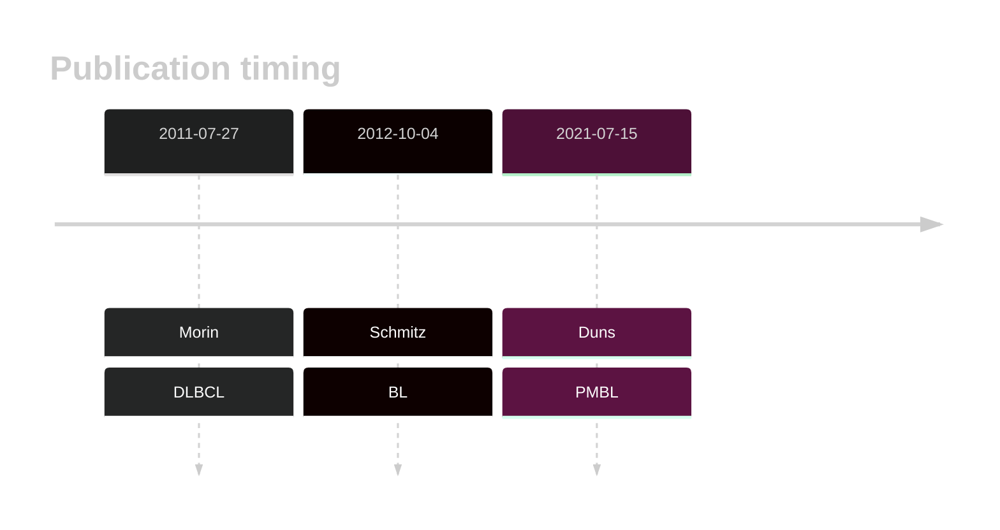

# FOXO1

## Overview
Mutations in the FOXO1 gene, which encodes a member of the forkhead family of transcription factors, play a significant role in diffuse large B-cell lymphoma (DLBCL). Mutations primarily occur in the first exon, with significant portions affecting the N-terminal region and the Forkhead DNA binding domain.1 These mutations are common in DLBCL, BL and, to a lesser extent, FL.2,3 FOXO1 mutations can contribute to resistance to certain therapies, such as anti-CD20-based immunotherapies, by repressing MS4A1 (CD20) expression.4 

## History

## Relevance tier by entity

|Entity|Tier|Description               |
|:------:|:----:|--------------------------|
||1|high-confidence MZL gene|
||2|relevance in PMBL/cHL/GZL not firmly established[@dunsCharacterizationDLBCLPMBL2021b]|
|    |1   |high-confidence BL gene   [@schmitzBurkittLymphomaPathogenesis2012]|
| |1   |high-confidence DLBCL gene[@morinFrequentMutationHistonemodifying2011]|
|    |1   |high-confidence FL gene   [@morinFrequentMutationHistonemodifying2011]|

## Mutation incidence in large patient cohorts (GAMBL reanalysis)

|Entity|source               |frequency (%)|
|:------:|:---------------------:|:-------------:|
|BL    |GAMBL genomes+capture|23.33        |
|BL    |Thomas cohort        |28.00        |
|BL    |Panea cohort         |21.80        |
|DLBCL |GAMBL genomes        |10.13        |
|DLBCL |Schmitz cohort       | 7.23        |
|DLBCL |Reddy cohort         | 2.40        |
|DLBCL |Chapuy cohort        | 2.14        |
|FL    |GAMBL genomes        |12.93        |

## Mutation pattern and selective pressure estimates

|Entity|aSHM|Significant selection|dN/dS (missense)|dN/dS (nonsense)|
|:------:|:----:|:---------------------:|:----------------:|:----------------:|
|BL    |No  |Yes                  |14.841          |  5.170         |
|DLBCL |No  |No                   | 6.936          |  0.000         |
|FL    |No  |Yes                  |18.992          |103.028         |

## FOXO1 Hotspots

| Chromosome |Coordinate (hg19) | ref>alt | HGVSp | 
 | :---:| :---: | :--: | :---: |
| chr13 | 41240294 | C>T | R19Q |
| chr13 | 41240294 | C>G | R19P |
| chr13 | 41240294 | C>A | R19L |
| chr13 | 41240289 | G>C | R21G |
| chr13 | 41240289 | G>A | R21C |
| chr13 | 41240288 | C>T | R21H |
| chr13 | 41240288 | C>G | R21P |
| chr13 | 41240288 | C>A | R21L |
| chr13 | 41240286 | AG>GC | S22P |
| chr13 | 41240286 | AG>GA | S22P |
| chr13 | 41240286 | A>G | S22P |
| chr13 | 41240285 | G>C | S22W |
| chr13 | 41240281 | G>T | C23* |
| chr13 | 41240280 | T>C | T24A |
| chr13 | 41240279 | G>A | T24I |
| chr13 | 41240277 | A>G | W25R |
| chr13 | 41240275 | C>T | W25* |
| chr13 | 41240274 | G>C | P26A |
| chr13 | 41240274 | G>A | P26S |
| chr13 | 41240273 | G>A | P26L |
| chr13 | 41240271 | G>C | L27V |

View coding variants in ProteinPaint [hg19](https://morinlab.github.io/LLMPP/GAMBL/FOXO1_protein.html)  or [hg38](https://morinlab.github.io/LLMPP/GAMBL/FOXO1_protein_hg38.html)

View all variants in GenomePaint [hg19](https://morinlab.github.io/LLMPP/GAMBL/FOXO1.html)  or [hg38](https://morinlab.github.io/LLMPP/GAMBL/FOXO1_hg38.html)

## FOXO1 Expression

## References

<!-- ORIGIN: morinFrequentMutationHistonemodifying2011 -->
<!-- BL: schmitzBurkittLymphomaPathogenesis2012 -->
<!-- BL: schmitzBurkittLymphomaPathogenesis2012 -->
<!-- FL: morinFrequentMutationHistonemodifying2011 -->
<!-- DLBCL: morinFrequentMutationHistonemodifying2011 -->
<!-- PMBL: dunsCharacterizationDLBCLPMBL2021b -->
