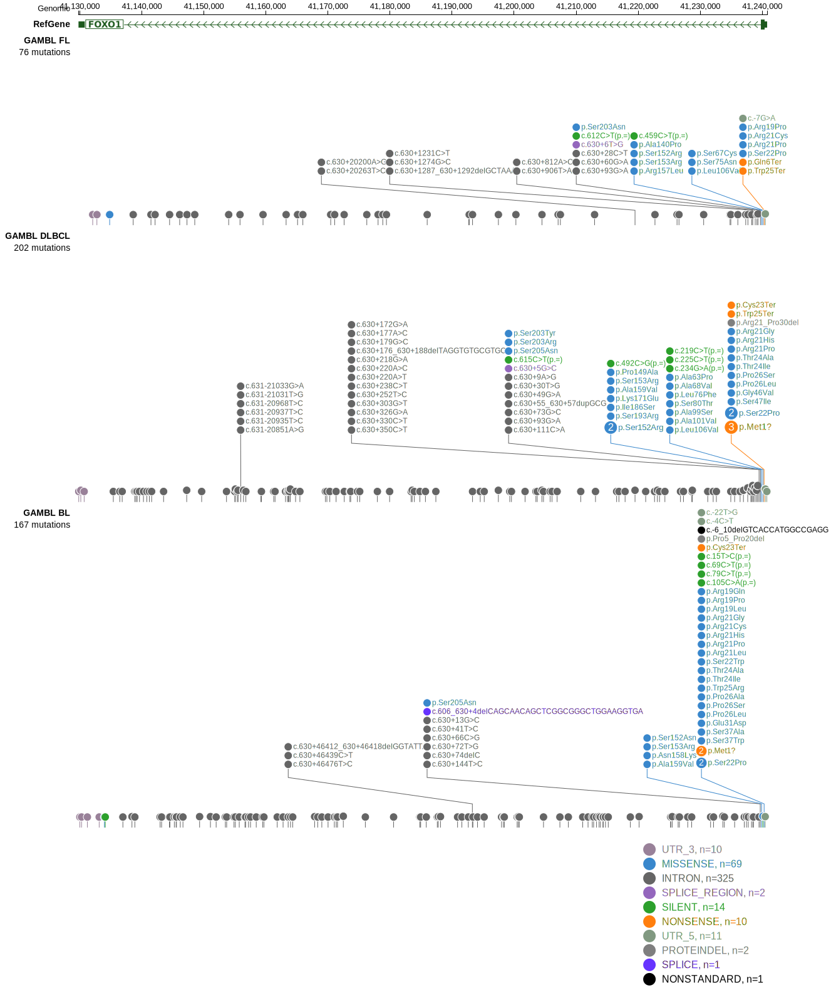

# FOXO1
## Overview
Mutations in the FOXO1 gene, which encodes a member of the forkhead family of transcription factors, play a significant role in diffuse large B-cell lymphoma (DLBCL). Mutations primarily occur in the first exon, with significant portions affecting the N-terminal region and the Forkhead DNA binding domain.1 These mutations are common in DLBCL, BL and, to a lesser extent, FL.2,3 FOXO1 mutations can contribute to resistance to certain therapies, such as anti-CD20-based immunotherapies, by repressing MS4A1 (CD20) expression.4 

## Relevance tier by entity

|Entity|Tier|Description               |
|:------:|:----:|--------------------------|
|BL    |1   |high-confidence BL gene   |
|DLBCL |1   |high-confidence DLBCL gene|
|FL    |1   |high-confidence FL gene   |

## Mutation incidence in large patient cohorts (GAMBL reanalysis)

|Entity|source               |frequency (%)|
|:------:|:---------------------:|:-------------:|
|BL    |GAMBL genomes+capture|23.33        |
|BL    |Thomas cohort        |28.00        |
|BL    |Panea cohort         |21.80        |
|DLBCL |GAMBL genomes        |10.13        |
|DLBCL |Schmitz cohort       | 7.23        |
|DLBCL |Reddy cohort         | 2.40        |
|DLBCL |Chapuy cohort        | 2.14        |
|FL    |GAMBL genomes        |12.93        |

## Mutation pattern and selective pressure estimates

|Entity|aSHM|Significant selection|dN/dS (missense)|dN/dS (nonsense)|
|:------:|:----:|:---------------------:|:----------------:|:----------------:|
|BL    |No  |Yes                  |14.841          |  5.170         |
|DLBCL |No  |No                   | 6.936          |  0.000         |
|FL    |No  |Yes                  |18.992          |103.028         |

> [!NOTE]
> First described in BL in 2012 by [Schmitz R](https://pubmed.ncbi.nlm.nih.gov/22885699). First described in DLBCL in 2011 by [Morin RD](https://pubmed.ncbi.nlm.nih.gov/21796119). First described in FL in 2011 by [Morin RD](https://pubmed.ncbi.nlm.nih.gov/21796119)

 ## FOXO1 Hotspots

| Chromosome |Coordinate (hg19) | ref>alt | HGVSp | 
 | :---:| :---: | :--: | :---: |
| chr13 | 41240294 | C>T | R19Q |
| chr13 | 41240294 | C>G | R19P |
| chr13 | 41240294 | C>A | R19L |
| chr13 | 41240289 | G>C | R21G |
| chr13 | 41240289 | G>A | R21C |
| chr13 | 41240288 | C>T | R21H |
| chr13 | 41240288 | C>G | R21P |
| chr13 | 41240288 | C>A | R21L |
| chr13 | 41240286 | AG>GC | S22P |
| chr13 | 41240286 | AG>GA | S22P |
| chr13 | 41240286 | A>G | S22P |
| chr13 | 41240285 | G>C | S22W |
| chr13 | 41240281 | G>T | C23* |
| chr13 | 41240280 | T>C | T24A |
| chr13 | 41240279 | G>A | T24I |
| chr13 | 41240277 | A>G | W25R |
| chr13 | 41240275 | C>T | W25* |
| chr13 | 41240274 | G>C | P26A |
| chr13 | 41240274 | G>A | P26S |
| chr13 | 41240273 | G>A | P26L |
| chr13 | 41240271 | G>C | L27V |

View coding variants in ProteinPaint [hg19](https://morinlab.github.io/LLMPP/GAMBL/FOXO1_protein.html)  or [hg38](https://morinlab.github.io/LLMPP/GAMBL/FOXO1_protein_hg38.html)

View all variants in GenomePaint [hg19](https://morinlab.github.io/LLMPP/GAMBL/FOXO1.html)  or [hg38](https://morinlab.github.io/LLMPP/GAMBL/FOXO1_hg38.html)

## References
1. *Trinh, D., Scott, D., Morin, R., Méndez-Lago, M., An, J., Jones, S., Mungall, A., Zhao, Y., Schein, J., Steidl, C., Connors, J., Gascoyne, R., & Marra, M. (2013). Analysis of FOXO1 mutations in diffuse large B-cell lymphoma.. Blood, 121 18, 3666-74 . https://doi.org/10.1182/blood-2013-01-479865.*
2. *Zhou, P., Blain, A., Newman, A., Zaka, M., Chagaluka, G., Adlar, F., Offor, U., Broadbent, C., Chaytor, L., Whitehead, A., Hall, A., O'Connor, H., Noorden, S., Lampert, I., Bailey, S., Molyneux, E., Bacon, C., Bomken, S., & Rand, V. (2019). Sporadic and endemic Burkitt lymphoma have frequent FOXO1 mutations but distinct hotspots in the AKT recognition motif.. Blood advances, 3 14, 2118-2127 . https://doi.org/10.1182/bloodadvances.2018029546.*
3. *Grande BM, Gerhard DS, Jiang A, Griner NB, Abramson JS, Alexander TB, Allen H, Ayers LW, Bethony JM, Bhatia K, Bowen J, Casper C, Choi JK, Culibrk L, Davidsen TM, Dyer MA, Gastier-Foster JM, Gesuwan P, Greiner TC, Gross TG, Hanf B, Harris NL, He Y, Irvin JD, Jaffe ES, Jones SJM, Kerchan P, Knoetze N, Leal FE, Lichtenberg TM, Ma Y, Martin JP, Martin MR, Mbulaiteye SM, Mullighan CG, Mungall AJ, Namirembe C, Novik K, Noy A, Ogwang MD, Omoding A, Orem J, Reynolds SJ, Rushton CK, Sandlund JT, Schmitz R, Taylor C, Wilson WH, Wright GW, Zhao EY, Marra MA, Morin RD, Staudt LM. Genome-wide discovery of somatic coding and noncoding mutations in pediatric endemic and sporadic Burkitt lymphoma. Blood. 2019 Mar 21;133(12):1313-1324. doi: 10.1182/blood-2018-09-871418. Epub 2019 Jan 7. PMID: 30617194; PMCID: PMC6428665.*
4. *Pyrzynska B, Dwojak M, Zerrouqi A, Morlino G, Zapala P, Miazek N, Zagozdzon A, Bojarczuk K, Bobrowicz M, Siernicka M, Machnicki MM, Gobessi S, Barankiewicz J, Lech-Maranda E, Efremov DG, Juszczynski P, Calado D, Golab J, Winiarska M. FOXO1 promotes resistance of non-Hodgkin lymphomas to anti-CD20-based therapy. Oncoimmunology. 2018 Jan 25;7(5):e1423183. doi: 10.1080/2162402X.2017.1423183. PMID: 29721381; PMCID: PMC5927521.*
5. *Morin RD, Mendez-Lago M, Mungall AJ, Goya R, Mungall KL, Corbett RD, Johnson NA, Severson TM, Chiu R, Field M, Jackman S, Krzywinski M, Scott DW, Trinh DL, Tamura-Wells J, Li S, Firme MR, Rogic S, Griffith M, Chan S, Yakovenko O, Meyer IM, Zhao EY, Smailus D, Moksa M, Chittaranjan S, Rimsza L, Brooks-Wilson A, Spinelli JJ, Ben-Neriah S, Meissner B, Woolcock B, Boyle M, McDonald H, Tam A, Zhao Y, Delaney A, Zeng T, Tse K, Butterfield Y, Birol I, Holt R, Schein J, Horsman DE, Moore R, Jones SJ, Connors JM, Hirst M, Gascoyne RD, Marra MA. Frequent mutation of histone-modifying genes in non-Hodgkin lymphoma. Nature. 2011 Jul 27;476(7360):298-303. doi: 10.1038/nature10351. PMID: 21796119; PMCID: PMC3210554.*
## FOXO1 Expression

<!-- ORIGIN: morinFrequentMutationHistonemodifying2011 -->
<!-- BL: schmitzBurkittLymphomaPathogenesis2012 -->
<!-- BL: schmitzBurkittLymphomaPathogenesis2012 -->
<!-- FL: morinFrequentMutationHistonemodifying2011 -->
<!-- DLBCL: morinFrequentMutationHistonemodifying2011 -->
