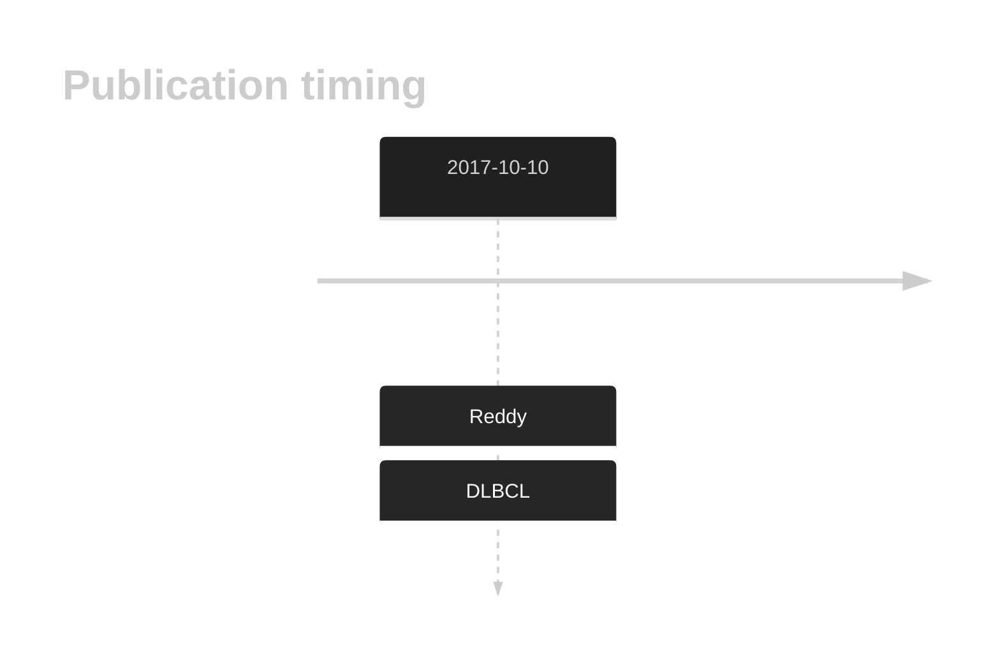

# FOXP1
## History

## Relevance tier by entity

|Entity|Tier|Description                              |
|:------:|:----:|-----------------------------------------|
| |2-a | aSHM target; Although recurrent, the relevance of mutations in DLBCL is tenuous |

## Mutation incidence in large patient cohorts (GAMBL reanalysis)

|Entity|source        |frequency (%)|
|:------:|:--------------:|:-------------:|
|DLBCL |GAMBL genomes |0.57         |
|DLBCL |Schmitz cohort|3.62         |
|DLBCL |Reddy cohort  |2.10         |
|DLBCL |Chapuy cohort |2.99         |

## Mutation pattern and selective pressure estimates

|Entity|aSHM|Significant selection|dN/dS (missense)|dN/dS (nonsense)|
|:------:|:----:|:---------------------:|:----------------:|:----------------:|
|BL    |Yes |No                   |1.218           | 9.469          |
|DLBCL |Yes |No                   |7.387           |17.777          |
|FL    |Yes |No                   |0.000           | 0.000          |

## aSHM regions

|chr_name|hg19_start|hg19_end|region                                                                                         |regulatory_comment|
|:--------:|:----------:|:--------:|:-----------------------------------------------------------------------------------------------:|:------------------:|
|chr3    |71104986  |71119518|[TSS-4](https://genome.ucsc.edu/s/rdmorin/GAMBL%20hg19?position=chr3%3A71104986%2D71119518)    |active_promoter   |
|chr3    |71176427  |71180960|[TSS-3](https://genome.ucsc.edu/s/rdmorin/GAMBL%20hg19?position=chr3%3A71176427%2D71180960)    |active_promoter   |
|chr3    |71350633  |71357665|[TSS-2](https://genome.ucsc.edu/s/rdmorin/GAMBL%20hg19?position=chr3%3A71350633%2D71357665)    |active_promoter   |
|chr3    |71503103  |71504870|[intron-1b](https://genome.ucsc.edu/s/rdmorin/GAMBL%20hg19?position=chr3%3A71503103%2D71504870)|intron            |
|chr3    |71550753  |71551478|[intron-1a](https://genome.ucsc.edu/s/rdmorin/GAMBL%20hg19?position=chr3%3A71550753%2D71551478)|intron            |
|chr3    |71626341  |71635648|[TSS-1](https://genome.ucsc.edu/s/rdmorin/GAMBL%20hg19?position=chr3%3A71626341%2D71635648)    |active_promoter   |

View coding variants in ProteinPaint [hg19](https://morinlab.github.io/LLMPP/GAMBL/FOXP1_protein.html)  or [hg38](https://morinlab.github.io/LLMPP/GAMBL/FOXP1_protein_hg38.html)

View all variants in GenomePaint [hg19](https://morinlab.github.io/LLMPP/GAMBL/FOXP1.html)  or [hg38](https://morinlab.github.io/LLMPP/GAMBL/FOXP1_hg38.html)

## FOXP1 Expression

## References
1.  Reddy A, Zhang J, Davis NS, Moffitt AB, Love CL, Waldrop A, Leppa S, Pasanen A, Meriranta L, Karjalainen-Lindsberg ML, Nørgaard P, Pedersen M, Gang AO, Høgdall E, Heavican TB, Lone W, Iqbal J, Qin Q, Li G, Kim SY, Healy J, Richards KL, Fedoriw Y, Bernal-Mizrachi L, Koff JL, Staton AD, Flowers CR, Paltiel O, Goldschmidt N, Calaminici M, Clear A, Gribben J, Nguyen E, Czader MB, Ondrejka SL, Collie A, Hsi ED, Tse E, Au-Yeung RKH, Kwong YL, Srivastava G, Choi WWL, Evens AM, Pilichowska M, Sengar M, Reddy N, Li S, Chadburn A, Gordon LI, Jaffe ES, Levy S, Rempel R, Tzeng T, Happ LE, Dave T, Rajagopalan D, Datta J, Dunson DB, Dave SS. Genetic and Functional Drivers of Diffuse Large B Cell Lymphoma. Cell. 2017 Oct;171(2):481-494.e15. 
<!-- ORIGIN: reddyGeneticFunctionalDrivers2017 -->
<!-- DLBCL: reddyGeneticFunctionalDrivers2017 -->
