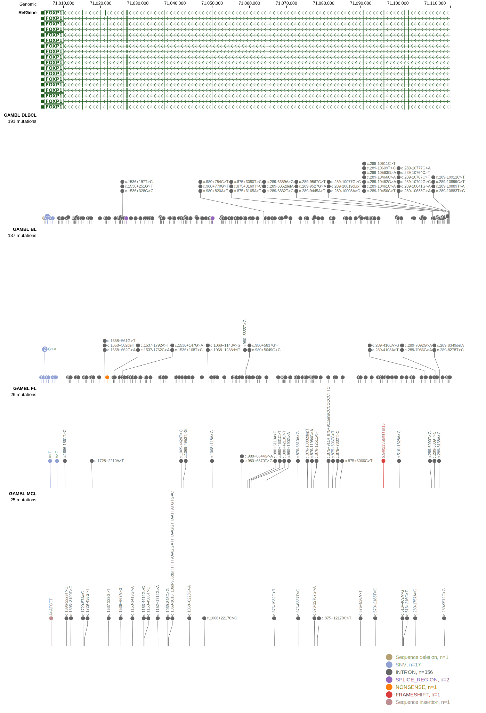
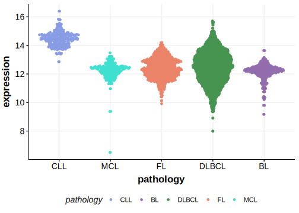

# FOXP1

## Relevance tier by entity

|Entity|Tier|Description                              |
|:------:|:----:|-----------------------------------------|
|DLBCL |2-a | aSHM target; Although recurrent, the relevance of mutations in DLBCL is tenuous |

## Mutation incidence in large patient cohorts (GAMBL reanalysis)

|Entity|source        |frequency (%)|
|:------:|:--------------:|:-------------:|
|DLBCL |GAMBL genomes |0.57         |
|DLBCL |Schmitz cohort|3.62         |
|DLBCL |Reddy cohort  |2.10         |
|DLBCL |Chapuy cohort |2.99         |

## Mutation pattern and selective pressure estimates

|Entity|aSHM|Significant selection|dN/dS (missense)|dN/dS (nonsense)|
|:------:|:----:|:---------------------:|:----------------:|:----------------:|
|BL    |Yes |No                   |1.218           | 9.469          |
|DLBCL |Yes |No                   |7.387           |17.777          |
|FL    |Yes |No                   |0.000           | 0.000          |

## aSHM regions

|chr_name|hg19_start|hg19_end|region                                                                                         |regulatory_comment|
|:--------:|:----------:|:--------:|:-----------------------------------------------------------------------------------------------:|:------------------:|
|chr3    |71104986  |71119518|[TSS-4](https://genome.ucsc.edu/s/rdmorin/GAMBL%20hg19?position=chr3%3A71104986%2D71119518)    |active_promoter   |
|chr3    |71176427  |71180960|[TSS-3](https://genome.ucsc.edu/s/rdmorin/GAMBL%20hg19?position=chr3%3A71176427%2D71180960)    |active_promoter   |
|chr3    |71350633  |71357665|[TSS-2](https://genome.ucsc.edu/s/rdmorin/GAMBL%20hg19?position=chr3%3A71350633%2D71357665)    |active_promoter   |
|chr3    |71503103  |71504870|[intron-1b](https://genome.ucsc.edu/s/rdmorin/GAMBL%20hg19?position=chr3%3A71503103%2D71504870)|intron            |
|chr3    |71550753  |71551478|[intron-1a](https://genome.ucsc.edu/s/rdmorin/GAMBL%20hg19?position=chr3%3A71550753%2D71551478)|intron            |
|chr3    |71626341  |71635648|[TSS-1](https://genome.ucsc.edu/s/rdmorin/GAMBL%20hg19?position=chr3%3A71626341%2D71635648)    |active_promoter   |

> [!NOTE]
> First described in DLBCL in 2017 by [Reddy A](https://pubmed.ncbi.nlm.nih.gov/28985567)

View coding variants in ProteinPaint [hg19](https://morinlab.github.io/LLMPP/GAMBL/FOXP1_protein.html)  or [hg38](https://morinlab.github.io/LLMPP/GAMBL/FOXP1_protein_hg38.html)

View all variants in GenomePaint [hg19](https://morinlab.github.io/LLMPP/GAMBL/FOXP1.html)  or [hg38](https://morinlab.github.io/LLMPP/GAMBL/FOXP1_hg38.html)

## FOXP1 Expression

