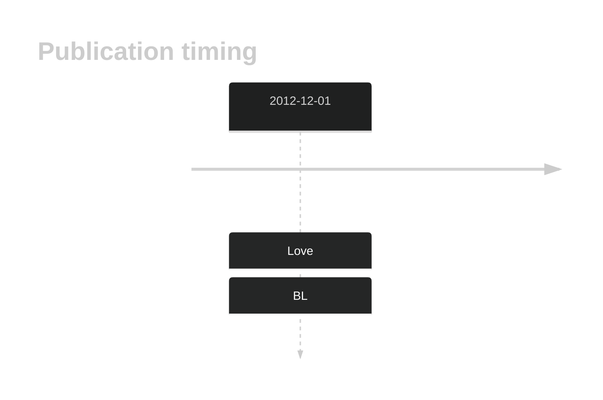

# FTCD

<<Warn("The variants reported in this gene in BL failed QC")>>

## Overview

Due to [minimal support](FTCD#representative-mutation) in the original primary data and very few mutations reported in subsequent studies, this gene is very unlikely to be relevant in BL. 

## History

## Relevance tier by entity

|Entity|Tier|Description                           |
|:------:|:----:|--------------------------------------|
|    |2-F   |Failed QC[@loveGeneticLandscapeMutations2012]|

## Mutation incidence in large patient cohorts (GAMBL reanalysis)

|Entity|source               |frequency (%)|
|:------:|:---------------------:|:-------------:|
|BL    |GAMBL genomes+capture|3.23         |
|BL    |Thomas cohort        |  NA         |
|BL    |Panea cohort         |  NA         |

## Mutation pattern and selective pressure estimates

|Entity|aSHM|Significant selection|dN/dS (missense)|dN/dS (nonsense)|
|:------:|:----:|:---------------------:|:----------------:|:----------------:|
|BL    |No  |No                   |3.359           |0               |
|DLBCL |No  |No                   |0.000           |0               |
|FL    |No  |No                   |0.000           |0               |

View coding variants in ProteinPaint [hg19](https://morinlab.github.io/LLMPP/GAMBL/FTCD_protein.html)  or [hg38](https://morinlab.github.io/LLMPP/GAMBL/FTCD_protein_hg38.html)

View all variants in GenomePaint [hg19](https://morinlab.github.io/LLMPP/GAMBL/FTCD.html)  or [hg38](https://morinlab.github.io/LLMPP/GAMBL/FTCD_hg38.html)

## FTCD Expression

<!-- ORIGIN: loveGeneticLandscapeMutations2012 -->
<!-- BL: loveGeneticLandscapeMutations2012 -->

## Representative Mutation

**Although well supported in the data, this mutation is clearly germline**

## All Mutations

[1062](https://www.bcgsc.ca/downloads/morinlab/GAMBL/Love/1062_reports.html)
[1064](https://www.bcgsc.ca/downloads/morinlab/GAMBL/Love/1064_reports.html)
[1093](https://www.bcgsc.ca/downloads/morinlab/GAMBL/Love/1093_reports.html)
[512](https://www.bcgsc.ca/downloads/morinlab/GAMBL/Love/512_reports.html)
[672](https://www.bcgsc.ca/downloads/morinlab/GAMBL/Love/672_reports.html)

## References

