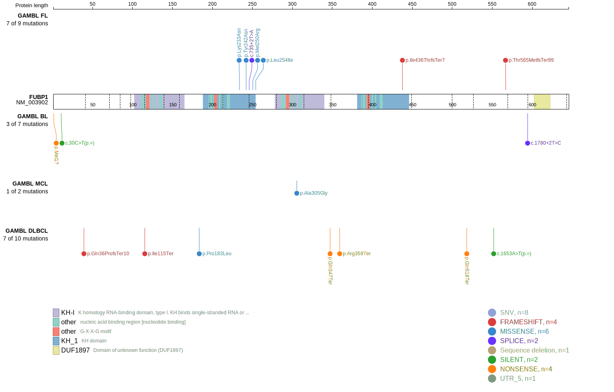
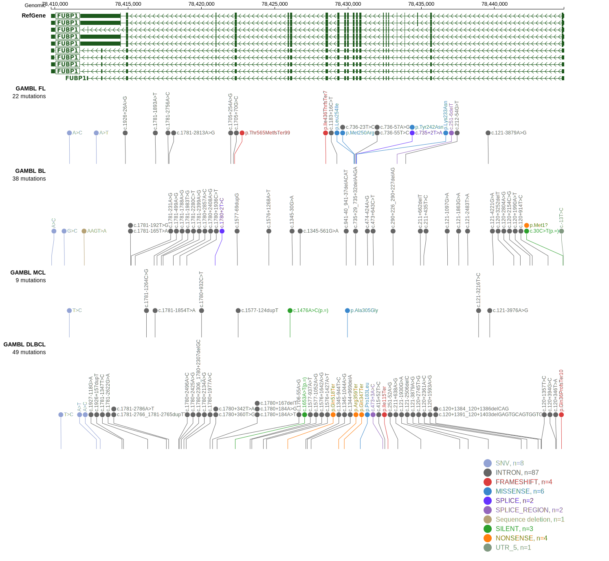
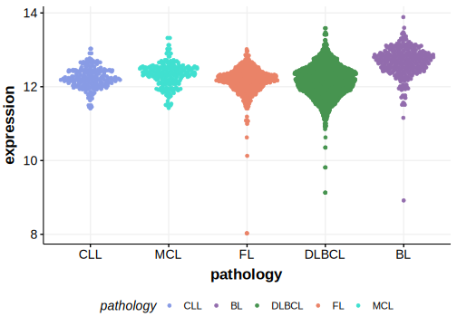

[[_TOC_]]

## Relevance tier by entity

|Entity|Tier|Description                              |
|:------:|:----:|-----------------------------------------|
| |2   |relevance in DLBCL not firmly established[@reddyGeneticFunctionalDrivers2017]|

## Mutation incidence in large patient cohorts (GAMBL reanalysis)

|Entity|source        |frequency (%)|
|:------:|:--------------:|:-------------:|
|DLBCL |GAMBL genomes |2.10         |
|DLBCL |Schmitz cohort|1.49         |
|DLBCL |Reddy cohort  |1.50         |
|DLBCL |Chapuy cohort |0.85         |

## Mutation pattern and selective pressure estimates

[[include:dnds_FUBP1.md]]

## FUBP1 Hotspots

| Chromosome |Coordinate (hg19) | ref>alt | HGVSp | 
 | :---:| :---: | :--: | :---: |
| chr1 | 78444687 | A>C | M1? |

View coding variants in ProteinPaint [hg19](https://morinlab.github.io/LLMPP/GAMBL/FUBP1_protein.html)  or [hg38](https://morinlab.github.io/LLMPP/GAMBL/FUBP1_protein_hg38.html)

View all variants in GenomePaint [hg19](https://morinlab.github.io/LLMPP/GAMBL/FUBP1.html)  or [hg38](https://morinlab.github.io/LLMPP/GAMBL/FUBP1_hg38.html)

## FUBP1 Expression

<!-- ORIGIN: reddyGeneticFunctionalDrivers2017 -->
<!-- DLBCL: reddyGeneticFunctionalDrivers2017 -->

[[include:mermaid_FUBP1.md]]

## References
