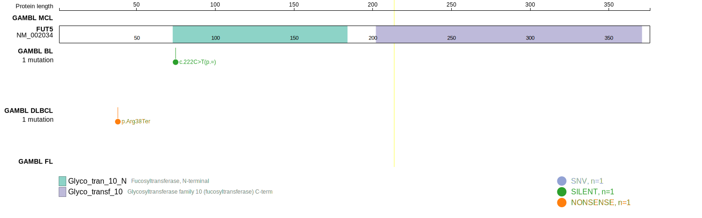
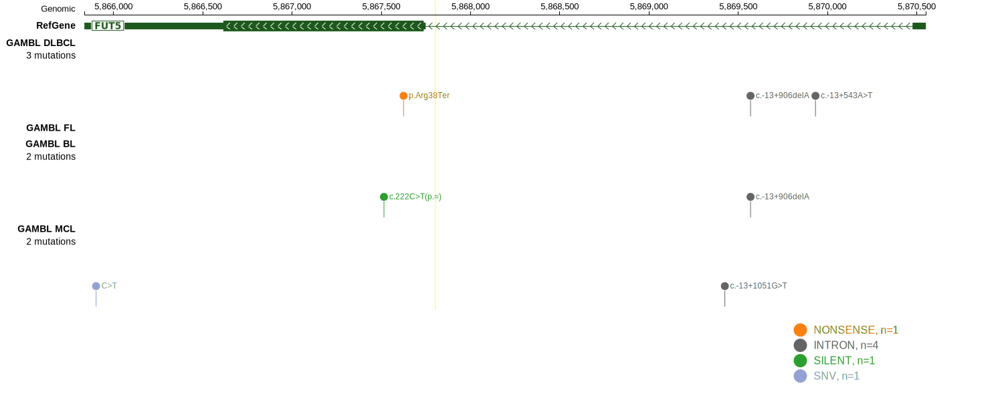

# FUT5

## History

## Relevance tier by entity

|Entity|Tier|Description                              |
|:------:|:----:|-----------------------------------------|
| |2   |relevance in DLBCL not firmly established[@chapuyMolecularSubtypesDiffuse2018b]|

## Mutation incidence in large patient cohorts (GAMBL reanalysis)

|Entity|source        |frequency (%)|
|:------:|:--------------:|:-------------:|
|DLBCL |GAMBL genomes |0.38         |
|DLBCL |Schmitz cohort|1.28         |
|DLBCL |Reddy cohort  |0.30         |
|DLBCL |Chapuy cohort |1.28         |

## Mutation pattern and selective pressure estimates

|Entity|aSHM|Significant selection|dN/dS (missense)|dN/dS (nonsense)|
|:------:|:----:|:---------------------:|:----------------:|:----------------:|
|BL    |No  |No                   |0.000           |0               |
|DLBCL |No  |No                   |3.328           |0               |
|FL    |No  |No                   |0.000           |0               |

View coding variants in ProteinPaint [hg19](https://morinlab.github.io/LLMPP/GAMBL/FUT5_protein.html)  or [hg38](https://morinlab.github.io/LLMPP/GAMBL/FUT5_protein_hg38.html)

View all variants in GenomePaint [hg19](https://morinlab.github.io/LLMPP/GAMBL/FUT5.html)  or [hg38](https://morinlab.github.io/LLMPP/GAMBL/FUT5_hg38.html)

## FUT5 Expression

<!-- ORIGIN: chapuyMolecularSubtypesDiffuse2018b -->
<!-- DLBCL: chapuyMolecularSubtypesDiffuse2018b -->

## All Mutations

[DLBCL-RICOVER_173-Tumor](https://bcgsc.ca/downloads/morinlab/GAMBL/Chapuy_2018/DLBCL-RICOVER_173-Tumor.html)

## References

