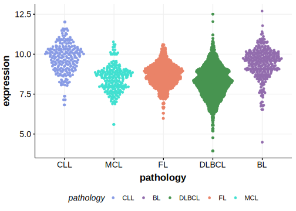

[[_TOC_]]

## Relevance tier by entity

|Entity|Tier|Description                           |
|:------:|:----:|--------------------------------------|
|    |3   |Retired, Failed QC[@paneaWholeGenomeLandscape2019]|

## Warnings

<<Warn("The variants reported in BL in this gene failed QC")>>

**[See below ](#representative-mutations) or [the study page ](papers/paneaWholeGenomeLandscape2019.md#tier-2) for more information**
## Mutation incidence in large patient cohorts (GAMBL reanalysis)

|Entity|source               |frequency (%)|
|:------:|:---------------------:|:-------------:|
|BL    |GAMBL genomes+capture|0.23         |
|BL    |Thomas cohort        |0.00         |
|BL    |Panea cohort         |1.00         |

## Mutation pattern and selective pressure estimates

[[include:dnds_FZD3.md]]

[[include:browser_FZD3.md]]

## Expression

<!-- ORIGIN: paneaWholeGenomeLandscape2019 -->
<!-- BL: paneaWholeGenomeLandscape2019 -->

## Representative Mutations

### BL[@paneaWholeGenomeLandscape2019]

**Rating**
&starf; &star; &star; &star; &star;

**Rating**
&starf; &star; &star; &star; &star;

[[include:mermaid_FZD3.md]]

## References

