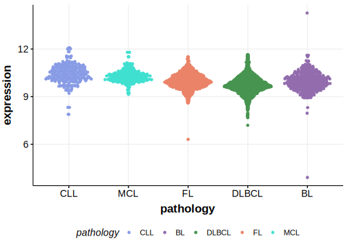

[[_TOC_]]

## Overview

Mutations in this gene were first described in DLBCL and FL in 2021 by Hübschmann et al.[@hubschmannMutationalMechanismsShaping2021]

## Relevance tier by entity

|Entity|Tier|Description                           |
|:------:|:----:|--------------------------------------|
|    |2   |relevance in FL not firmly established[@hubschmannMutationalMechanismsShaping2021]|

## Mutation incidence in large patient cohorts (GAMBL reanalysis)

|Entity|source       |frequency (%)|
|:------:|:-------------:|:-------------:|
|FL    |GAMBL genomes|1.15         |

## Mutation pattern and selective pressure estimates

[[include:dnds_FZR1.md]]

[[include:browser_FZR1.md]]

## Expression

## All Mutations

[SP194077](https://www.bcgsc.ca/downloads/morinlab/GAMBL/MALY/SP194077.html)
[SP193650](https://www.bcgsc.ca/downloads/morinlab/GAMBL/MALY/SP193650.html)

[[include:mermaid_FZR1.md]]

## References

<!-- ORIGIN: hubschmannMutationalMechanismsShaping2021b -->
<!-- FL: hubschmannMutationalMechanismsShaping2021b -->
