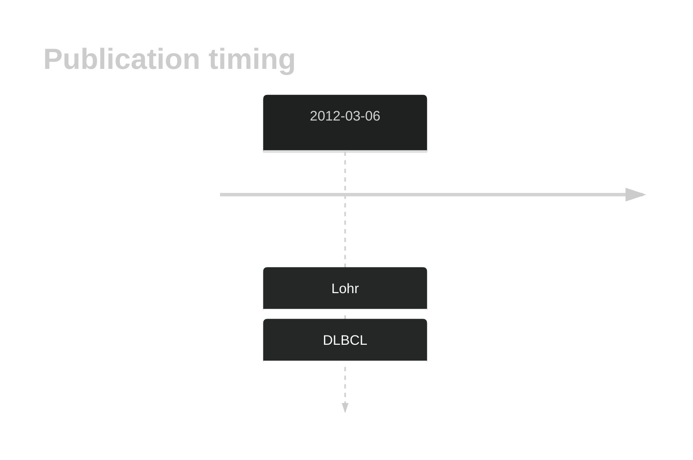

# GABRA1

## History

## Relevance tier by entity

|Entity|Tier|Description|
|:------:|:----:|--------------------------------------|
||2|relevance in DLBCL not firmly established[@lohrDiscoveryPrioritizationSomatic2012a]|

## Mutation incidence in large patient cohorts (GAMBL reanalysis)

|Entity|source |frequency (%)|
|:------:|:----:|:----:|
|BL|GAMBL Exome |2.874 |
|BL|GAMBL Genome |1.158 |
|DLBCL|GAMBL Exome |1.24 |
|DLBCL|GAMBL Genome |1.128 |
|FL|GAMBL Exome |0.86 |
|MCL|GAMBL Genome |0.585 |

## References

