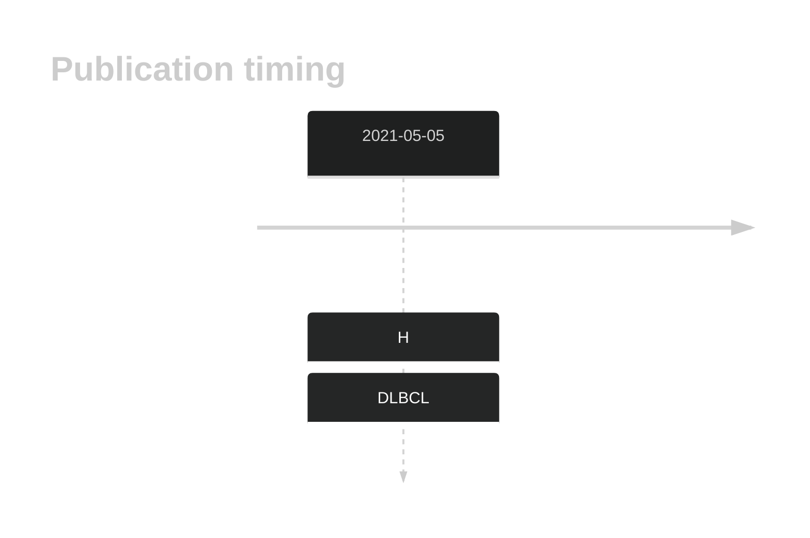
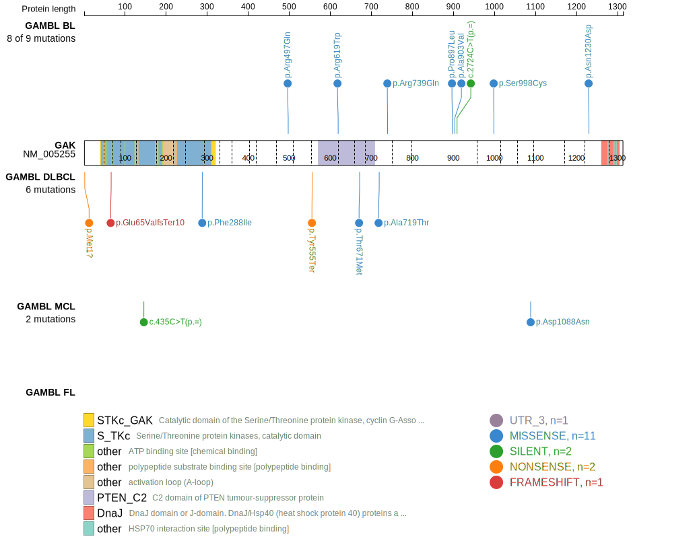
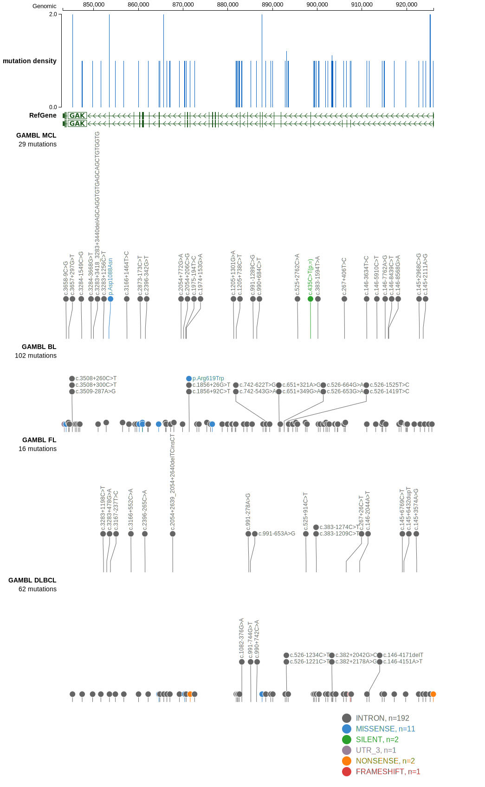

# GAK

## History
Mutations in this gene were first described in DLBCL in 2021 by Hübschmann et al.1

## Relevance tier by entity

|Entity|Tier|Description                              |
|:------:|:----:|-----------------------------------------|
| |2   |relevance in DLBCL not firmly established|

## Mutation incidence in large patient cohorts (GAMBL reanalysis)

|Entity|source        |frequency (%)|
|:------:|:--------------:|:-------------:|
|DLBCL |GAMBL genomes |1.91         |
|DLBCL |Schmitz cohort|3.62         |
|DLBCL |Reddy cohort  |1.90         |
|DLBCL |Chapuy cohort |2.56         |

## Mutation pattern and selective pressure estimates

|Entity|aSHM|Significant selection|dN/dS (missense)|dN/dS (nonsense)|
|:------:|:----:|:---------------------:|:----------------:|:----------------:|
|BL    |No  |No                   |3.849           |0.000           |
|DLBCL |No  |No                   |0.798           |9.151           |
|FL    |No  |No                   |0.000           |0.000           |

View coding variants in ProteinPaint [hg19](https://morinlab.github.io/LLMPP/GAMBL/GAK_protein.html)  or [hg38](https://morinlab.github.io/LLMPP/GAMBL/GAK_protein_hg38.html)

View all variants in GenomePaint [hg19](https://morinlab.github.io/LLMPP/GAMBL/GAK.html)  or [hg38](https://morinlab.github.io/LLMPP/GAMBL/GAK_hg38.html)

## GAK Expression

## References
1.  Hübschmann D, Kleinheinz K, Wagener R, Bernhart SH, López C, Toprak UH, Sungalee S, Ishaque N, Kretzmer H, Kreuz M, Waszak SM, Paramasivam N, Ammerpohl O, Aukema SM, Beekman R, Bergmann AK, Bieg M, Binder H, Borkhardt A, Borst C, Brors B, Bruns P, Carrillo de Santa Pau E, Claviez A, Doose G, Haake A, Karsch D, Haas S, Hansmann ML, Hoell JI, Hovestadt V, Huang B, Hummel M, Jäger-Schmidt C, Kerssemakers JNA, Korbel JO, Kube D, Lawerenz C, Lenze D, Martens JHA, Ott G, Radlwimmer B, Reisinger E, Richter J, Rico D, Rosenstiel P, Rosenwald A, Schillhabel M, Stilgenbauer S, Stadler PF, Martín-Subero JI, Szczepanowski M, Warsow G, Weniger MA, Zapatka M, Valencia A, Stunnenberg HG, Lichter P, Möller P, Loeffler M, Eils R, Klapper W, Hoffmann S, Trümper L, ICGC MMML-Seq consortium, ICGC DE-Mining consortium, BLUEPRINT consortium, Küppers R, Schlesner M, Siebert R. Mutational mechanisms shaping the coding and noncoding genome of germinal center derived B-cell lymphomas. Leukemia. 2021 Jul;35(7):2002–2016. PMCID: PMC8257491

<!-- ORIGIN: hubschmannMutationalMechanismsShaping2021b -->
<!-- DLBCL: hubschmannMutationalMechanismsShaping2021b -->
