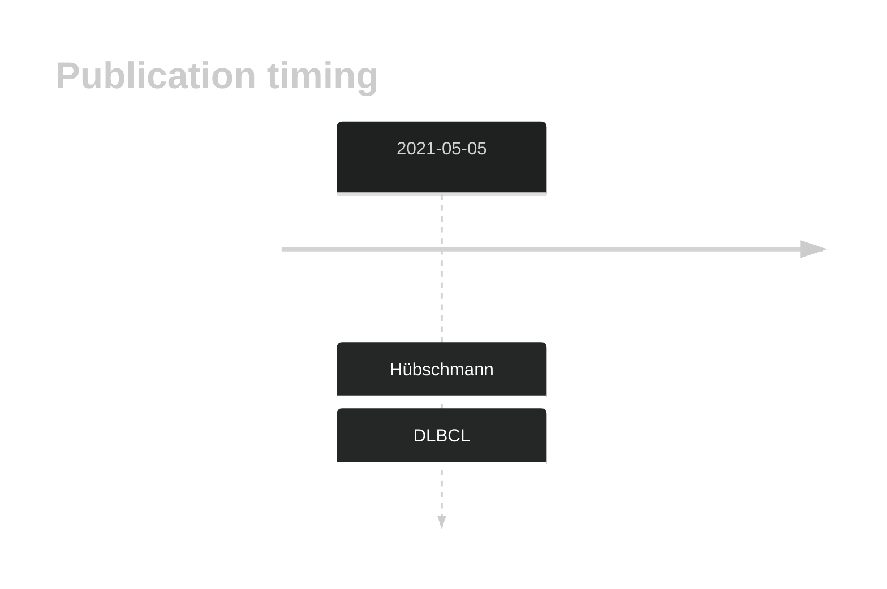

# GAK

## History
Mutations in this gene were first described in DLBCL in 2021 by Hübschmann et al.1

## Relevance tier by entity

|Entity|Tier|Description                              |
|:------:|:----:|-----------------------------------------|
| |2   |relevance in DLBCL not firmly established[@hubschmannMutationalMechanismsShaping2021]|

## Mutation incidence in large patient cohorts (GAMBL reanalysis)

|Entity|source        |frequency (%)|
|:------:|:--------------:|:-------------:|
|DLBCL |GAMBL genomes |1.91         |
|DLBCL |Schmitz cohort|3.62         |
|DLBCL |Reddy cohort  |1.90         |
|DLBCL |Chapuy cohort |2.56         |

## Mutation pattern and selective pressure estimates

|Entity|aSHM|Significant selection|dN/dS (missense)|dN/dS (nonsense)|
|:------:|:----:|:---------------------:|:----------------:|:----------------:|
|BL    |No  |No                   |3.849           |0.000           |
|DLBCL |No  |No                   |0.798           |9.151           |
|FL    |No  |No                   |0.000           |0.000           |

View coding variants in ProteinPaint [hg19](https://morinlab.github.io/LLMPP/GAMBL/GAK_protein.html)  or [hg38](https://morinlab.github.io/LLMPP/GAMBL/GAK_protein_hg38.html)

View all variants in GenomePaint [hg19](https://morinlab.github.io/LLMPP/GAMBL/GAK.html)  or [hg38](https://morinlab.github.io/LLMPP/GAMBL/GAK_hg38.html)

## GAK Expression

## All Mutations

[SP116697](https://www.bcgsc.ca/downloads/morinlab/GAMBL/MALY/SP116697.html)
[SP192765](https://www.bcgsc.ca/downloads/morinlab/GAMBL/MALY/SP192765.html)
[SP192870](https://www.bcgsc.ca/downloads/morinlab/GAMBL/MALY/SP192870.html)

## References

<!-- ORIGIN: hubschmannMutationalMechanismsShaping2021b -->
<!-- DLBCL: hubschmannMutationalMechanismsShaping2021b -->
