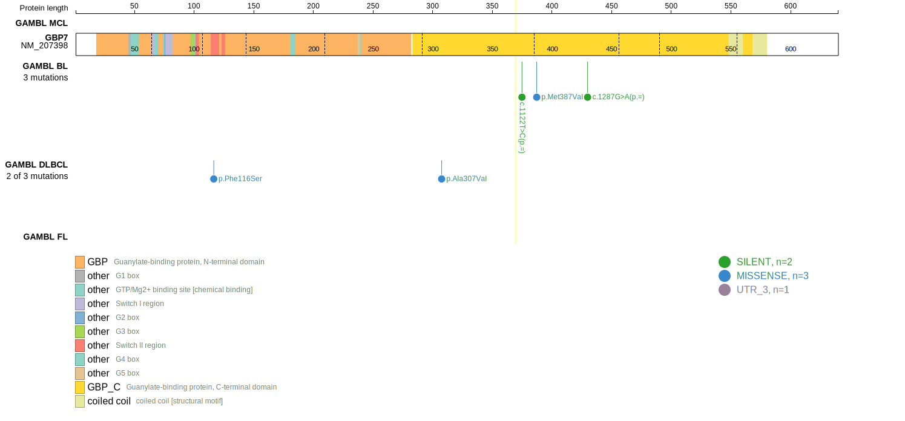
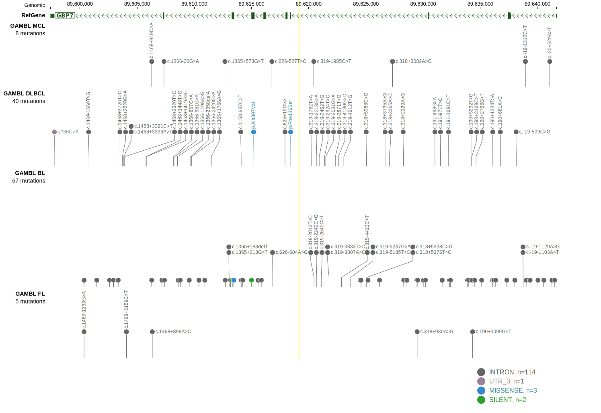

# GBP7

## Relevance tier by entity

|Entity|Tier|Description                           |
|:------:|:----:|--------------------------------------|
|FL    |2   |relevance in FL not firmly established|

## Mutation incidence in large patient cohorts (GAMBL reanalysis)

|Entity|source       |frequency (%)|
|:------:|:-------------:|:-------------:|
|FL    |GAMBL genomes|0.23         |

## Mutation pattern and selective pressure estimates

|Entity|aSHM|Significant selection|dN/dS (missense)|dN/dS (nonsense)|
|:------:|:----:|:---------------------:|:----------------:|:----------------:|
|BL    |No  |No                   |0.582           |0               |
|DLBCL |No  |No                   |0.000           |0               |
|FL    |No  |No                   |0.000           |0               |

> [!NOTE]
> First described in FL in 2023 by [Kalmbach S](https://pubmed.ncbi.nlm.nih.gov/37563306)

View coding variants in ProteinPaint [hg19](https://morinlab.github.io/LLMPP/GAMBL/GBP7_protein.html)  or [hg38](https://morinlab.github.io/LLMPP/GAMBL/GBP7_protein_hg38.html)

View all variants in GenomePaint [hg19](https://morinlab.github.io/LLMPP/GAMBL/GBP7.html)  or [hg38](https://morinlab.github.io/LLMPP/GAMBL/GBP7_hg38.html)

