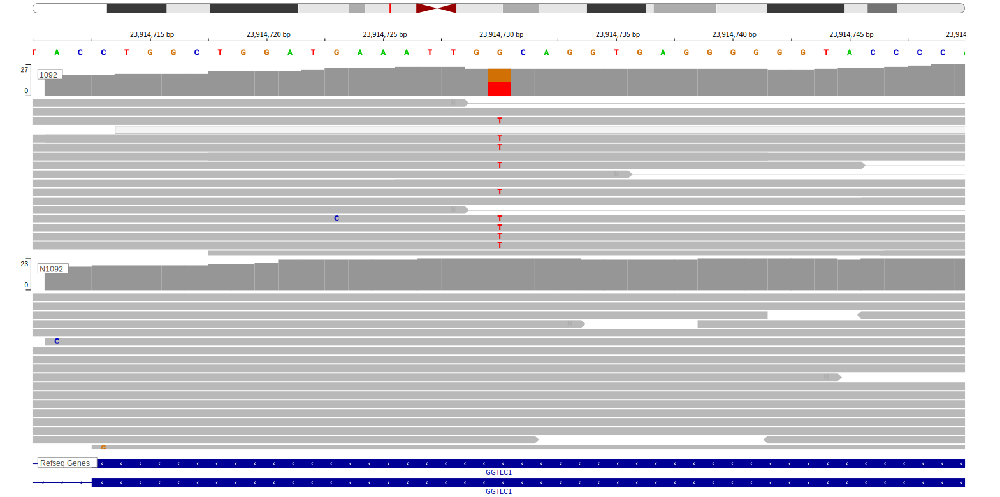

[[_TOC_]]

## Relevance tier by entity

[[include:tables/table1_GGTLA4.md]]

## Mutation incidence in large patient cohorts (GAMBL reanalysis)

[[include:tables/BL_GGTLA4.md]]

[[include:tables/browser_GGTLA4.md]]

## Representative Mutations

**Rating**
&starf; &starf; &starf; &starf; &star;

## All Mutations

[1092](https://www.bcgsc.ca/downloads/morinlab/GAMBL/Love/1092_reports.html)
[698](https://www.bcgsc.ca/downloads/morinlab/GAMBL/Love/698_reports.html)

[[include:tables/mermaid_GGTLA4.md]]

## References

