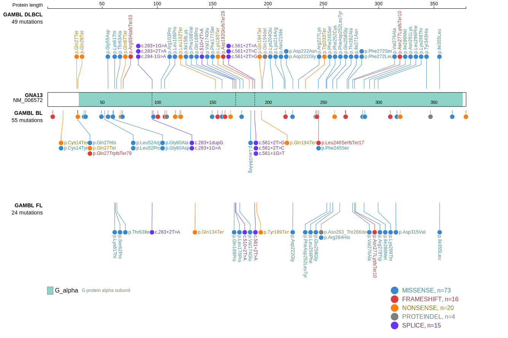
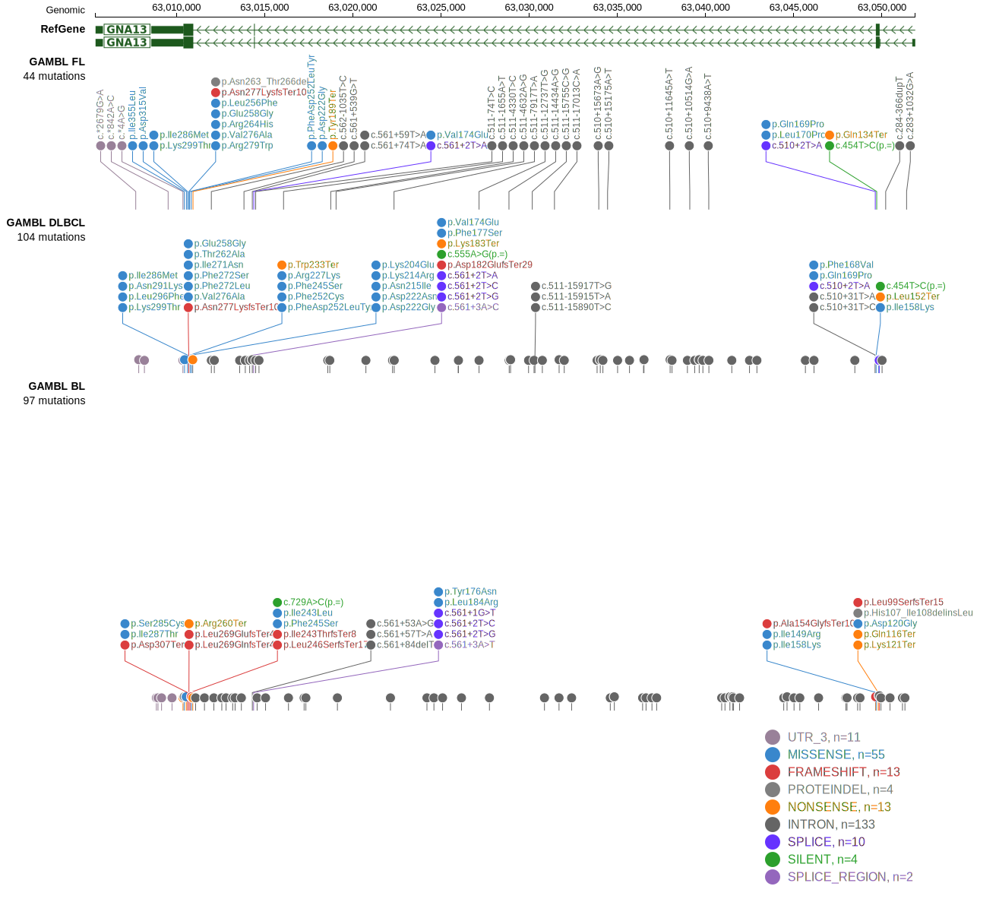

# [GNA13]

## Mutation tier

|Entity|Tier|Description               |
|:------:|:----:|--------------------------|
|BL    |1   |high-confidence BL gene   |
|DLBCL |1   |high-confidence DLBCL gene|
|FL    |1   |high-confidence FL gene   |
## Mutation incidence

|Entity|source               |frequency (%)|
|:------:|:---------------------:|:-------------:|
|BL    |GAMBL genomes+capture|21.02        |
|BL    |Thomas cohort        |21.60        |
|BL    |Panea cohort         |20.80        |
|DLBCL |GAMBL genomes        |11.66        |
|DLBCL |Schmitz cohort       | 8.51        |
|DLBCL |Reddy cohort         |11.91        |
|DLBCL |Chapuy cohort        |10.26        |
|FL    |GAMBL genomes        |10.16        |

## Mutation pattern

|Entity|aSHM|Significant selection|dN/dS (missense)|dN/dS (nonsense)|
|:------:|:----:|:---------------------:|:----------------:|:----------------:|
|BL    |No  |Yes                  |51.517          |966.741         |
|DLBCL |No  |Yes                  |38.484          |284.077         |
|FL    |No  |Yes                  |48.688          |215.216         |

> [!NOTE]
> First described in BL in 2012 by [Love C](https://pubmed.ncbi.nlm.nih.gov/23143597). First described in DLBCL in 2011 by [Morin RD](https://pubmed.ncbi.nlm.nih.gov/21796119). First described in FL in 2011 by [Morin RD](https://pubmed.ncbi.nlm.nih.gov/21796119)

 ## GNA13 Hotspots

| Chromosome |Coordinate (hg19) | ref>alt | HGVSp | 
 | :---:| :---: | :--: | :---: |
| chr17 | 63052633 | G>A | Q27* |
| chr17 | 63052631 | C>G | Q27H |
| chr17 | 63052630 | G>A | Q28* |
| chr17 | 63052613 | C>G | E33D |
| chr17 | 63052609 | C>G | D35H |

View coding variants in ProteinPaint [hg19](https://www.bcgsc.ca/downloads/morinlab/GAMBL/test/genes/GNA13_protein.html)  or [hg38](https://www.bcgsc.ca/downloads/morinlab/GAMBL/test/genes/GNA13_protein_hg38.html)

View all variants in GenomePaint [hg19](https://www.bcgsc.ca/downloads/morinlab/GAMBL/test/genes/GNA13.html)  or [hg38](https://www.bcgsc.ca/downloads/morinlab/GAMBL/test/genes/GNA13_hg38.html)

