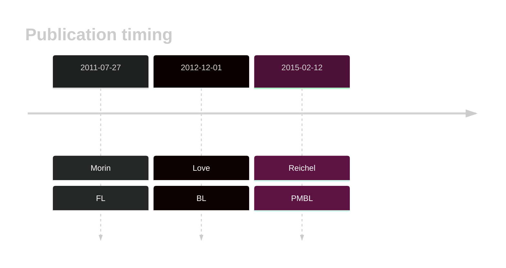

# GNA13
## Overview
Mutations in GNA13, which encodes a G protein alpha subunit involved in multiple signaling pathways, have been identified as significant contributors to the pathogenesis of germinal centre-derived B-cell lymphomas, including diffuse large B-cell lymphoma (DLBCL) and Burkitt lymphoma (BL).1 This gene has some recurrent sites of mutations (hot spots). Overall, mutations are often loss-of-function in nature, disrupting the normal activity of GNA13. GNA13 regulates B-cell homing and growth suppression within the germinal center niche and its loss of function promotes lymphoma development.2
## History

## Relevance tier by entity

|Entity|Tier|Description               |
|:------:|:----:|--------------------------|
||1|high-confidence PMBL/cHL/GZL gene|
|    |1   |high-confidence BL gene   |
| |1   |high-confidence DLBCL gene|
|    |1   |high-confidence FL gene   |

## Mutation incidence in large patient cohorts (GAMBL reanalysis)

|Entity|source               |frequency (%)|
|:------:|:---------------------:|:-------------:|
|BL    |GAMBL genomes+capture|21.02        |
|BL    |Thomas cohort        |21.60        |
|BL    |Panea cohort         |20.80        |
|DLBCL |GAMBL genomes        |11.66        |
|DLBCL |Schmitz cohort       | 8.51        |
|DLBCL |Reddy cohort         |11.91        |
|DLBCL |Chapuy cohort        |10.26        |
|FL    |GAMBL genomes        |10.16        |

## Mutation pattern and selective pressure estimates

|Entity|aSHM|Significant selection|dN/dS (missense)|dN/dS (nonsense)|
|:------:|:----:|:---------------------:|:----------------:|:----------------:|
|BL    |No  |Yes                  |51.517          |966.741         |
|DLBCL |No  |Yes                  |38.484          |284.077         |
|FL    |No  |Yes                  |48.688          |215.216         |

> [!NOTE]
> First described in BL in 2012 by [Love C](https://pubmed.ncbi.nlm.nih.gov/23143597). First described in DLBCL in 2011 by [Morin RD](https://pubmed.ncbi.nlm.nih.gov/21796119). First described in FL in 2011 by [Morin RD](https://pubmed.ncbi.nlm.nih.gov/21796119)

 ## GNA13 Hotspots

| Chromosome |Coordinate (hg19) | ref>alt | HGVSp | 
 | :---:| :---: | :--: | :---: |
| chr17 | 63052633 | G>A | Q27* |
| chr17 | 63052631 | C>G | Q27H |
| chr17 | 63052630 | G>A | Q28* |
| chr17 | 63052613 | C>G | E33D |
| chr17 | 63052609 | C>G | D35H |

View coding variants in ProteinPaint [hg19](https://morinlab.github.io/LLMPP/GAMBL/GNA13_protein.html)  or [hg38](https://morinlab.github.io/LLMPP/GAMBL/GNA13_protein_hg38.html)

View all variants in GenomePaint [hg19](https://morinlab.github.io/LLMPP/GAMBL/GNA13.html)  or [hg38](https://morinlab.github.io/LLMPP/GAMBL/GNA13_hg38.html)

## GNA13 Expression

<!-- ORIGIN: morinFrequentMutationHistonemodifying2011 -->
<!-- BL: loveGeneticLandscapeMutations2012 -->
<!-- FL: morinFrequentMutationHistonemodifying2011 -->
<!-- BL: loveGeneticLandscapeMutations2012 -->
<!-- DLBCL: morinFrequentMutationHistonemodifying2011 -->
## References
1. *Morin RD, Mendez-Lago M, Mungall AJ, Goya R, Mungall KL, Corbett RD, Johnson NA, Severson TM, Chiu R, Field M, Jackman S, Krzywinski M, Scott DW, Trinh DL, Tamura-Wells J, Li S, Firme MR, Rogic S, Griffith M, Chan S, Yakovenko O, Meyer IM, Zhao EY, Smailus D, Moksa M, Chittaranjan S, Rimsza L, Brooks-Wilson A, Spinelli JJ, Ben-Neriah S, Meissner B, Woolcock B, Boyle M, McDonald H, Tam A, Zhao Y, Delaney A, Zeng T, Tse K, Butterfield Y, Birol I, Holt R, Schein J, Horsman DE, Moore R, Jones SJM, Connors JM, Hirst M, Gascoyne RD, Marra MA. Frequent mutation of histone-modifying genes in non-Hodgkin lymphoma. Nature. 2011 Jul 27;476(7360):298–303. PMCID: PMC3210554*
2. *Muppidi JR, Schmitz R, Green JA, Xiao W, Larsen AB, Braun SE, An J, Xu Y, Rosenwald A, Ott G, Gascoyne RD, Rimsza LM, Campo E, Jaffe ES, Delabie J, Smeland EB, Braziel RM, Tubbs RR, Cook JR, Weisenburger DD, Chan WC, Vaidehi N, Staudt LM, Cyster JG. Loss of signalling via Gα13 in germinal centre B-cell-derived lymphoma. Nature. 2014 Dec 11;516(7530):254-8. doi: 10.1038/nature13765. Epub 2014 Sep 28. PMID: 25274307; PMCID: PMC4267955.*
3. *Love C, Sun Z, Jima D, Li G, Zhang J, Miles R, Richards KL, Dunphy CH, Choi WWL, Srivastava G, Lugar PL, Rizzieri DA, Lagoo AS, Bernal-Mizrachi L, Mann KP, Flowers CR, Naresh KN, Evens AM, Chadburn A, Gordon LI, Czader MB, Gill JI, Hsi ED, Greenough A, Moffitt AB, McKinney M, Banerjee A, Grubor V, Levy S, Dunson DB, Dave SS. The genetic landscape of mutations in Burkitt lymphoma. Nat Genet. 2012 Dec;44(12):1321–1325. PMCID: PMC3674561*
4. *Reichel J, Chadburn A, Rubinstein PG, Giulino-Roth L, Tam W, Liu Y, Gaiolla R, Eng K, Brody J, Inghirami G, Carlo-Stella C, Santoro A, Rahal D, Totonchy J, Elemento O, Cesarman E, Roshal M. Flow sorting and exome sequencing reveal the oncogenome of primary Hodgkin and Reed-Sternberg cells. Blood. 2015 Feb 12;125(7):1061–1072. PMID: 25488972*
