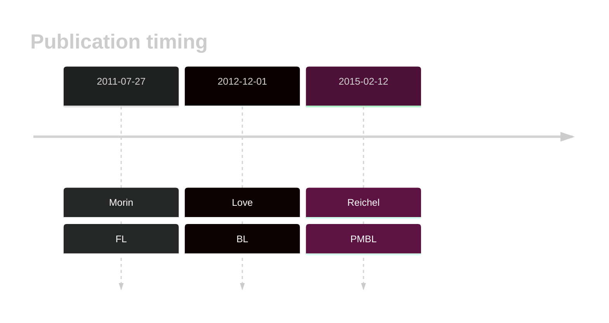

# GNA13

## Overview
Mutations in GNA13, which encodes a G protein alpha subunit involved in multiple signaling pathways, have been identified as significant contributors to the pathogenesis of germinal centre-derived B-cell lymphomas, including diffuse large B-cell lymphoma (DLBCL) and Burkitt lymphoma (BL).1 This gene has some recurrent sites of mutations (hot spots). Overall, mutations are often loss-of-function in nature, disrupting the normal activity of GNA13. GNA13 regulates B-cell homing and growth suppression within the germinal center niche and its loss of function promotes lymphoma development.2

## History

## Relevance tier by entity

|Entity|Tier|Description               |
|:------:|:----:|--------------------------|
||1|high-confidence PMBL/cHL/GZL gene[@reichelFlowSortingExome2015a]|
|    |1   |high-confidence BL gene   [@loveGeneticLandscapeMutations2012]|
| |1   |high-confidence DLBCL gene[@morinFrequentMutationHistonemodifying2011]|
|    |1   |high-confidence FL gene   [@morinFrequentMutationHistonemodifying2011]|

## Mutation incidence in large patient cohorts (GAMBL reanalysis)

|Entity|source               |frequency (%)|
|:------:|:---------------------:|:-------------:|
|BL    |GAMBL genomes+capture|21.02        |
|BL    |Thomas cohort        |21.60        |
|BL    |Panea cohort         |20.80        |
|DLBCL |GAMBL genomes        |11.66        |
|DLBCL |Schmitz cohort       | 8.51        |
|DLBCL |Reddy cohort         |11.91        |
|DLBCL |Chapuy cohort        |10.26        |
|FL    |GAMBL genomes        |10.16        |

## Mutation pattern and selective pressure estimates

|Entity|aSHM|Significant selection|dN/dS (missense)|dN/dS (nonsense)|
|:------:|:----:|:---------------------:|:----------------:|:----------------:|
|BL    |No  |Yes                  |51.517          |966.741         |
|DLBCL |No  |Yes                  |38.484          |284.077         |
|FL    |No  |Yes                  |48.688          |215.216         |

## GNA13 Hotspots

| Chromosome |Coordinate (hg19) | ref>alt | HGVSp | 
 | :---:| :---: | :--: | :---: |
| chr17 | 63052633 | G>A | Q27* |
| chr17 | 63052631 | C>G | Q27H |
| chr17 | 63052630 | G>A | Q28* |
| chr17 | 63052613 | C>G | E33D |
| chr17 | 63052609 | C>G | D35H |

View coding variants in ProteinPaint [hg19](https://morinlab.github.io/LLMPP/GAMBL/GNA13_protein.html)  or [hg38](https://morinlab.github.io/LLMPP/GAMBL/GNA13_protein_hg38.html)

View all variants in GenomePaint [hg19](https://morinlab.github.io/LLMPP/GAMBL/GNA13.html)  or [hg38](https://morinlab.github.io/LLMPP/GAMBL/GNA13_hg38.html)

## GNA13 Expression

<!-- ORIGIN: morinFrequentMutationHistonemodifying2011 -->
<!-- BL: loveGeneticLandscapeMutations2012 -->
<!-- FL: morinFrequentMutationHistonemodifying2011 -->
<!-- BL: loveGeneticLandscapeMutations2012 -->
<!-- DLBCL: morinFrequentMutationHistonemodifying2011 -->

## References
