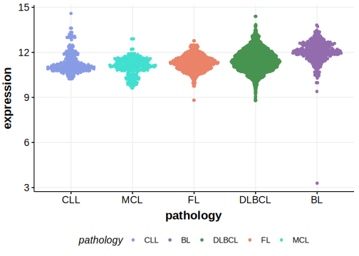

[[_TOC_]]

## Overview
Mutations in GNA13, which encodes a G protein alpha subunit involved in multiple signaling pathways, have been identified as significant contributors to the pathogenesis of germinal centre-derived B-cell lymphomas, including diffuse large B-cell lymphoma (DLBCL) and Burkitt lymphoma (BL).[@reichelFlowSortingExome2015] This gene has some recurrent sites of mutations (hot spots). Overall, mutations are often loss-of-function in nature, disrupting the normal activity of GNA13. GNA13 regulates B-cell homing and growth suppression within the germinal center niche and its loss of function promotes lymphoma development.[@loveGeneticLandscapeMutations2012]

## Relevance tier by entity

|Entity|Tier|Description               |
|:------:|:----:|--------------------------|
||1|high-confidence PMBL/cHL/GZL gene[@reichelFlowSortingExome2015]|
|    |1   |high-confidence BL gene   [@loveGeneticLandscapeMutations2012]|
| |1   |high-confidence DLBCL gene[@morinFrequentMutationHistonemodifying2011]|
|    |1   |high-confidence FL gene   [@morinFrequentMutationHistonemodifying2011]|

## Mutation incidence in large patient cohorts (GAMBL reanalysis)

[[include:DLBCL_GNA13.md]]
[[include:FL_GNA13.md]]
[[include:BL_GNA13.md]]

## Mutation pattern and selective pressure estimates

[[include:dnds_GNA13.md]]

## GNA13 Hotspots

| Chromosome |Coordinate (hg19) | ref>alt | HGVSp | 
 | :---:| :---: | :--: | :---: |
| chr17 | 63052633 | G>A | Q27* |
| chr17 | 63052631 | C>G | Q27H |
| chr17 | 63052630 | G>A | Q28* |
| chr17 | 63052613 | C>G | E33D |
| chr17 | 63052609 | C>G | D35H |

[[include:browser_GNA13.md]]

## Expression

<!-- ORIGIN: morinFrequentMutationHistonemodifying2011 -->
<!-- BL: loveGeneticLandscapeMutations2012 -->
<!-- FL: morinFrequentMutationHistonemodifying2011 -->
<!-- BL: loveGeneticLandscapeMutations2012 -->
<!-- DLBCL: morinFrequentMutationHistonemodifying2011 -->

[[include:mermaid_GNA13.md]]

## References
