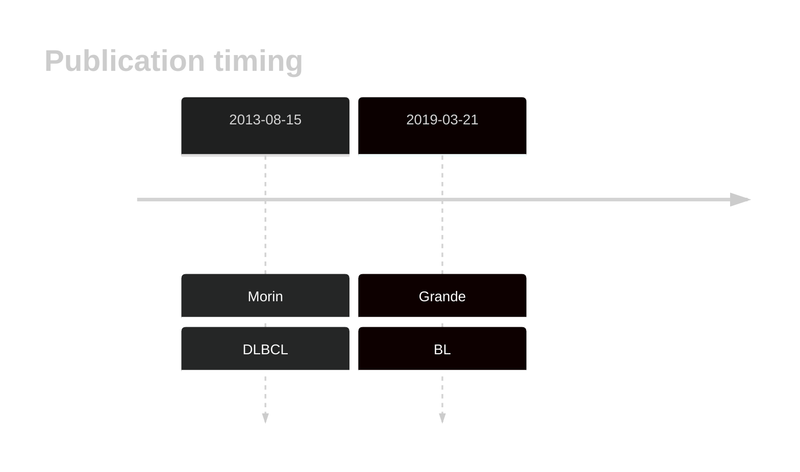
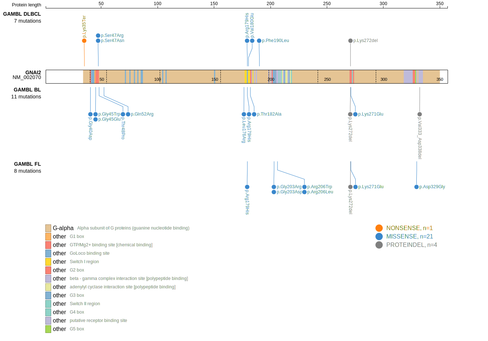
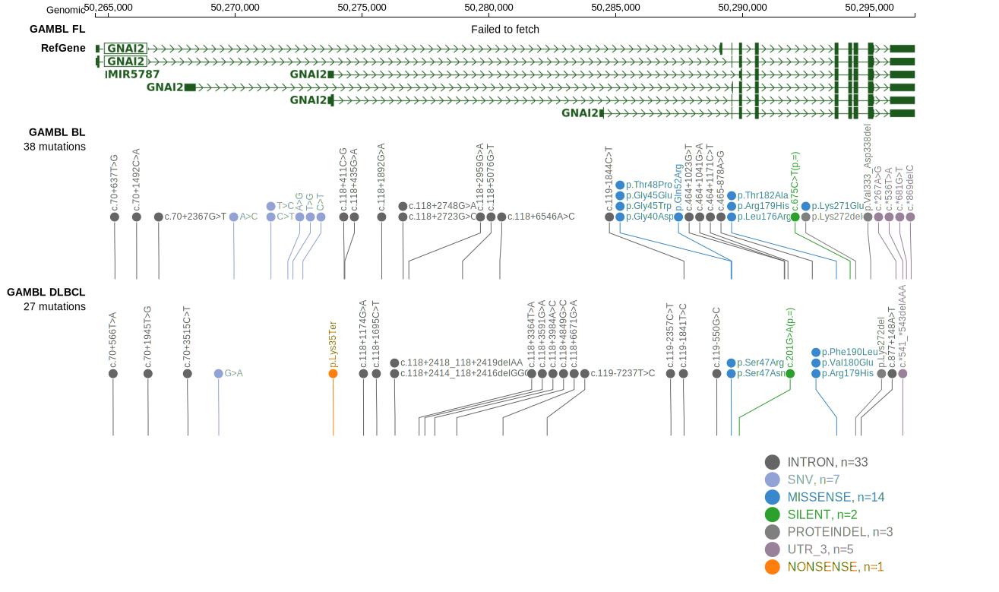
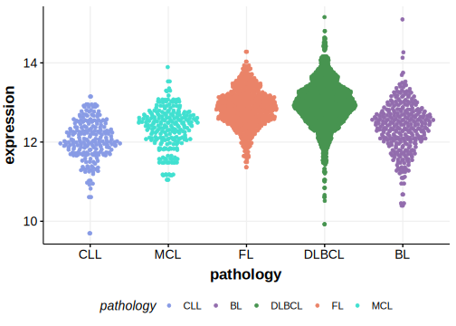

# GNAI2
## Overview
Mutations in the GNAI2 gene, which encodes the G protein alpha subunit involved in signal transduction, have been identified as significant contributors to the pathogenesis of B-cell lymphomas, including BL, DLBCL and, to a lesser extent, FL.1 Mutations in GNAI2, along with GNA13 and other small GTPases, affect the signaling pathways that regulate B-cell homing. These mutations are thought to cause aberrant localization and function of B-cells within lymphoid tissues.1 The functional role of these mutations has not been studied as extensively as those in GNA13 and further work is needed to elucidate the specific role of these mutations in lymphomagenesis. 

## History
Mutations were first described in DLBCL in 2013 by Morin et al1 and in BL in 2019 by Grande et al.2

## Relevance tier by entity

|Entity|Tier|Description               |
|:------:|:----:|--------------------------|
|    |1   |high-confidence BL gene   |
| |1   |high-confidence DLBCL gene|
|    |1   |high-confidence FL gene   |

## Mutation incidence in large patient cohorts (GAMBL reanalysis)

|Entity|source               |frequency (%)|
|:------:|:---------------------:|:-------------:|
|BL    |GAMBL genomes+capture|11.32        |
|BL    |Thomas cohort        | 9.70        |
|BL    |Panea cohort         | 8.90        |
|DLBCL |GAMBL genomes        | 5.35        |
|DLBCL |Schmitz cohort       | 6.38        |
|DLBCL |Reddy cohort         | 1.90        |
|DLBCL |Chapuy cohort        | 3.85        |
|FL    |GAMBL genomes        | 4.16        |

## Mutation pattern and selective pressure estimates

|Entity|aSHM|Significant selection|dN/dS (missense)|dN/dS (nonsense)|
|:------:|:----:|:---------------------:|:----------------:|:----------------:|
|BL    |No  |Yes                  |18.304          | 0.000          |
|DLBCL |No  |Yes                  |32.161          |57.623          |
|FL    |No  |Yes                  |55.205          | 0.000          |

 ## GNAI2 Hotspots

| Chromosome |Coordinate (hg19) | ref>alt | HGVSp | 
 | :---:| :---: | :--: | :---: |
| chr3 | 50289532 | G>A | G40D |
| chr3 | 50289546 | G>T | G45W |
| chr3 | 50289547 | G>A | G45E |
| chr3 | 50289553 | G>A | S47N |
| chr3 | 50289554 | C>G | S47R |
| chr3 | 50289555 | A>C | T48P |
| chr3 | 50289568 | A>G | Q52R |
| chr3 | 50293686 | T>G | L176R |
| chr3 | 50293695 | G>A | R179H |
| chr3 | 50293698 | T>A | V180E |
| chr3 | 50293703 | A>G | T182A |

View coding variants in ProteinPaint [hg19](https://morinlab.github.io/LLMPP/GAMBL/GNAI2_protein.html)  or [hg38](https://morinlab.github.io/LLMPP/GAMBL/GNAI2_protein_hg38.html)

View all variants in GenomePaint [hg19](https://morinlab.github.io/LLMPP/GAMBL/GNAI2.html)  or [hg38](https://morinlab.github.io/LLMPP/GAMBL/GNAI2_hg38.html)

## GNAI2 Expression

## References
1.  *Morin RD, Mungall K, Pleasance E, Mungall AJ, Goya R, Huff RD, Scott DW, Ding J, Roth A, Chiu R, Corbett RD, Chan FC, Mendez-Lago M, Trinh DL, Bolger-Munro M, Taylor G, Hadj Khodabakhshi A, Ben-Neriah S, Pon J, Meissner B, Woolcock B, Farnoud N, Rogic S, Lim EL, Johnson NA, Shah S, Jones S, Steidl C, Holt R, Birol I, Moore R, Connors JM, Gascoyne RD, Marra MA. Mutational and structural analysis of diffuse large B-cell lymphoma using whole-genome sequencing. Blood. 2013 Aug 15;122(7):1256–1265. PMCID: PMC3744992*

2.  *Grande BM, Gerhard DS, Jiang A, Griner NB, Abramson JS, Alexander TB, Allen H, Ayers LW, Bethony JM, Bhatia K, Bowen J, Casper C, Choi JK, Culibrk L, Davidsen TM, Dyer MA, Gastier-Foster JM, Gesuwan P, Greiner TC, Gross TG, Hanf B, Harris NL, He Y, Irvin JD, Jaffe ES, Jones SJM, Kerchan P, Knoetze N, Leal FE, Lichtenberg TM, Ma Y, Martin JP, Martin MR, Mbulaiteye SM, Mullighan CG, Mungall AJ, Namirembe C, Novik K, Noy A, Ogwang MD, Omoding A, Orem J, Reynolds SJ, Rushton CK, Sandlund JT, Schmitz R, Taylor C, Wilson WH, Wright GW, Zhao EY, Marra MA, Morin RD, Staudt LM. Genome-wide discovery of somatic coding and noncoding mutations in pediatric endemic and sporadic Burkitt lymphoma. Blood. 2019 Mar 21;133(12):1313–1324.* 

<!-- ORIGIN: morinMutationalStructuralAnalysis2013 -->
<!-- DLBCL: morinMutationalStructuralAnalysis2013 -->
<!-- BL: grandeGenomewideDiscoverySomatic2019 -->
