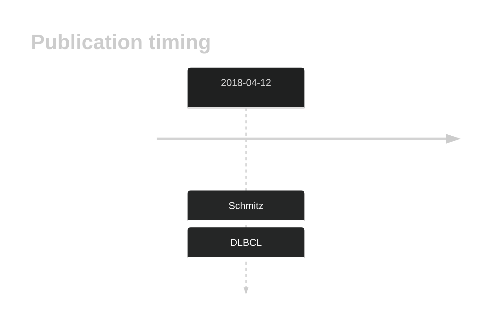
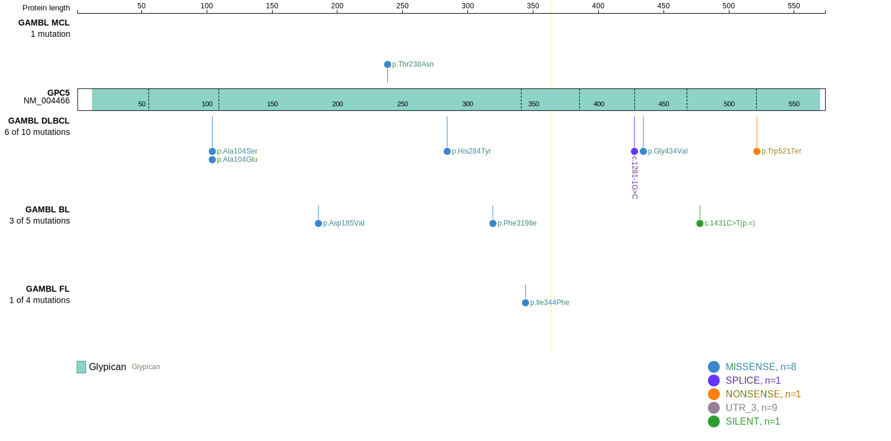
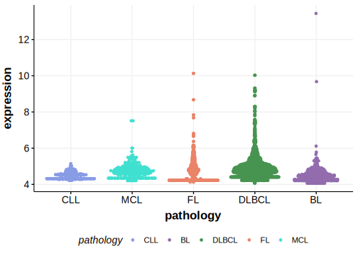

# GPC5

## History

## Relevance tier by entity

|Entity|Tier|Description                              |
|:------:|:----:|-----------------------------------------|
| |2   |relevance in DLBCL not firmly established[@schmitzGeneticsPathogenesisDiffuse2018]|

## Mutation incidence in large patient cohorts (GAMBL reanalysis)

|Entity|source        |frequency (%)|
|:------:|:--------------:|:-------------:|
|DLBCL |GAMBL genomes |1.34         |
|DLBCL |Schmitz cohort|1.91         |
|DLBCL |Reddy cohort  |2.20         |
|DLBCL |Chapuy cohort |0.85         |

## Mutation pattern and selective pressure estimates

|Entity|aSHM|Significant selection|dN/dS (missense)|dN/dS (nonsense)|
|:------:|:----:|:---------------------:|:----------------:|:----------------:|
|BL    |No  |No                   |1.380           |0               |
|DLBCL |No  |No                   |0.000           |0               |
|FL    |No  |No                   |1.144           |0               |

View coding variants in ProteinPaint [hg19](https://morinlab.github.io/LLMPP/GAMBL/GPC5_protein.html)  or [hg38](https://morinlab.github.io/LLMPP/GAMBL/GPC5_protein_hg38.html)

View all variants in GenomePaint [hg19](https://morinlab.github.io/LLMPP/GAMBL/GPC5.html)  or [hg38](https://morinlab.github.io/LLMPP/GAMBL/GPC5_hg38.html)

## GPC5 Expression

<!-- ORIGIN: schmitzGeneticsPathogenesisDiffuse2018a -->
<!-- DLBCL: schmitzGeneticsPathogenesisDiffuse2018a -->

## References

