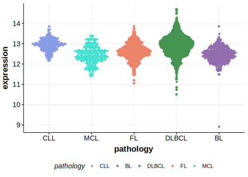

# GRB2

## Overview
GRB2 (Growth factor receptor-bound protein 2) is an adaptor protein that links receptor tyrosine kinases to the Ras signaling pathway through its SH2 and SH3 domains. 
The mutation pattern in DLBCL implies the preferential accumulation of *inactivating mutations*. 
While direct evidence of GRB2 mutations in DLBCL is limited, its established role in other cancers and signal transduction pathways suggests that it may contribute to lymphomagenesis. 
Further research is needed to elucidate its specific role in DLBCL.

## History

## Relevance tier by entity

|Entity|Tier|Description                           |
|:------:|:----:|--------------------------------------|
| |1   |high-confidence DLBCL gene            [@pasqualucciAnalysisCodingGenome2011]|

## Mutation incidence in large patient cohorts (GAMBL reanalysis)

[[include:DLBCL_GRB2.md]]

## Mutation pattern and selective pressure estimates

[[include:dnds_GRB2.md]]

View coding variants in ProteinPaint [hg19](https://morinlab.github.io/LLMPP/GAMBL/GRB2_protein.html)  or [hg38](https://morinlab.github.io/LLMPP/GAMBL/GRB2_protein_hg38.html)

View all variants in GenomePaint [hg19](https://morinlab.github.io/LLMPP/GAMBL/GRB2.html)  or [hg38](https://morinlab.github.io/LLMPP/GAMBL/GRB2_hg38.html)

## GRB2 Expression

<!-- ORIGIN: pasqualucciAnalysisCodingGenome2011 -->
<!-- DLBCL: pasqualucciAnalysisCodingGenome2011 -->
<!-- BL: paneaWholeGenomeLandscape2019 -->

## References
