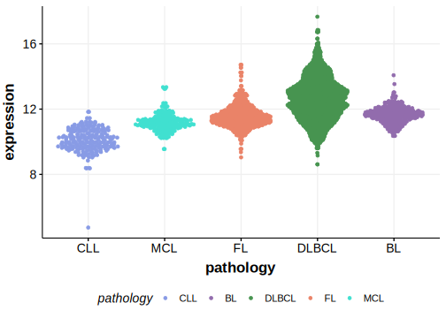

[[_TOC_]]

## Overview
GRHPR is one of [a number of genes](https://github.com/morinlab/LLMPP/wiki/ashm) affected by aberrant somatic hypermutation in B-cell lymphomas, which complicates the interpretation of mutations at this locus. The mutation pattern in DLBCL implies the preferential accumulation of *inactivating mutations*. Coding and non-coding mutations in GRHPR are a feature of the MCD genetic subgroup of DLBCL.[@arthurGenomewideDiscoverySomatic2018] Further research is needed to elucidate the specific role of GRHPR mutations in DLBCL.

## Relevance tier by entity

|Entity|Tier|Description               |
|:------:|:----:|--------------------------|
| |1 | aSHM target and high-confidence DLBCL gene[@arthurGenomewideDiscoverySomatic2018]|

## Mutation incidence in large patient cohorts (GAMBL reanalysis)

[[include:DLBCL_GRHPR.md]]

## Mutation pattern and selective pressure estimates

[[include:dnds_GRHPR.md]]

## aSHM regions

|chr_name|hg19_start|hg19_end|region                                                                                   |regulatory_comment|
|:--------:|:----------:|:--------:|:-----------------------------------------------------------------------------------------:|:------------------:|
|chr9    |37423010  |37425279|[TSS](https://genome.ucsc.edu/s/rdmorin/GAMBL%20hg19?position=chr9%3A37423010%2D37425279)|active_promoter   |

[[include:browser_GRHPR.md]]

## Expression

[[include:mermaid_GRHPR.md]]

## References

<!-- ORIGIN: arthurGenomewideDiscoverySomatic2018 -->
<!-- DLBCL: arthurGenomewideDiscoverySomatic2018 -->
