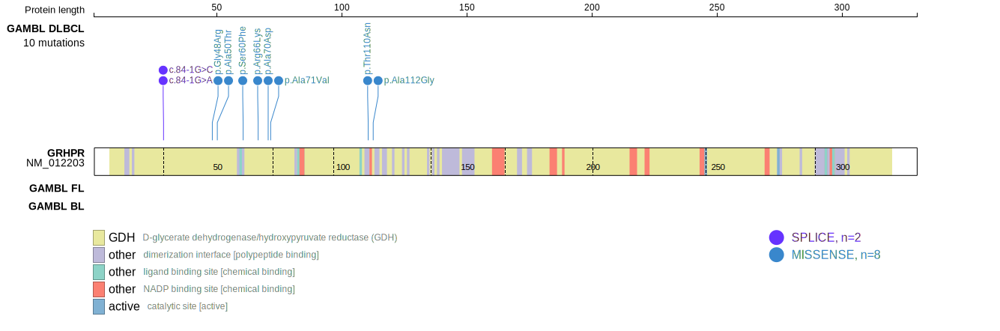
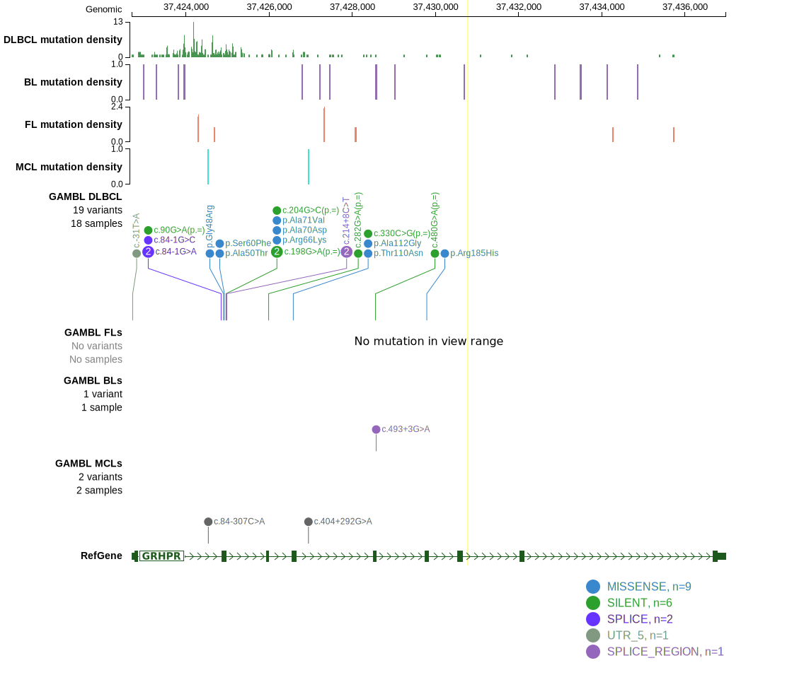

# [GRHPR]

## Mutation tier

|Entity|Tier|Description               |
|:------:|:----:|--------------------------|
|DLBCL |1   |high-confidence DLBCL gene|
## Mutation incidence

|Entity|source        |frequency (%)|
|:------:|:--------------:|:-------------:|
|DLBCL |GAMBL genomes |2.68         |
|DLBCL |Schmitz cohort|4.50         |
|DLBCL |Reddy cohort  |3.60         |
|DLBCL |Chapuy cohort |4.70         |

## Mutation pattern

|Entity|aSHM|Significant selection|dN/dS (missense)|dN/dS (nonsense)|
|:------:|:----:|:---------------------:|:----------------:|:----------------:|
|BL    |Yes |No                   | 1.819          | 0.000          |
|DLBCL |Yes |Yes                  |10.245          |60.346          |
|FL    |Yes |No                   | 0.000          | 0.000          |

## aSHM regions

|chr_name|hg19_start|hg19_end|region                                                                                   |regulatory_comment|
|:--------:|:----------:|:--------:|:-----------------------------------------------------------------------------------------:|:------------------:|
|chr9    |37423010  |37425279|[TSS](https://genome.ucsc.edu/s/rdmorin/GAMBL%20hg19?position=chr9%3A37423010%2D37425279)|active_promoter   |

View coding variants in ProteinPaint [hg19](https://www.bcgsc.ca/downloads/morinlab/GAMBL/test/genes/GRHPR_protein.html)  or [hg38](https://www.bcgsc.ca/downloads/morinlab/GAMBL/test/genes/GRHPR_protein_hg38.html)

View all variants in GenomePaint [hg19](https://www.bcgsc.ca/downloads/morinlab/GAMBL/test/genes/GRHPR.html)  or [hg38](https://www.bcgsc.ca/downloads/morinlab/GAMBL/test/genes/GRHPR_hg38.html)

