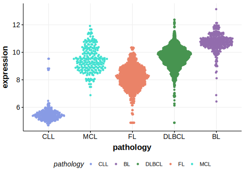

[[_TOC_]]

## Relevance tier by entity

[[include:tables/table1_GTSE1.md]]

## Mutation incidence in large patient cohorts (GAMBL reanalysis)

|Entity|source               |frequency (%)|
|:------:|:---------------------:|:-------------:|
|BL    |GAMBL genomes+capture|2.08         |
|BL    |Thomas cohort        |  NA         |
|BL    |Panea cohort         |  NA         |

## Mutation pattern and selective pressure estimates

[[include:tables/dnds_GTSE1.md]]

[[include:tables/browser_GTSE1.md]]

## Expression

<!-- ORIGIN: schmitzBurkittLymphomaPathogenesis2012 -->
<!-- BL: schmitzBurkittLymphomaPathogenesis2012 -->

[[include:tables/mermaid_GTSE1.md]]

## References

