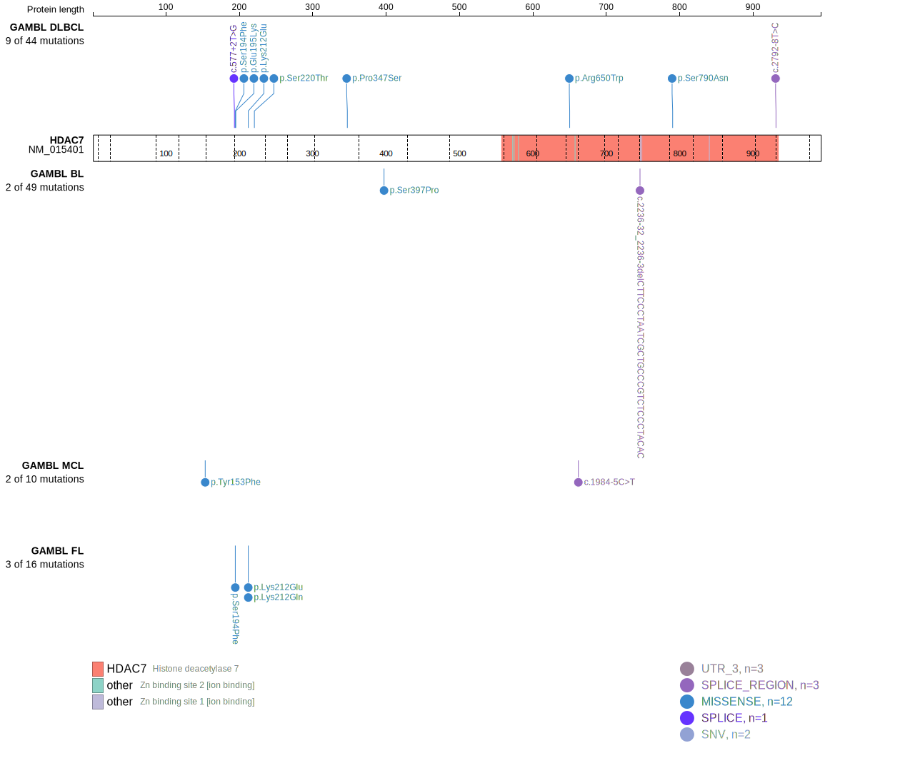

# [HDAC7]

## Mutation tier

|Entity|Tier|Description                              |
|:------:|:----:|-----------------------------------------|
|DLBCL |2   |relevance in DLBCL not firmly established|
## Mutation incidence

|Entity|source        |frequency (%)|
|:------:|:--------------:|:-------------:|
|DLBCL |GAMBL genomes |2.29         |
|DLBCL |Schmitz cohort|4.68         |
|DLBCL |Reddy cohort  |2.10         |
|DLBCL |Chapuy cohort |2.56         |

## Mutation pattern

|Entity|aSHM|Significant selection|dN/dS (missense)|dN/dS (nonsense)|
|:------:|:----:|:---------------------:|:----------------:|:----------------:|
|BL    |No  |No                   |2.610           |0               |
|DLBCL |No  |No                   |1.696           |0               |
|FL    |No  |No                   |6.314           |0               |

> [!NOTE]
> First described in DLBCL in 2013 by [Morin RD](https://pubmed.ncbi.nlm.nih.gov/23699601)

View coding variants in ProteinPaint [hg19](https://www.bcgsc.ca/downloads/morinlab/GAMBL/test/genes/HDAC7_protein.html)  or [hg38](https://www.bcgsc.ca/downloads/morinlab/GAMBL/test/genes/HDAC7_protein_hg38.html)

View all variants in GenomePaint [hg19](https://www.bcgsc.ca/downloads/morinlab/GAMBL/test/genes/HDAC7.html)  or [hg38](https://www.bcgsc.ca/downloads/morinlab/GAMBL/test/genes/HDAC7_hg38.html)

