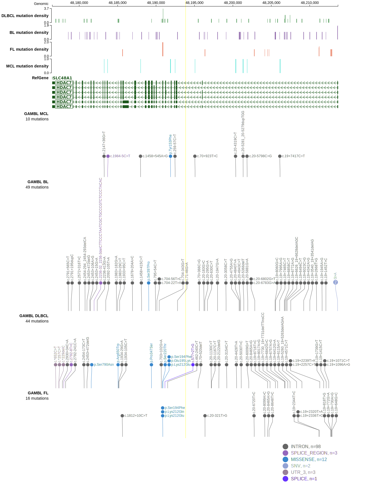

[[_TOC_]]

## Relevance tier by entity

|Entity|Tier|Description                              |
|:------:|:----:|-----------------------------------------|
| |2   |relevance in DLBCL not firmly established[@morinMutationalStructuralAnalysis2013]|

## Mutation incidence in large patient cohorts (GAMBL reanalysis)

|Entity|source        |frequency (%)|
|:------:|:--------------:|:-------------:|
|DLBCL |GAMBL genomes |2.29         |
|DLBCL |Schmitz cohort|4.68         |
|DLBCL |Reddy cohort  |2.10         |
|DLBCL |Chapuy cohort |2.56         |

## Mutation pattern and selective pressure estimates

[[include:dnds_HDAC7.md]]

View coding variants in ProteinPaint [hg19](https://morinlab.github.io/LLMPP/GAMBL/HDAC7_protein.html)  or [hg38](https://morinlab.github.io/LLMPP/GAMBL/HDAC7_protein_hg38.html)

View all variants in GenomePaint [hg19](https://morinlab.github.io/LLMPP/GAMBL/HDAC7.html)  or [hg38](https://morinlab.github.io/LLMPP/GAMBL/HDAC7_hg38.html)

## HDAC7 Expression

<!-- ORIGIN: morinMutationalStructuralAnalysis2013 -->
<!-- DLBCL: morinMutationalStructuralAnalysis2013 -->

## All Mutations

[RG003](https://www.bcgsc.ca/downloads/morinlab/GAMBL/Morin_2013/RG003.html)

[[include:mermaid_HDAC7.md]]

## References

