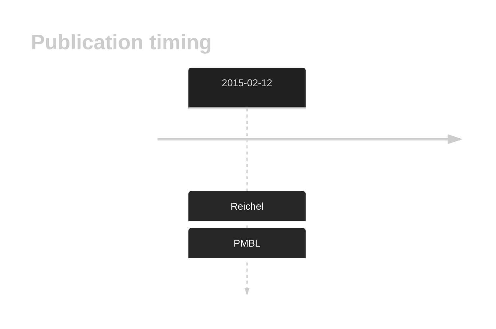

# HELLS

## History

## Relevance tier by entity

|Entity|Tier|Description|
|:------:|:----:|--------------------------------------|
||2|relevance in PMBL/cHL/GZL not firmly established[@reichelFlowSortingExome2015a]|

## Mutation incidence in large patient cohorts (GAMBL reanalysis)

|Entity|source |frequency (%)|
|:------:|:----:|:----:|
|BL|GAMBL Exome |2.299 |
|BL|GAMBL Genome |1.158 |
|DLBCL|GAMBL Exome |0.97 |
|DLBCL|GAMBL Genome |0.564 |

## References

