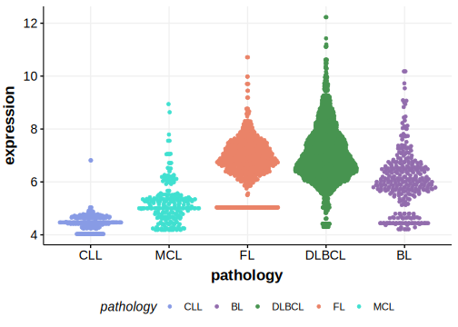

[[_TOC_]]

## Relevance tier by entity

[[include:tables/table1_HEPH.md]]

## Mutation incidence in large patient cohorts (GAMBL reanalysis)

|Entity|source       |frequency (%)|
|:------:|:-------------:|:-------------:|
|MCL   |GAMBL genomes|0.95         |

## Mutation pattern and selective pressure estimates

[[include:tables/dnds_HEPH.md]]

[[include:browser_HEPH.md]]

## Expression

<!-- ORIGIN: zhangGenomicLandscapeMantle2014 -->
<!-- MCL: zhangGenomicLandscapeMantle2014 -->

[[include:tables/mermaid_HEPH.md]]

## References
