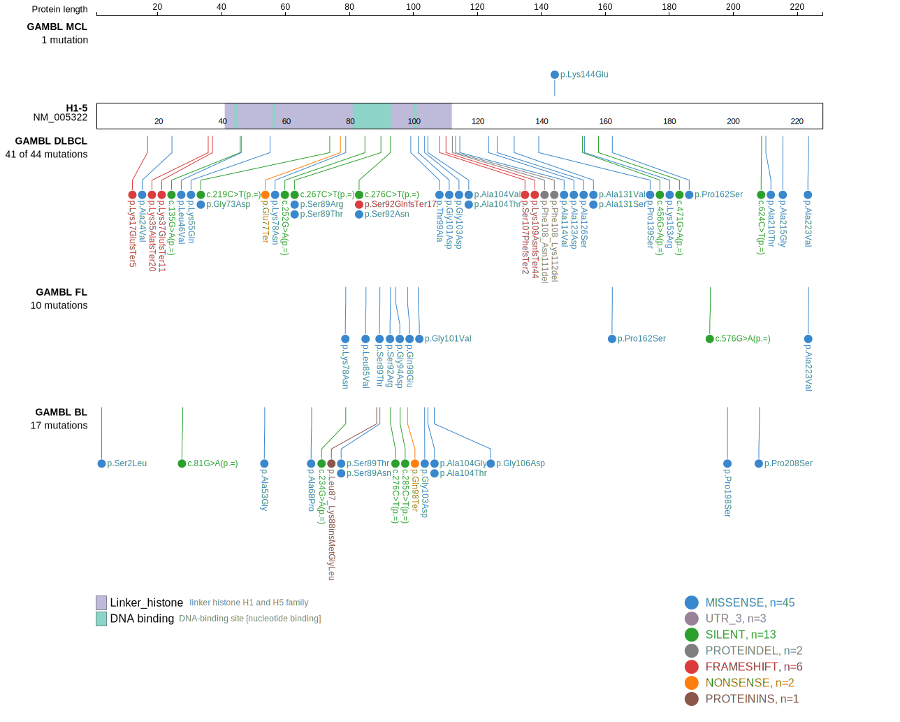
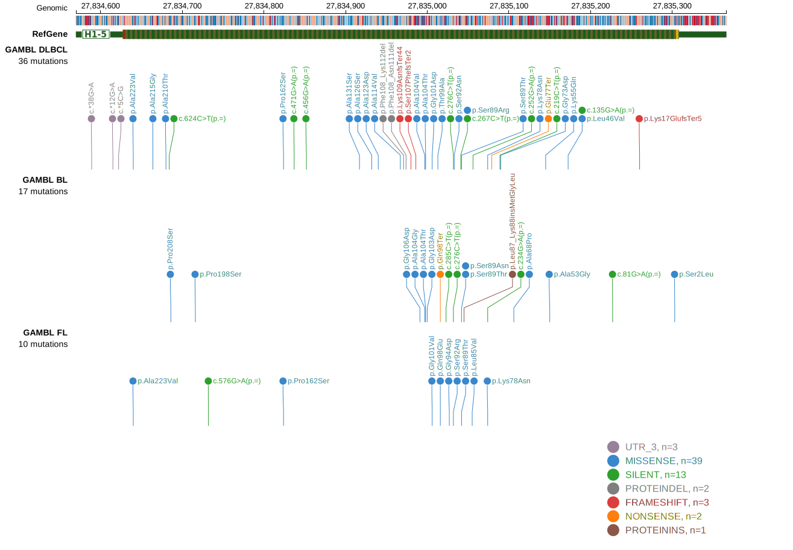

# HIST1H1B
## Overview
This is one of several genes that encode linker histone proteins that are recurrently mutated in DLBCL and FL.1,2 Mutations are often found in the globular domain of the protein, which is critical for its interaction with DNA and other histone proteins. 
## Relevance tier by entity

|Entity|Tier|Description                           |
|:------:|:----:|--------------------------------------|
|    |2   |relevance in BL not firmly established|
| |1   |high-confidence DLBCL gene            |
|    |1   |high-confidence FL gene               |

## Mutation incidence in large patient cohorts (GAMBL reanalysis)

|Entity|source               |frequency (%)|
|:------:|:---------------------:|:-------------:|
|BL    |GAMBL genomes+capture|4.62         |
|BL    |Thomas cohort        |5.50         |
|BL    |Panea cohort         |4.00         |
|DLBCL |GAMBL genomes        |8.41         |
|DLBCL |Schmitz cohort       |8.51         |
|DLBCL |Reddy cohort         |7.31         |
|DLBCL |Chapuy cohort        |9.83         |
|FL    |GAMBL genomes        |5.54         |

## Mutation pattern and selective pressure estimates

|Entity|aSHM|Significant selection|dN/dS (missense)|dN/dS (nonsense)|
|:------:|:----:|:---------------------:|:----------------:|:----------------:|
|BL    |No  |Yes                  | 6.345          |34.135          |
|DLBCL |No  |Yes                  | 5.595          | 0.000          |
|FL    |No  |No                   |19.175          | 0.000          |

View coding variants in ProteinPaint [hg19](https://morinlab.github.io/LLMPP/GAMBL/HIST1H1B_protein.html)  or [hg38](https://morinlab.github.io/LLMPP/GAMBL/HIST1H1B_protein_hg38.html)

View all variants in GenomePaint [hg19](https://morinlab.github.io/LLMPP/GAMBL/HIST1H1B.html)  or [hg38](https://morinlab.github.io/LLMPP/GAMBL/HIST1H1B_hg38.html)

## HIST1H1B Expression

<!-- ORIGIN: krysiakRecurrentSomaticMutations2017b -->
<!-- PMBL: sarkozyMutationalLandscapeGray2021a -->
<!-- FL: krysiakRecurrentSomaticMutations2017b -->
<!-- DLBCL: chapuyMolecularSubtypesDiffuse2018b -->
