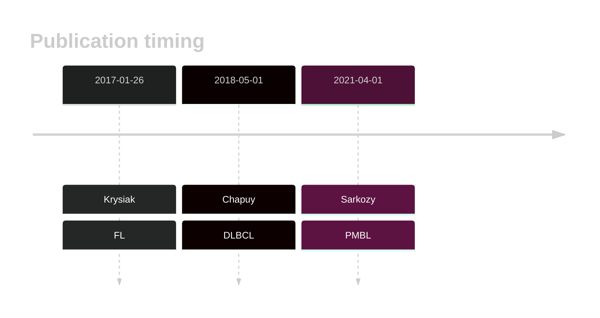

# HIST1H1B

## Overview
This is one of several genes that encode linker histone proteins that are recurrently mutated in DLBCL and FL.1,2 Mutations are often found in the globular domain of the protein, which is critical for its interaction with DNA and other histone proteins. 
## History

## Relevance tier by entity

|Entity|Tier|Description                           |
|:------:|:----:|--------------------------------------|
||1|high-confidence PMBL/cHL/GZL gene|
|    |2   |relevance in BL not firmly established|
| |1   |high-confidence DLBCL gene            |
|    |1   |high-confidence FL gene               |

## Mutation incidence in large patient cohorts (GAMBL reanalysis)

|Entity|source               |frequency (%)|
|:------:|:---------------------:|:-------------:|
|BL    |GAMBL genomes+capture|4.62         |
|BL    |Thomas cohort        |5.50         |
|BL    |Panea cohort         |4.00         |
|DLBCL |GAMBL genomes        |8.41         |
|DLBCL |Schmitz cohort       |8.51         |
|DLBCL |Reddy cohort         |7.31         |
|DLBCL |Chapuy cohort        |9.83         |
|FL    |GAMBL genomes        |5.54         |

## Mutation pattern and selective pressure estimates

|Entity|aSHM|Significant selection|dN/dS (missense)|dN/dS (nonsense)|
|:------:|:----:|:---------------------:|:----------------:|:----------------:|
|BL    |No  |Yes                  | 6.345          |34.135          |
|DLBCL |No  |Yes                  | 5.595          | 0.000          |
|FL    |No  |No                   |19.175          | 0.000          |

View coding variants in ProteinPaint [hg19](https://morinlab.github.io/LLMPP/GAMBL/HIST1H1B_protein.html)  or [hg38](https://morinlab.github.io/LLMPP/GAMBL/HIST1H1B_protein_hg38.html)

View all variants in GenomePaint [hg19](https://morinlab.github.io/LLMPP/GAMBL/HIST1H1B.html)  or [hg38](https://morinlab.github.io/LLMPP/GAMBL/HIST1H1B_hg38.html)

## HIST1H1B Expression

<!-- ORIGIN: krysiakRecurrentSomaticMutations2017b -->
<!-- PMBL: sarkozyMutationalLandscapeGray2021a -->
<!-- FL: krysiakRecurrentSomaticMutations2017b -->
<!-- DLBCL: chapuyMolecularSubtypesDiffuse2018b -->

## References
1.  Krysiak K, Gomez F, White BS, Matlock M, Miller CA, Trani L, Fronick CC, Fulton RS, Kreisel F, Cashen AF, Carson KR, Berrien-Elliott MM, Bartlett NL, Griffith M, Griffith OL, Fehniger TA. Recurrent somatic mutations affecting B-cell receptor signaling pathway genes in follicular lymphoma. Blood. 2017 Jan 26;129(4):473–483. PMCID: PMC5270390
2.  Chapuy B, Stewart C, Dunford AJ, Kim J, Kamburov A, Redd RA, Lawrence MS, Roemer MGM, Li AJ, Ziepert M, Staiger AM, Wala JA, Ducar MD, Leshchiner I, Rheinbay E, Taylor-Weiner A, Coughlin CA, Hess JM, Pedamallu CS, Livitz D, Rosebrock D, Rosenberg M, Tracy AA, Horn H, van Hummelen P, Feldman AL, Link BK, Novak AJ, Cerhan JR, Habermann TM, Siebert R, Rosenwald A, Thorner AR, Meyerson ML, Golub TR, Beroukhim R, Wulf GG, Ott G, Rodig SJ, Monti S, Neuberg DS, Loeffler M, Pfreundschuh M, Trümper L, Getz G, Shipp MA. Molecular subtypes of diffuse large B cell lymphoma are associated with distinct pathogenic mechanisms and outcomes. Nat Med. 2018 May;24(5):679–690. PMCID: PMC6613387
3.  Sarkozy C, Hung SS, Chavez EA, Duns G, Takata K, Chong LC, Aoki T, Jiang A, Miyata-Takata T, Telenius A, Slack GW, Molina TJ, Ben-Neriah S, Farinha P, Dartigues P, Damotte D, Mottok A, Salles GA, Casasnovas RO, Savage KJ, Laurent C, Scott DW, Traverse-Glehen A, Steidl C. Mutational landscape of gray zone lymphoma. Blood. 2021 Apr 1;137(13):1765–1776. PMID: 32961552
