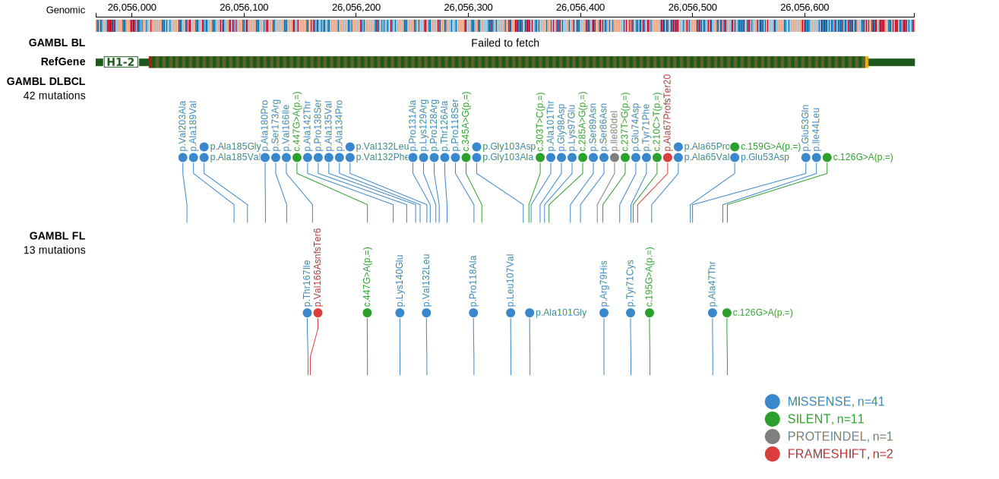

# HIST1H1C
## Overview
This is one of several genes that encode linker histone proteins that are recurrently mutated in DLBCL and FL.1,2 

## Relevance tier by entity

|Entity|Tier|Description                           |
|:------:|:----:|--------------------------------------|
|BL    |2   |relevance in BL not firmly established|
|DLBCL |1   |high-confidence DLBCL gene            |
|FL    |1   |high-confidence FL gene               |

## Mutation incidence in large patient cohorts (GAMBL reanalysis)

|Entity|source               |frequency (%)|
|:------:|:---------------------:|:-------------:|
|BL    |GAMBL genomes+capture| 4.85        |
|BL    |Thomas cohort        | 3.80        |
|BL    |Panea cohort         | 9.90        |
|DLBCL |GAMBL genomes        | 9.94        |
|DLBCL |Schmitz cohort       | 9.79        |
|DLBCL |Reddy cohort         | 9.41        |
|DLBCL |Chapuy cohort        |12.39        |
|FL    |GAMBL genomes        | 5.08        |

## Mutation pattern and selective pressure estimates

|Entity|aSHM|Significant selection|dN/dS (missense)|dN/dS (nonsense)|
|:------:|:----:|:---------------------:|:----------------:|:----------------:|
|BL    |No  |No                   |10.205          |0               |
|DLBCL |No  |Yes                  | 9.354          |0               |
|FL    |No  |No                   | 4.446          |0               |

> [!NOTE]
> First described in BL in 2019 by [Panea RI](https://pubmed.ncbi.nlm.nih.gov/31558468). First described in DLBCL in 2011 by [Morin RD](https://pubmed.ncbi.nlm.nih.gov/21796119). First described in FL in 2011 by [Morin RD](https://pubmed.ncbi.nlm.nih.gov/21796119)

View coding variants in ProteinPaint [hg19](https://morinlab.github.io/LLMPP/GAMBL/HIST1H1C_protein.html)  or [hg38](https://morinlab.github.io/LLMPP/GAMBL/HIST1H1C_protein_hg38.html)

View all variants in GenomePaint [hg19](https://morinlab.github.io/LLMPP/GAMBL/HIST1H1C.html)  or [hg38](https://morinlab.github.io/LLMPP/GAMBL/HIST1H1C_hg38.html)

## References

1. *Morin RD, Mendez-Lago M, Mungall AJ, Goya R, Mungall KL, Corbett RD, Johnson NA, Severson TM, Chiu R, Field M, Jackman S, Krzywinski M, Scott DW, Trinh DL, Tamura-Wells J, Li S, Firme MR, Rogic S, Griffith M, Chan S, Yakovenko O, Meyer IM, Zhao EY, Smailus D, Moksa M, Chittaranjan S, Rimsza L, Brooks-Wilson A, Spinelli JJ, Ben-Neriah S, Meissner B, Woolcock B, Boyle M, McDonald H, Tam A, Zhao Y, Delaney A, Zeng T, Tse K, Butterfield Y, Birol I, Holt R, Schein J, Horsman DE, Moore R, Jones SJ, Connors JM, Hirst M, Gascoyne RD, Marra MA. Frequent mutation of histone-modifying genes in non-Hodgkin lymphoma. Nature. 2011 Jul 27;476(7360):298-303. doi: 10.1038/nature10351. PMID: 21796119; PMCID: PMC3210554.*
2. *Li H, Kaminski MS, Li Y, Yildiz M, Ouillette P, Jones S, Fox H, Jacobi K, Saiya-Cork K, Bixby D, Lebovic D, Roulston D, Shedden K, Sabel M, Marentette L, Cimmino V, Chang AE, Malek SN. Mutations in linker histone genes HIST1H1 B, C, D, and E; OCT2 (POU2F2); IRF8; and ARID1A underlying the pathogenesis of follicular lymphoma. Blood. 2014 Mar 6;123(10):1487-98. doi: 10.1182/blood-2013-05-500264. Epub 2014 Jan 16. PMID: 24435047; PMCID: PMC4729540.*
