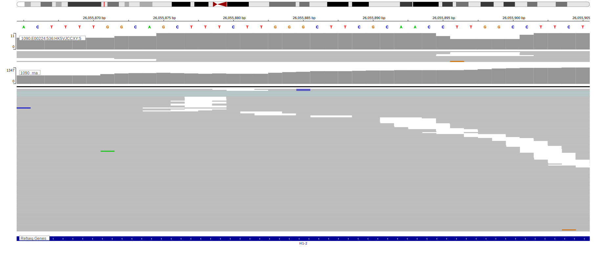

# HIST1H1C

## Overview

This is one of several genes that encode linker histone proteins that are recurrently mutated in DLBCL and FL.1,2 Mutations are often found in the globular domain of the protein, which is critical for its interaction with DNA and other histone proteins. 

<<Warn("The variants reported in BL in this gene failed QC")>>

**[See below ](#representative-mutations) or [the study page ](papers/paneaWholeGenomeLandscape2019.md#tier-2) for more information**

## History

## Relevance tier by entity

|Entity|Tier|Description                           |
|:------:|:----:|--------------------------------------|
||1|high-confidence PMBL/cHL/GZL gene|
| |1   |high-confidence DLBCL gene            [@morinFrequentMutationHistonemodifying2011]|
|    |1   |high-confidence FL gene               [@morinFrequentMutationHistonemodifying2011]|
|    |2-F   |Failed QC|

## Mutation incidence in large patient cohorts (GAMBL reanalysis)

|Entity|source               |frequency (%)|
|:------:|:---------------------:|:-------------:|
|BL    |GAMBL genomes+capture| 4.85        |
|BL    |Thomas cohort        | 3.80        |
|BL    |Panea cohort         | 9.90        |
|DLBCL |GAMBL genomes        | 9.94        |
|DLBCL |Schmitz cohort       | 9.79        |
|DLBCL |Reddy cohort         | 9.41        |
|DLBCL |Chapuy cohort        |12.39        |
|FL    |GAMBL genomes        | 5.08        |

## Mutation pattern and selective pressure estimates

|Entity|aSHM|Significant selection|dN/dS (missense)|dN/dS (nonsense)|
|:------:|:----:|:---------------------:|:----------------:|:----------------:|
|BL    |No  |No                   |10.205          |0               |
|DLBCL |No  |Yes                  | 9.354          |0               |
|FL    |No  |No                   | 4.446          |0               |

View coding variants in ProteinPaint [hg19](https://morinlab.github.io/LLMPP/GAMBL/HIST1H1C_protein.html)  or [hg38](https://morinlab.github.io/LLMPP/GAMBL/HIST1H1C_protein_hg38.html)

View all variants in GenomePaint [hg19](https://morinlab.github.io/LLMPP/GAMBL/HIST1H1C.html)  or [hg38](https://morinlab.github.io/LLMPP/GAMBL/HIST1H1C_hg38.html)

## Representative Mutations

### BL3

**Rating**
&starf; &starf; &starf; &starf; &star;

**Rating**
&starf; &star; &star; &star; &star;

## References

<!-- ORIGIN: morinFrequentMutationHistonemodifying2011 -->
<!-- DLBCL: morinFrequentMutationHistonemodifying2011 -->
<!-- BL: paneaWholeGenomeLandscape2019 -->
<!-- FL: morinFrequentMutationHistonemodifying2011 -->
