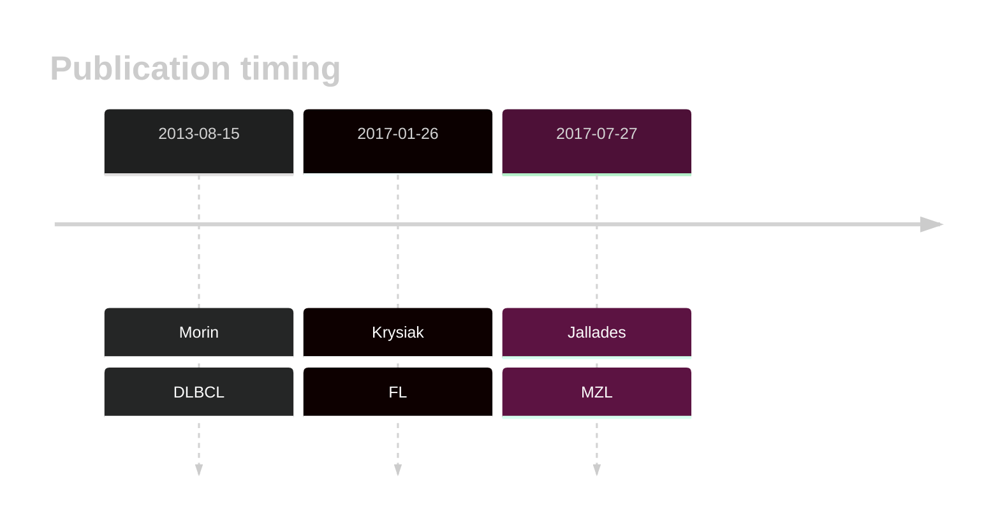

# HIST1H1D
## Overview
This is one of several genes that encode linker histone proteins that are recurrently mutated in DLBCL and FL.1,2 Mutations are often found in the globular domain of the protein, which is critical for its interaction with DNA and other histone proteins. 
## History

## Relevance tier by entity

|Entity|Tier|Description                           |
|:------:|:----:|--------------------------------------|
||1|high-confidence PMBL/cHL/GZL gene|
||2|relevance in MZL not firmly established|
|    |2   |relevance in BL not firmly established|
| |1   |high-confidence DLBCL gene            |
|    |1   |high-confidence FL gene               |

## Mutation incidence in large patient cohorts (GAMBL reanalysis)

|Entity|source               |frequency (%)|
|:------:|:---------------------:|:-------------:|
|BL    |GAMBL genomes+capture|3.23         |
|BL    |Thomas cohort        |4.70         |
|BL    |Panea cohort         |4.00         |
|DLBCL |GAMBL genomes        |6.12         |
|DLBCL |Schmitz cohort       |5.74         |
|DLBCL |Reddy cohort         |6.11         |
|DLBCL |Chapuy cohort        |7.69         |
|FL    |GAMBL genomes        |3.23         |

## Mutation pattern and selective pressure estimates

|Entity|aSHM|Significant selection|dN/dS (missense)|dN/dS (nonsense)|
|:------:|:----:|:---------------------:|:----------------:|:----------------:|
|BL    |No  |No                   |8.064           |0               |
|DLBCL |No  |No                   |2.458           |0               |
|FL    |No  |No                   |0.857           |0               |

> [!NOTE]
> First described in DLBCL in 2013 by [Morin RD](https://pubmed.ncbi.nlm.nih.gov/23699601)

View coding variants in ProteinPaint [hg19](https://morinlab.github.io/LLMPP/GAMBL/HIST1H1D_protein.html)  or [hg38](https://morinlab.github.io/LLMPP/GAMBL/HIST1H1D_protein_hg38.html)

View all variants in GenomePaint [hg19](https://morinlab.github.io/LLMPP/GAMBL/HIST1H1D.html)  or [hg38](https://morinlab.github.io/LLMPP/GAMBL/HIST1H1D_hg38.html)

## HIST1H1D Expression

<!-- ORIGIN: morinMutationalStructuralAnalysis2013 -->
<!-- FL: krysiakRecurrentSomaticMutations2017b -->
<!-- DLBCL: morinMutationalStructuralAnalysis2013 -->
<!-- MZL: jalladesExomeSequencingIdentifies2017 -->
## References
1.  Morin RD, Mungall K, Pleasance E, Mungall AJ, Goya R, Huff RD, Scott DW, Ding J, Roth A, Chiu R, Corbett RD, Chan FC, Mendez-Lago M, Trinh DL, Bolger-Munro M, Taylor G, Hadj Khodabakhshi A, Ben-Neriah S, Pon J, Meissner B, Woolcock B, Farnoud N, Rogic S, Lim EL, Johnson NA, Shah S, Jones S, Steidl C, Holt R, Birol I, Moore R, Connors JM, Gascoyne RD, Marra MA. Mutational and structural analysis of diffuse large B-cell lymphoma using whole-genome sequencing. Blood. 2013 Aug 15;122(7):1256–1265. PMCID: PMC3744992
2.  Krysiak K, Gomez F, White BS, Matlock M, Miller CA, Trani L, Fronick CC, Fulton RS, Kreisel F, Cashen AF, Carson KR, Berrien-Elliott MM, Bartlett NL, Griffith M, Griffith OL, Fehniger TA. Recurrent somatic mutations affecting B-cell receptor signaling pathway genes in follicular lymphoma. Blood. 2017 Jan 26;129(4):473–483. PMCID: PMC5270390
3.  Jallades L, Baseggio L, Sujobert P, Huet S, Chabane K, Callet-Bauchu E, Verney A, Hayette S, Desvignes JP, Salgado D, Levy N, Béroud C, Felman P, Berger F, Magaud JP, Genestier L, Salles G, Traverse-Glehen A. Exome sequencing identifies recurrent BCOR alterations and the absence of KLF2, TNFAIP3 and MYD88 mutations in splenic diffuse red pulp small B-cell lymphoma. Haematologica. 2017 Oct;102(10):1758–1766. PMCID: PMC5622860
