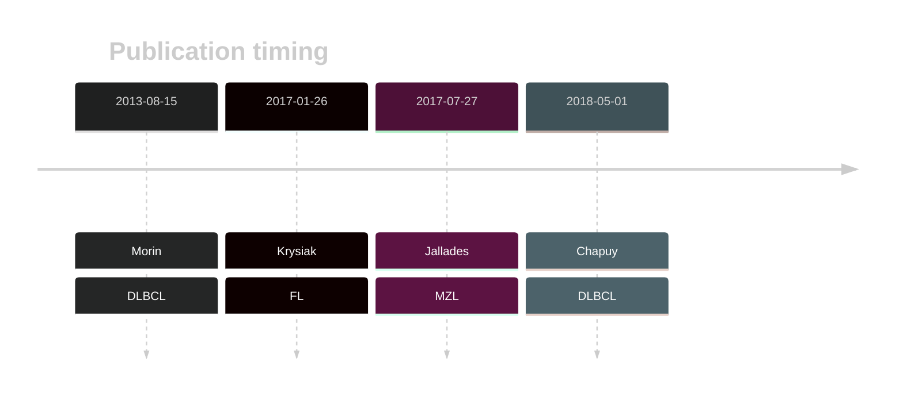

# HIST1H1D

## Overview
This is one of several genes that encode linker histone proteins that are recurrently mutated in DLBCL and FL.[@morinMutationalStructuralAnalysis2013; @krysiakRecurrentSomaticMutations2017]
Mutations are often found in the globular domain of the protein, which is critical for its interaction with DNA and other histone proteins. 

## History

## Relevance tier by entity

|Entity|Tier|Description                           |
|:------:|:----:|--------------------------------------|
||1|high-confidence PMBL/cHL/GZL gene|
||2|relevance in MZL not firmly established[@jalladesExomeSequencingIdentifies2017]|
| |1   |high-confidence DLBCL gene            [@morinMutationalStructuralAnalysis2013; @chapuyMolecularSubtypesDiffuse2018]|
|    |1   |high-confidence FL gene               [@krysiakRecurrentSomaticMutations2017]|

## Mutation incidence in large patient cohorts (GAMBL reanalysis)

|Entity|source               |frequency (%)|
|:------:|:---------------------:|:-------------:|
|BL    |GAMBL genomes+capture|3.23         |
|BL    |Thomas cohort        |4.70         |
|BL    |Panea cohort         |4.00         |
|DLBCL |GAMBL genomes        |6.12         |
|DLBCL |Schmitz cohort       |5.74         |
|DLBCL |Reddy cohort         |6.11         |
|DLBCL |Chapuy cohort        |7.69         |
|FL    |GAMBL genomes        |3.23         |

## Mutation pattern and selective pressure estimates

|Entity|aSHM|Significant selection|dN/dS (missense)|dN/dS (nonsense)|
|:------:|:----:|:---------------------:|:----------------:|:----------------:|
|BL    |No  |No                   |8.064           |0               |
|DLBCL |No  |No                   |2.458           |0               |
|FL    |No  |No                   |0.857           |0               |

View coding variants in ProteinPaint [hg19](https://morinlab.github.io/LLMPP/GAMBL/HIST1H1D_protein.html)  or [hg38](https://morinlab.github.io/LLMPP/GAMBL/HIST1H1D_protein_hg38.html)

View all variants in GenomePaint [hg19](https://morinlab.github.io/LLMPP/GAMBL/HIST1H1D.html)  or [hg38](https://morinlab.github.io/LLMPP/GAMBL/HIST1H1D_hg38.html)

<!-- ORIGIN: morinMutationalStructuralAnalysis2013 -->
<!-- FL: krysiakRecurrentSomaticMutations2017b -->
<!-- DLBCL: morinMutationalStructuralAnalysis2013 -->
<!-- MZL: jalladesExomeSequencingIdentifies2017 -->

## References
